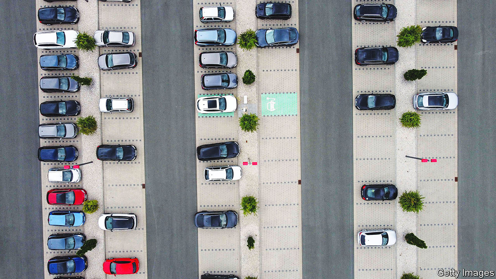
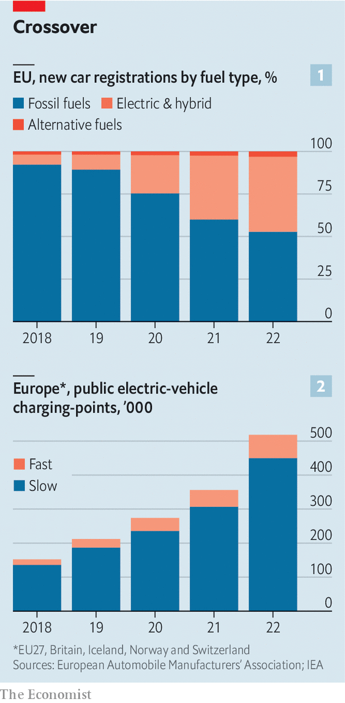
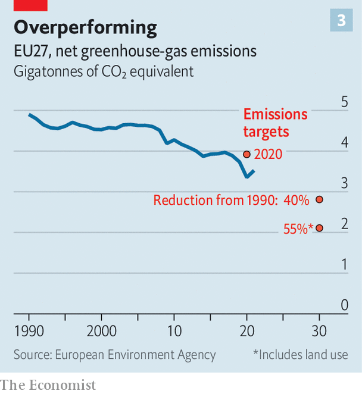

###### Electric cars

# Electric cars could be crucial for the EU to meet its climate goals 

##### But only if the charging infrastructure is ramped up much faster 

 

> May 22nd 2023 

On the last weekend of April the Berlin showroom of niO, a Chinese maker of electric vehicles (EVs), was a happy place. On the first floor a family was celebrating a child’s birthday party. On the ground floor car enthusiasts inspected an SUV, a saloon and a racing car on display. The price tags were high (around €50,000, or $54,000, for the passenger car and almost €75,000 for the sUV; the racing car was not for sale) but they seemed considerably lower than those of German rivals such as Mercedes or bmw—until you read the fine print. The battery is not included. It must be bought for €12,000 or €21,000, depending on capacity; or rented.

 


For many Europeans an EV is still unaffordable (an average petrol-powered passenger car sells for around €28,000), but sales of EVs . Fully battery-powered cars accounted for 12.1% of cars registered in the European Union (EU) last year, compared with 9.1% for EVs in 2021 and just 1.9% in 2019, according to the European Automobile Manufacturers’ Association (ACEA). A wider category, alternatively powered vehicles (APVs), which lumps together pure electric and plug-in and non-plug-in hybrids, made up more than half the EU car market during the last quarter of 2022, with over 1.3m vehicles registered in total. It was the first time that APVs surpassed purely hydrocarbon-powered cars. 

“The EU is the global front-runner in the adoption of EVs,” stated a report last November by McKinsey, a consultancy. The union’s member states are themselves responsible for more than a quarter of the world’s EV production, and are big importers of them too. Forward-thinking carmakers and early-adopting consumers could create a world-leading EV ecosystem, which could generate new jobs and speed up progress towards climate goals—or so McKinsey enthuses. 

The biggest stumbling-block to an electric-car future, though, is the charging infrastructure, which is not keeping pace with the increase in vehicle sales. According to ACEA, between 2016 and 2022 sales of electric cars in Europe grew almost three times faster than the number of charging-points that were installed there. 

Power to the people

For electric vehicles to play their full part in the EU’s ambitious goal of carbon neutrality by 2050, the EU will need to increase the number of public charging-points from around 300,000 to at least 3.4m and up to 6.8m by 2030, says another McKinsey report. That is a tall order. Up to 14,000 public charging-points need to be installed per week until 2030, says ACEA. The number is currently just 2,000 per week. 

The EU will also need to ensure that chargers are more evenly distributed, to harmonise payment systems, and to provide many more fast-charging points for lorries. At the moment half of all EU charging-points are in the Netherlands (90,000) and Germany (60,000). A big country like Romania, which is six times larger than the Netherlands, has only 0.4% of all the EU’s charging-points. 

The imbalance in the charging infrastructure reflects the cost of EVs. Electric cars have a much higher market share in northern and western European countries, where average post-tax incomes are €32,000 a year, than in southern and eastern Europe, where the average is less than half that. Yet because of lower global prices for lithium and other materials needed for battery production, as well as government subsidies, the economies of scale of rapidly increasing production and stiff competition, especially from Chinese producers, prices for EVs are falling faster than some forecast. “By 2025 or 2026 most carmakers will be able to build petrol-powered cars and EVs for the same price,” predicts Daniel Röska of Bernstein Research. At the moment it costs about €3,500 less to build a petrol-powered Golf, a popular Volkswagen model, than an equivalent-size EV.

The charging infrastructure is likely to remain a sticking-point for longer. In March the European Commission announced a new law aimed at appeasing worries about gaps. It sets targets for electric recharging and hydrogen refuelling, such as a requirement that for each battery-powered car in an EU member state, a power output of at least 1.3 kilowatt (kw) must be provided by publicly accessible chargers. And for every 60km along the trans-European road network, a fast recharging station with a total of at least 150kw of capacity should be installed from 2025 onwards.

This is not nearly enough, says the European carmakers’ lobby. “Already today, a lack of charging and refuelling stations is severely hampering the market uptake of zero-emission vehicles,” comments Sigrid de Vries, ACEA’s director-general. She predicts that “a significant infrastructure gap” will continue to limit the transition of Europe’s car industry. In response, some carmakers started building their own charging networks a while ago, led by Tesla. In January Mercedes announced it will put in place some 10,000 chargers worldwide by the end of the decade.

Fit for 55, a climate package with 13 proposals presented by the European Commission in July 2021, increased the ambition for the fight against greenhouse-gas (GHG) emissions to a reduction of emissions by 55% (compared with levels in 1990) by 2030 from the original 40% reduction proposed back in 2011. Transport is one of the keys to success. It accounts for 22% of the EU’s total emissions. Within that, 70% comes from road transport; and road transport is the only sector where emissions have steadily risen since 1990. (The EU has reduced its overall carbon footprint by 30% since 1990, mainly by burning less coal to generate electricity.) In a report in October the commission said the EU was “on track to deliver on its climate ambition”, but that “swift action” was required to meet the 2030 goals as well as the 2050 net-zero ambition. That was why the Fit for 55 proposals were put forward. These proposals are still working their way through the union’s lawmaking process.

Going for green

Fit for 55 might sound like a low-impact yoga class for the middle-aged, but its range of plans could make Europe the world’s climate-policy leader, provided they are followed up. They include a ban on the sale of new internal-combustion engines (ICE) by 2035, and new rules that beef up the targets for emission reductions by 2030 for sectors covered by Europe’s emissions trading system (ETS). The ETS is a cap-and-trade scheme in which permits to emit carbon are allocated to aviation, energy-intensive industries and power generators, and can then be traded between them. The proposals also add transport and domestic heating to the existing ETS scheme. Moreover, new levies at the EU’s borders for carbon-intensive imports, such as industrial materials, are part of the proposals, as well as the establishment of a “social climate fund” that will be used to help vulnerable households and small firms cope with the price increases of bringing heating and transport into the ETS. 

 


At the end of April EU ministers approved six central laws of the Fit for 55 package, including the carbon border-adjustment mechanism and the social climate fund. Whether the EU will manage to meet its ambitious climate goals will now depend on member states’ willingness to deliver on the plans and to abstain from watering down any legislation that does not sit well with their voters, says Elisabetta Cornago of the Centre for European Reform, a think-tank in Brussels. Germany’s recent last-minute attempts to block the ban of new ICE powered cars from 2035 does not augur well. Germany insisted on allowing some new ICE cars to be built after 2035, so long as they are fuelled with carbon-neutral e-fuels, such as ethanol. Critics fear this will open the door to cheating.

Likewise, Italy’s right-wing government is now pushing back against the EU’s plans to improve the insulation and energy efficiency of public and residential buildings. Buildings account for roughly 40% of the EU’s energy consumption and 36% of its carbon emissions. Yet Italy’s housing stock is older and more dilapidated than that of many other countries, so meeting the targets will require extensive and costly renovations. Italy’s construction association says that some 2m buildings will need renovation over the next ten years, at the eye-watering cost of €40bn-60bn a year, if it is to meet the EU’s green homes plans. Italy’s government also backed Germany in its last-minute reversal on the end of the ICE, and criticises the proposal to slash industrial emissions.

“Fit for 55 is entirely on track; that is, the main laws have literally just been voted and now need to be implemented,” says a Brussels official. Transport is in better shape than other sectors in terms of progress to net zero. Seven laws of the Fit for 55 package still need to be approved. But if they pass soon, the EU could stake a strong claim to be considered the world leader in the fight against climate change. ■


