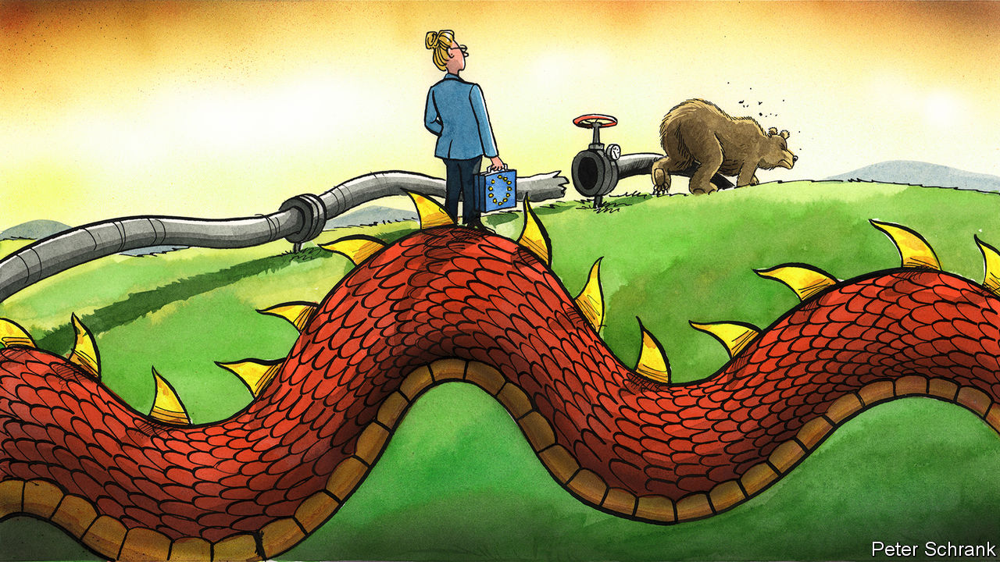

###### Charlemagne

# Europe has shaken off Putin’s gas embargo 

##### Now it needs to think about how to deal with China 

 

> May 25th 2023 


Weapons come in all shapes and sizes, from the Javelins that blow up Russian tanks to the F-16s Ukrainian aces may soon be flying. As his invasion of Ukraine got bogged down last year, Vladimir Putin, Russia’s president, reached for a weapon few imagined he would dare to wield: the throttling of deliveries from Russia’s vast gasfields to its main customers in Europe. Particularly for Germany and other countries that had piped the stuff straight into their homes and factories, doom-mongers predicted dire consequences—think double-digit falls in GDP, surging unemployment, not to mention freezing households. Yet Mr Putin’s weapon of mass economic destruction has turned out to be a dud. The crisis has all but passed, and far less harm came of it than expected. Once they are done breathing a sigh of relief, policymakers should reflect on what this means as they ponder their next geopolitical challenge: how to “de-risk” the continent’s trade with China. If Putin’s super-weapon fizzled, how much should Europe pay to rid itself of dependence on China for its imports of everything from rare earths to mobile phones?

In retrospect, the dependence built up by dozy policymakers and short-sighted businesses on Russian gas was reckless: gas accounted for a quarter of energy consumption in Europe, and Russia made up a third of that. Yet the impact of the Kremlin turning off the tap (not entirely, as some Russian gas is still being piped west through Turkey and Ukraine, of all places) fell well short of the “gastastrophe” feared by some. Prices for natural gas in Europe have tumbled from over €300 ($324) per megawatt hour last summer to €30 in recent days. That is high, but back within the normal historical range. Even if prices jump once thermostats are cranked back up come winter, few expect them to spike very much. 

How has Europe gone from running out of gas to wondering where it will store the stuff? Benjamin Moll, Georg Zachmann and Moritz Schularick, three economists, recently compared the doom-mongers’ vision with reality in Germany. Far from falling into an abyss, Europe’s largest economy suffered only the mildest of technical recessions. Some have put this down to luck, notably a mild winter in much of Europe reducing the demand for heating. In fact, the economists find, the weather was in line with recent years. If anything, other factors compounded the effect of missing Russian gas. French nuclear plants turned out to need unexpected maintenance at the worst possible time, for example. 

Rather, millions of firms and people in Europe have turned out to be unwitting heroes of making do. “Market economies have a tremendous ability to adapt to changing circumstances,” says Mr Moll, a professor at the London School of Economics. Households turned down the heating, at least in countries where politicians did not cap energy prices in a bid to placate voters. Factories once dependent on gas found ways to switch to other fuels. The most power-hungry bits of industry, such as those producing paper, cement, aluminium and some chemicals, were sometimes shuttered. Instead, those products were imported: effectively, an alternative way to bring energy to Europe’s shores. 

The supply of energy also adapted. New piped gas was found, from Norway, Algeria or Azerbaijan. Given sky-high prices, ships laden with liquefied natural gas (LNG) flocked in. The installation of a new facility to unload such boats was thought to need years, yet Germany pulled it off in ten months. Mothballed coal-fired plants were revived, and renewables installed. Countries far and wide contributed to Europe’s energy pivot, too. It can be difficult for a factory in Spain to make do without gas, say. But a utility in Vietnam or China (where demand was muted by covid-19 lockdowns) might have more options, and its cargoes of LNG could be diverted to Europe. The effects can be brutal: Pakistan faced power shortages as its utilities could not outbid gas-starved Europeans.

From Nord Stream to No Stream

Europe will not soon come to depend on Russian gas again—not least because the Nord Stream pipeline that brought lots of it was blown up by an unknown party in September. But the episode has spooked politicians into thinking about which other nefarious powers might one day hold them to ransom. Prompted in no small part by America, Europe wants to ensure it is not beholden to China. What good is defusing the Russian gas weapon if it is replaced with a similar dependence on Chinese solar panels?

One coping mechanism is to replace imports with stuff made in Europe. This idea, popular with trade sceptics in France, gained ground during the pandemic, when the EU ran short of facemasks and paracetamol. Voters were promised that production would be “reshored”. Thus mask factories popped up in France (now gathering dust); a paracetamol plant is in the offing, backed by millions in state aid. The Russian gas imbroglio has increased the list of products statists think Europe should make at home. Targets have been set, Soviet-style, for various sectors. The largesse for microchip and battery plants can already be counted in billions.

The other approach is to keep buying from abroad, but diversify. Businesses that would herd to a single country’s suppliers, often Chinese ones, can be nudged to new shores. Under the impetus of more liberal (ie, less French) forces in Brussels, this is being mooted: public tenders for renewables projects, for example, will be penalised if products are sourced from a country that supplies more than 65% of the EU market. That will induce firms to look beyond the usual Chinese factories. Because the effect is gradual and harnesses market forces, it will be far less costly.

The Russian gas embargo that failed is a useful reminder that economies are more adaptable than politicians think. But recession was averted in part thanks to expensive bungs from government. All the more reason for the right lessons to be learned. It pays to think where your stuff comes from. But some ways of de-risking are smarter than others. ■


