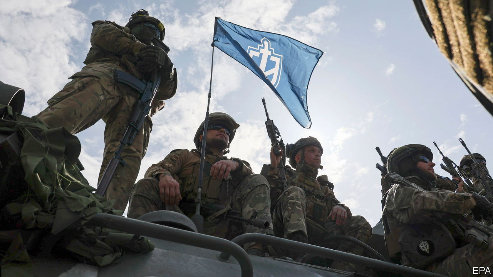
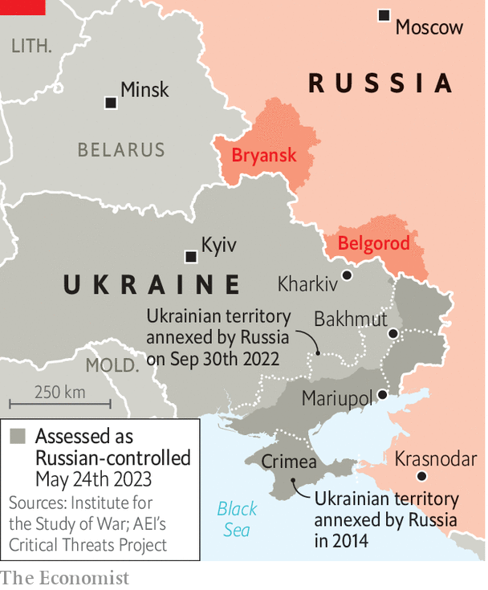

###### Raid on Belgorod

# Who are the militias raiding Russia’s Belgorod region? 

##### They have links to Ukrainian military intelligence and, in some cases, to the far right 

 

> May 25th 2023 


In the late afternoon of May 22nd footage emerged of two grinning pro-Ukrainian fighters in the midst of a cross-border raid into Russia. “The key to the border has been broken in half,” says one, quoting from “Everything is Going to Plan”, a cult anthem by Civil Defence, a Russian rock band. But the attack that the two men had helped engineer showed that, for Russia, things were very much not going to plan. It included: an illegal crossing from Ukraine into Belgorod, a Russian region on the border, by tanks and infantry fighting vehicles; the death of at least one border guard; farm buildings on fire; a downed helicopter; traffic jams of fleeing locals; and the reported evacuation of a nuclear-arms facility several kilometres into Russian territory. Who was responsible for the incursion?

 


Members of two militias that oppose Vladimir Putin—the Russian Volunteer Corps and the Free Russia Legion—claimed to have “liberated” several border villages. The groups appear to be based in Ukraine, from where they mount their attacks. Russia says that the militias are a front for the Ukrainian army; Ukraine insists that they are composed of Russian dissidents. The reality is somewhere in between. Both militias do indeed recruit disaffected Russian nationals. Both also co-ordinate their activities with hur, Ukraine’s military-intelligence agency. Yet the groups have no formal connection to the Ukrainian government. That allows Ukrainian officials to distance themselves from the militias’ operations, however implausibly.

The Kremlin sought to downplay the embarrassing security breach. Russian officials described it as an attempt by Ukraine to “deflect attention” from what they claimed was their capture of the long-contested town of Bakhmut on May 20th (Ukraine says it still holds buildings and trenches on Bakhmut’s south-western edge). On May 23rd the Russian defence ministry claimed to have killed or expelled all the militia fighters from Belgorod, though it provided no evidence.

A Ukrainian intelligence source offers a more realistic assessment. Two ideas underpinned the operation in Belgorod, he says. The first was to undermine Mr Putin’s domestic authority: if a strongman can’t guarantee security, what is the point of him? The second was to pull Russian military reserves away from critical sections of the front line, in the run-up to a long-planned Ukrainian counter-offensive. 

This is not the first foray by Ukraine-backed militias into Russian territory. The Free Russia Legion and Russian Volunteer Corps were formed last year, under opaque circumstances, but came to prominence this March when they spearheaded an incursion from Ukraine into Bryansk, another border region. Russia claimed that two civilians were killed in that attack, but offered no proof.

The two militias differ in organisation and ideology. The Free Russia Legion is more chaotic and closer to hur; the Russian Volunteer Corps is better disciplined but has far-right leanings. Andrei Chernak, a spokesman for HUR, says that the “existential” danger Ukraine faces means that it cannot be too choosy about whom it collaborates with. Survival is Ukraine’s only focus, he said. “We are prepared to work with everyone.” ■

