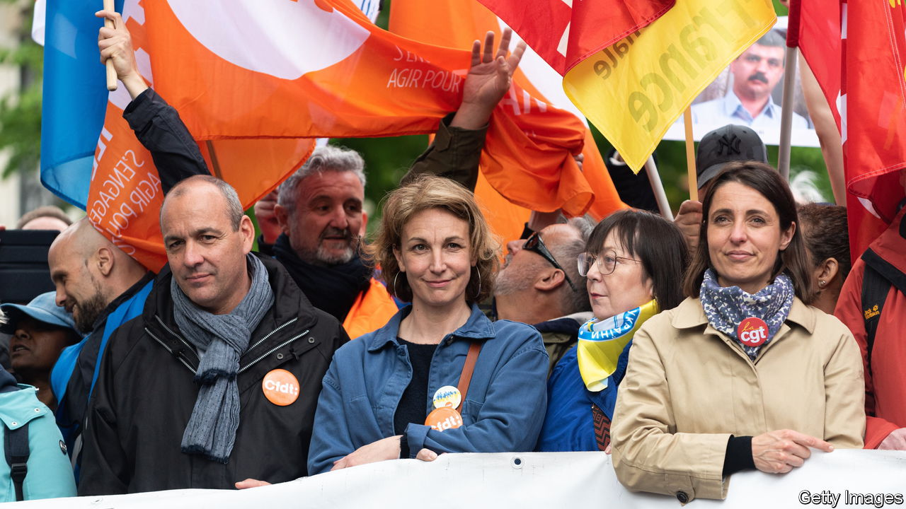

###### French unions

# Women take over France’s powerful trade unions 

##### Amid speculation that a departing (male) leader could go into politics 

 

> May 25th 2023 

In many respects, this has been a dreadful year for French trade unionism. A four-month struggle against pension reform has come to little. New rules that raise the retirement age from 62 years to 64 have been forced through parliament, without a direct vote, and written into law. Yet France’s unions are upbeat. Why?

One reason is that all eight French unions have stuck together throughout. Another is that the public-sector workers who usually fill the streets have been joined by young people and private-sector employees. Only 10.8% of French workers belong to a union, compared with 23.5% in Britain and 16.3% in Germany. But French unions derive their strength from their ability to pack protest rallies, as well as the strong statutory role they enjoy within firms. 

The most arresting reason involves a change of leadership. In March, for the first time in its 128-year history, the CGT, a union with links to the Communist Party, elected a female leader, Sophie Binet. Aged 41, the one-time student unionist is as relaxed in a television studio as she is behind a megaphone. She also has a knack for the one-liner. In April she mocked an address by President Emmanuel Macron, designed to calm matters after rioting and saucepan-banging protests, by suggesting that it “could have been written by ChatGPT”.

Green, feminist and from a white-collar union branch, Ms Binet has her hands full dealing with what has traditionally been a muscular union centred on heavy industry. But this is also what makes her an interesting pick. Ms Binet thinks she can still get the government to shelve the new pension rules. A poll suggests that 60% of the French want the protests to continue. Unions have called a 14th one-day strike for June 6th. The opposition is trying to get parliament to annul the new pension age. 

The feminisation of the labour movement is also under way at the CFDT, France’s biggest union. After ten years, Laurent Berger will stand down on June 21st and hand over to his deputy, Marylise Léon. In this case, though, it is the departing Mr Berger who is the source of speculation. The son of a shipbuilder and a familiar face at every protest march, he has earned credibility on the left for standing up to Mr Macron and holding the unions’ alliance together. Paris swirls with rumours that he is considering a political future. 

Asked by , Mr Berger insists he does not want to go into politics “if it’s just about giving your name to put on a poster”. Yet he is clearly thinking hard about how to create a political space between the radicalised left and what he calls Mr Macron’s “hyper-centre”. Mr Berger has a new book out about the politics of work. The French left, he says, needs to move on from the idea that “work is misery, alienation, exploitation” and think about how to make it fairer, and more valued. 

If Mr Berger does go into politics, he could be a formidable challenger to any centrist successor to Mr Macron. The union leader deplores the way the president imposed pension reform, outrage that taps into a strong popular feeling. Yet he is thoughtful about how work culture needs to change. Mr Berger plans to take some time out to think about the left’s future, as well as his own. “Am I going to disappear?” he asks. “Evidently not.” ■

