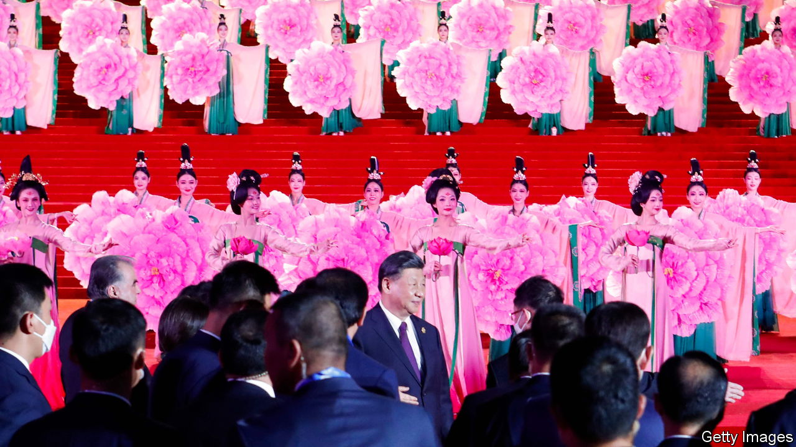

###### Xi v Putin

# China and Russia compete for Central Asia’s favour 

##### The problem is that the former Soviet republics are feeling increasingly flush 

 

> May 25th 2023 

Central Asia’s top brass is on tour. On May 9th presidents of the region’s former Soviet republics were in Moscow, having been roped in as spectators for Vladimir Putin’s annual military parade. Ten days later, as g7 leaders gathered in Japan, it was Xi Jinping’s turn to play host, in Xi’an. At the first in-person meeting of a new group that China has dubbed the c+c5, he wooed Central’s Asia’s five leaders with a bonanza of investments, trade deals and knowledge transfers, to the tune of $3.8bn.

Central Asia is home to untapped natural gas and oil reserves, supplies of copper and uranium, and 10,300km of land borders with China and Russia. Outreach to the region has occupied Beijing and Moscow since the fall of the Soviet Union. But owing to uncertainty in Afghanistan and war in Ukraine, Chinese officials have taken a particular interest of late. Security was top of the agenda in Xi’an, upsetting a long-term compromise in which the region’s armed forces move in lockstep with Moscow while Beijing pulls the region’s pursestrings by bankrolling colossal projects. 

The prizes offered by Mr Xi add to a push already under way to strengthen China’s economic ties with Central Asia. Beijing is involved in more than 90 industrial projects across the region. Turkmen gas alone accounts for more than 70% of the country’s annual gas imports. In 2022 China was Central Asia’s largest trading partner, as the value of imports and exports between the two parties rose to $70bn—up more than 40% from the year before, according to official Chinese figures. By contrast, trade between Russia and Central Asia amounted to less than $40bn.

Mr Putin has stepped up his overtures, partly to counter Mr Xi. Russia has promised a slew of infrastructure investments. Competition is particularly fierce to build transport for the region’s natural resources, many of which are trapped underground. In Xi’an Mr Xi offered to construct a pipeline, the fourth of its kind, to ferry gas eastward from Kazakhstan, Turkmenistan and Uzbekistan. Russia wants as much fuel as possible flowing through its borders in the Caspian and Central pipeline systems, which it has the power to turn on and off. In the words of an academic in Moscow, “there is a silent stand-off.” 

Mr Putin’s diplomacy also has other motivations. Necessity has drawn Russia closer to its southern neighbours. War in Ukraine has left Mr Putin desperate to hold on to remaining allies, even though politicians in Central Asia have avoided openly supporting his invasion. Moscow is newly reliant on Central Asia to circumvent sanctions. Central bankers in Kazakhstan and Uzbekistan help settle payments, using gold and roubles, for transactions that before the war would have been made using swift, a Western system. Logistics bosses and customs officials receive Russian exports before passing them on to Europe. Such intermediated trade counted for 4-6% of Kyrgyzstan’s gdp last year.

The result is that Central Asia’s economies are booming. Currencies in Kazakhstan, Tajikistan and Uzbekistan have risen against the dollar since the war began, bucking an emerging-market trend. The European Bank for Reconstruction and Development, a multilateral outfit, predicts that industries thriving on transporting Russian exports will contribute to gdp growth of 5.2% in the region this year, comfortably outstripping expectations. Capital, firms and people fleeing Russia, many of whom are highly educated, may well produce an even healthier 2024. 

Frenetic business has sent pay soaring, too. In November, annual real wage growth reached 10% in Uzbekistan and 7% in Kazakhstan, meaning the region’s workers have seen more of a lift than those in any g7 country. Newly flush households will spend more on food and energy during Central Asia’s freezing winters. Strong domestic demand has left the region’s governments struggling to keep up. Kazakhstan and Uzbekistan both paused gas exports in January, with a promise to bring them to a complete end by 2025. Whoever wins the charm offensive to build Central Asia’s new pipelines may find there is no fuel available to fill them. ■


