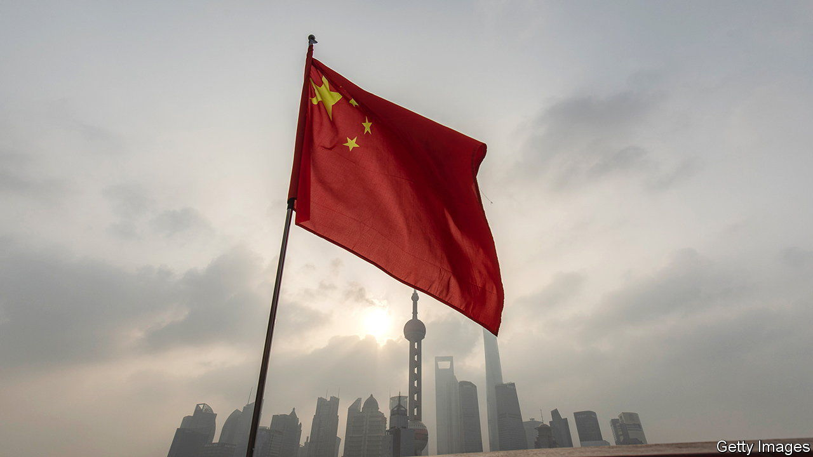

###### Quite a coup

# China’s state capitalists celebrate their soaring shares 

##### Government-owned firms have enjoyed a renaissance this year 

 

> May 25th 2023 

Remember the name: China Science Publishing &amp; Media (cspm) might be the hottest state-owned textbook stock, ever. Shares in the company, which publishes titles such as “Gaseous Detonation Physics and its Universal Framework Theory”, are up 230% since the start of the year. It is not the content, riveting though it is, that has lifted cspm’s market capitalisation to nearly 30bn yuan ($4.3bn). Across the board, China’s state-owned companies have enjoyed a renaissance—at the request of regulators. Stop focusing on profits, authorities have insisted. Instead, think about firms’ social contributions and their broader impact on the economy. All told, the “reconsideration” of China’s clunkiest firms has been worth 3trn yuan in the first five months of the year.

The success of the concept—called the “valuation system with Chinese characteristics”—is quite the coup for the country’s state capitalists. It suggests an ability to guide investment flows. First mentioned in November by Yi Huiman, head of the China Securities Regulatory Commission, the system’s principles continue to evolve. At their core is the idea that standard valuation methods are poor at assessing state-owned companies because such firms adhere to central-government policies which seek to improve overall economic prosperity, not simply a firm’s bottom line.

China’s state-owned enterprises (soes) have a reputation for poor performance and stingy dividends. Their market valuations have reflected this. Part of the problem, say proponents of the new system, is that companies have communicated poorly with investors. Some have even asked analysts not to cover them. Now the firms should help investors understand their “intrinsic values”, Mr Yi has said. No method for doing this has been divulged, but investors speculate that these values include local employment and the hesitancy at many soes to lay off unproductive staff.

This sounds strikingly similar to what investors grudgingly call “national service”, or sacrificing profits to boost economic growth. China’s largest banks are often asked to do this by lowering interest rates on loans to risky borrowers—defying all commercial logic—in the hopes of spurring growth. Kweichow Moutai, a state-owned liquor-maker and one of China’s most valuable listed firms, frequently spends on public works and has even started bailing out local governments in its province. By classic valuation models, this is all detrimental to shareholder value.

The biggest beneficiary of the new system may be pensioners. China faces a gaping shortfall in its ability to support the elderly. Poor demographics and an early retirement age are exacerbating the problem. Officials are transferring trillions of yuan in state-owned capital to the national pension fund as part of a reform process. A boost in the valuation of the firms could eventually help the state meet its pension obligations. The new valuation system, says Meng Lei of ubs, a bank, is an attempt to help investors understand the broader implications of this transfer of state-owned capital to pensioners. 

Is there a more traditional case for investment in companies such as cspm? After a surge of excitement this year, state firms’ share prices are falling again. A new index tracking them is down by 11% since its peak on May 8th. The 291 state-owned shares that are included in the China coverage of msci, an index operator, trade at around six times forward earnings, or close to all-time lows, according to Goldman Sachs, a bank. This is about half the ratio for non-state companies. 

Even before the recent fall, soes were trading at a hefty discount. Officials now hope to match their fine words with actions. The regulator that oversees state assets recently switched its main gauge for evaluating company performance from net profits to return on equity. Analysts at cicc, a Chinese investment bank, reckon this might help lift capital returns and operating results. In which case, the interests of state capitalists and private investors would be better aligned than at present. ■


