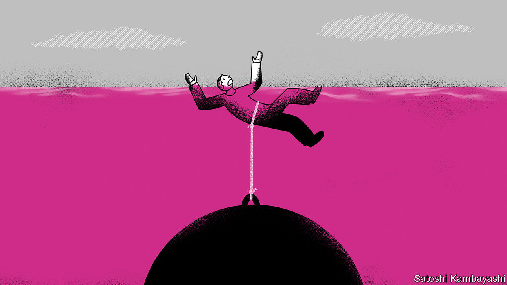
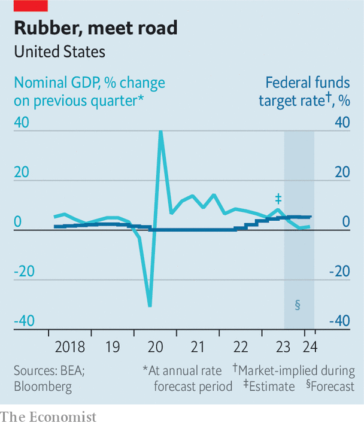

###### Buttonwood

# The American credit cycle is at a dangerous point 

##### Welcome to a bad time for big debts 

 

> May 24th 2023 

The celebrated tome “Capital in the Twenty-First Century”, by Thomas Piketty, a French economist, runs to 204,000 words—longer even than Homer’s “Odyssey”. But the book’s  can be distilled to a single, three-character expression: r &gt; g. As long as “r”, the real rate of return to capital, exceeds “g”, the real rate of economic growth—as Mr Piketty calculated it did over the course of the 20th century—then inequality will supposedly widen. 

The simplicity of the message won Mr Piketty widespread acclaim. It also spawned a resurgence in the popularity of economic expressions. An influential one, i &gt; g, is a variation on the Piketty rule. It applies when nominal interest rates (or risk-free returns) exceed nominal growth. The troubling conclusion from this expression applies to debt. In an i &gt; g world, growth in the revenues, wages or tax receipts that a debtor earns will be slower than the interest accumulating on their borrowing, meaning  have the potential to explode.

 


An i &gt; g world is unfamiliar to America and most of the West. Since the end of 2009 nominal growth has been higher than nominal rates (aside from the first half of 2020, when the covid-19 pandemic crashed the economy). Now America is about to cross the threshold. In the first quarter of 2023, despite annualised real economic growth of only 1.1%, troublesomely high inflation meant that nominal GDP rose at an annualised rate of 5.1%, roughly in line with today’s federal funds rate. A panel of economists surveyed by Bloomberg, a data firm, anticipate that in the second quarter of the year growth will slip to just 0.4% and inflation to 3.3%. Nominal growth is forecast to be just 3.7%—well below nominal rates of around 5.2%. 

“This is when the rubber really meets the road for the economic cycle,” notes Carl Riccadonna of bnp Paribas, a bank. “This is the point at which, if you’re a business, your revenues are now growing more slowly than your cost of financing.” Wage growth will lag debt growth. Government debts will grow faster than tax receipts. A single quarter of this might be bearable. Unfortunately, economists expect the situation to last a year or more. 

The precise impact depends on the extent to which debt reprices as interest rates rise. The vast majority of American homeowners have 30-year fixed-rate mortgages. This generous financing will protect them against a pincer-like combo of slowing wage growth and rising interest expenses. Nevertheless, consumers carrying other kinds of debt—including revolving credit-card balances and private student loans—will feel the pinch. 

Many companies hold a mix of fixed- and floating-rate debt, meaning they will also be somewhat insulated. But the maturities of their debts tend to be much shorter than those of mortgages. A large portion of corporate fixed-rate debt is due to roll over in 2024. Companies that are preparing to refinance are getting nervous. Raphael Bejarano of Jefferies, an investment bank, points out that many corporate treasurers have been spooked by just how difficult it has been to issue debt over the past year. “Many of them are looking at their big maturities in 2024 and trying to roll some of that debt a little earlier, even at higher rates,” he says. What they really fear is being unable to roll their debt over at all. 

The most-exposed companies include many that have been recently snapped up by private-equity barons. Private-credit loans taken on by their firms’ portfolio companies tend to have floating rates. During the last major credit cycle, in 2008, many private-equity firms were able to hang on to their overleveraged acquisitions by negotiating with lenders, which were mostly banks. This time around they will be going toe-to-toe with private-credit lenders, many of which also employ hefty private-equity teams and will be more than happy to take on overleveraged firms. In a sign of what may be to come, on May 16th kkr, a giant private-assets firm, allowed Envision Healthcare, a portfolio company in which it invested $3.5bn at a $10bn valuation in 2018, to fall into bankruptcy and be seized by its lenders. 

When surveying this scene, it is reassuring to note that interest rates have been high for a while, the American economy has fared pretty well and even bank failures seem to have represented a flesh wound rather than a fatal one. But all of this has happened in a different context. It is far easier to swallow a high cost of capital when it is matched by high returns on said capital. And that will not be the case for much longer. ■


