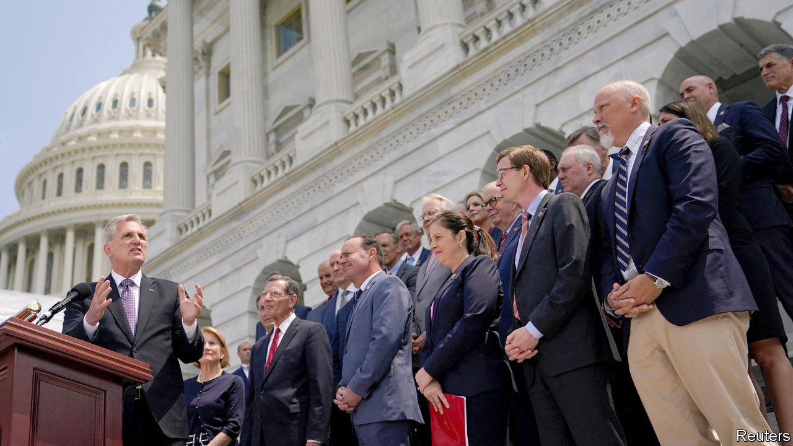
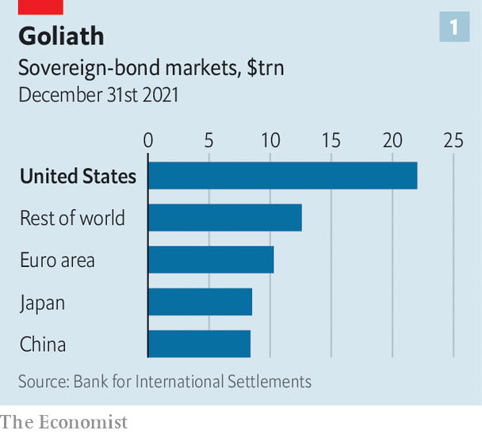
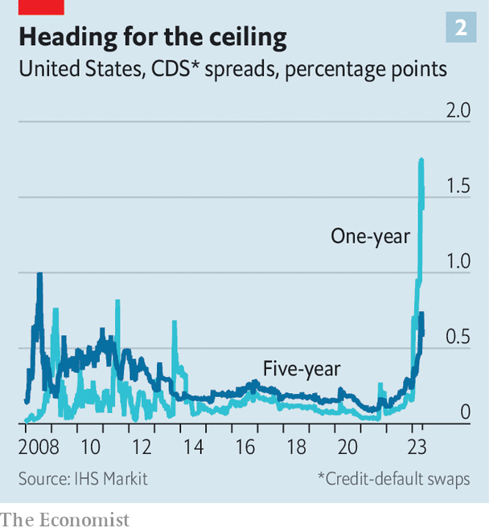

###### The nightmare scenario

# What happens if America defaults on its debt? 

##### An unimaginable eventuality becomes all too imaginable 

 

> May 22nd 2023 

The American constitution vests legislative power in Congress. Over the coming days the political body may arrogate to itself a metaphysical power: transforming the utterly unthinkable into hard reality. By  in time, Congress could drive the country into its  in modern history. A collapse in stockmarkets, a surge in unemployment, panic throughout the global economy—all are firmly within the realm of possibility.

How this would happen is . America has until roughly June 1st to raise its debt limit—a politically determined ceiling on total gross federal borrowing, currently $31.4trn—or it will run out of cash to cover all its obligations, from military salaries to sending cheques to pensioners and making bond payments.

The country has faced such deadlines in the past, lulling observers into the belief that it will, once again, raise its debt limit at the last minute. But its politicians are more fractious than during past standoffs. Kevin McCarthy, the Republican speaker of the House of Representatives, is pushing for swingeing spending cuts, as he must to keep his narrow, quarrelsome majority together. The Republican proposal—to reset some federal spending in 2024 at the level it was at in 2022—would equate to a roughly 25% cut in real terms, all but demolishing President Joe Biden’s legislative achievements in green-energy investment, and perhaps throwing the economy into a deep recession.

That, predictably, is a non-starter for Democrats, who are also resisting Republican demands to expand work requirements for welfare recipients. Negotiations have broken down several times over the past week. Adding to the complexity is an intervention from Donald Trump, who remarked that the consequences of an American default “could be maybe nothing”—an insouciance that has emboldened the Republican fringe. The stockmarket, basically flat over the past month, reflects the common view among investors that a compromise will ultimately be reached. That could well turn out to be complacent. Moreover, any agreement may merely extend the debt ceiling by just another year or two, meaning that America is likely once again to find itself in the same mess. 

The Treasury, working with the Federal Reserve, has a fallback plan if Congress does not raise the debt limit. Known as “payment prioritisation”, this would stave off a default by paying interest on bonds and cutting back even more from other obligations. Yet putting bondholders ahead of pensioners and soldiers would be unpalatable, and may prove unsustainable. What’s more, prioritisation would rely on the continued success of regular auctions to replace maturing Treasury bonds. There is no guarantee that investors would trust such a dysfunctional government. With each passing day, an American default would loom as an ever more serious risk.


Default could come in two flavours: a short crunch or a longer crisis. Although the consequences of both would be baleful, the latter would be much worse. Either way, the Fed would have a crucial role to play in containing the fallout; this crucial role would, however, be one of damage-limitation. Every market and economy around the world would feel the pain, regardless of the central bank’s actions.

 


America is home to the world’s biggest sovereign-debt market: with $25trn of bonds in public hands, it accounts for about one-third of the global total (see chart 1). Treasuries are viewed as the ultimate risk-free asset—offering a guaranteed return for corporate cash managers, governments elsewhere and investors big and small—and as a baseline for pricing other financial instruments. They are the bedrock of daily cash flows. Short-term “repo” lending in America, worth about $4trn a day and a lifeblood for global financial markets, largely runs by using Treasuries as collateral. All this infrastructure would be thrown into doubt.

X-asperation

By definition, a default would initially be a short-term disruption. An official at the Fed says that it would resemble a liquidity crisis. Assume that the government defaults on bills and bonds coming due after the “x-date” when it runs out of cash (this is estimated by the Treasury to be June 1st, if not perhaps a little after that, depending on tax receipts). Demand may still remain firm for debt with later maturities on the assumption that Congress would come to its senses before too long. Indeed, a preview of the divergence can already be seen. Treasury bills due in June currently have annualised yields of about 5.5%; those in August are closer to 5%. This gap would probably widen precipitously in the event of a default. The cost of insuring against a default on American government debt, as measured by credit-default swaps, has rocketed over the past few months to a record high (see chart 2).

 


To start with, the Fed would treat defaulted securities much as it treats normal securities, accepting them as collateral for central-bank loans and potentially even buying them outright. In effect, the Fed would replace impaired debt with good debt, working on the assumption that the government would make payment on the defaulted securities, just with some delay. Although Jerome Powell, chairman of the Fed, described such steps as “loathsome” in 2013, he also said that he would accept them “under certain circumstances”. The Fed is wary of both inserting itself at the centre of a political dispute and taking actions that seem to directly backstop the federal deficit—in the end, though, its desire to prevent financial chaos would almost certainly override these concerns.

The Fed’s response would create a paradox. To the extent that its actions succeed in stabilising markets, they would reduce the need for politicians to compromise. Moreover, running a financial system based, in part, on defaulted securities would pose challenges. Fedwire, the settlement system for Treasuries, is programmed to make bills disappear once they pass their maturity date. The Treasury has said that it will intervene to extend the operational maturities of defaulted bills to ensure they remain transferable. Yet it is easy to imagine this kind of jerry-rigged system eventually breaking down. At a minimum, investors would demand higher interest to compensate for the risk, leading to a tightening of credit conditions throughout global markets.

However this process works out, America would already be in the throes of extreme fiscal austerity. The government would be unable to borrow more money, meaning it would have to cut spending by the gap between current tax revenues and expenditures—an overnight reduction of around 25%, according to analysts at the Brookings Institution, a think-tank. Moody’s Analytics, a research outfit, estimates that in the immediate aftermath of a default, America’s economy would shrink by nearly 1% and its unemployment rate would rise from 3.4% to 5%, putting about 1.5m people out of work. 

In the short-term scenario, Congress responds by raising the debt ceiling, allowing markets to recover. A default that lasts for a few days would be a black eye for America’s reputation and probably induce a recession. Yet with deft management, it would not be the stuff of nightmares. 

A longer default would be more dangerous. Mark Zandi of Moody’s calls it a potential “tarp moment”, referring to the autumn of 2008 when Congress initially failed to pass the Troubled Asset Relief Programme to bail out the banks, prompting global markets to crater. Continued failure to lift the debt ceiling, even after a default occurs, could have a similar impact.

The Council of Economic Advisers, an agency in the White House, estimates that in the first few months of a breach, the stockmarket would slump by 45%. Moody’s reckons it would fall by about 20%, and that unemployment would shoot up by five percentage points, which would mean somewhere in the region of 8m Americans losing their jobs. The government, constrained by the debt ceiling, would be unable to respond to the downturn with fiscal stimulus, making for a deeper recession. The political dynamics are difficult to anticipate—but they would not be pleasant.

An avalanche of credit downgrades would add to these troubles. In 2011, during a previous debt-ceiling standoff, Standard & Poor’s, a rating agency, downgraded America to a notch below its top aaa rating. After a default, rating agencies would be under immense pressure to do likewise. This could lead to a nasty chain reaction. Institutions backstopped by the American government, including Fannie Mae, a crucial source of mortgage finance, would also be downgraded, translating into higher mortgage rates and undercutting the all-important property sector. Yields on corporate bonds would spike as investors scrambled for cash. Banks would pull back their lending. Panic would spread.

There would be bizarre, unpredictable twists. Normally, the currencies of defaulting countries suffer. In the case of an American breach, investors might flock at first to the dollar, viewing it as a haven in crisis, as is normally the case. Within America, people might turn to deposits at too-big-to-fail banks, believing the Fed would stand behind them whatever happened. But any signs of resilience would carry a huge caveat: America would have violated the trust that the world has long placed in it. Questions about alternatives to the dollar and to the American financial system would gain urgency. Faith, once destroyed, cannot easily be restored. ■


