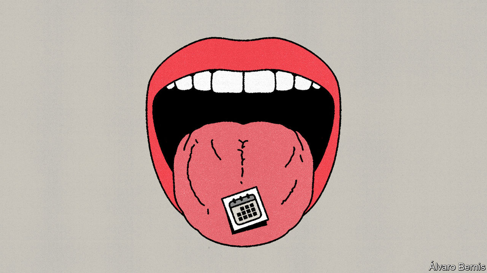

###### Free exchange

# What performance-enhancing stimulants mean for economic growth 

##### Could America’s Adderall shortage have harmed its productivity? 

 

> May 25th 2023 

Towards the end of last year America began running short of medicines used to treat attention-deficit hyperactivity disorder (adhd), including Adderall (an amphetamine) and Ritalin (a central-nervous-system stimulant). Nine in ten pharmacies reported shortages of the medication, which tens of millions of Americans use to help improve focus and concentration. Around the same time, something intriguing happened: American productivity, a measure of efficiency at work, dropped. In the first quarter of 2023, output per hour fell by 3%. 

Coincidence? Probably. Lots of other things could have explained the productivity dip. Equally, though, many of America’s most productive people rely on Adderall to get the job done. It often seems like half of Silicon Valley, the most innovative place on Earth, is on the stuff. And surprising things can cause gdp to rise and fall, including holidays, strikes and the weather. What’s more, the economic history is clear: without things that give people a buzz, the world would still be in the economic dark ages. 

Not all drug consumption helps people work better, of course. Don Draper from “Mad Men”, a tv series about advertising executives in the 1960s, came across many of his finest ideas three Scotches deep. But contrary to popular belief Ernest Hemingway, one of America’s greatest authors, never advised “write drunk, edit sober”, preferring to write liquor-free. In a book published in 1983 David Ogilvy, perhaps the most famous real-life mad man, warned of the dangers of drunks in the office. Use of cocaine, common on Wall Street and in Hollywood, can give people a short-term boost. It also causes grave long-term problems.

Indeed, economists normally think of mood-altering substances as a drag on prosperity. One estimate in 2007 put the cost of drug abuse in America at $193bn, or around 1.3% of gdp. More recently economists have looked at “deaths of despair”, which many link to abuse of opioids. In 2021 more than 80,000 Americans died from opioid overdoses. 

But stimulants can play a positive role, too. Consider two of them: sugar and coffee. The first allowed people to work harder; the second allowed them to work smarter. 

Until the start of the 18th century calories were a significant constraint on Western economic growth. In 1700 total food supply per person in Britain was equivalent to around 2,000 calories a day—enough for the average man to survive, but not to do a great deal more. Workers were therefore inefficient. Many of the poor, who survived on even more meagre diets, barely had the energy to move, let alone do anything useful.

This changed when sugar imports from Britain’s colonies increased. Annual sugar consumption per person rose from around 5lbs a year in 1700 to 20lbs by 1800—several times higher than in continental Europe. After 1800 imports then soared as Britons developed a taste for sweet tea and cakes. The change from a fibre-heavy to a sugar-heavy diet, noted Robert Fogel, a Nobel prize-winning economist, “raised the proportion of ingested energy that [could] be metabolised”. 

Some observed that a growing share of Englishmen were getting fat. But the imports also gave Britain’s economy a sugar high. In France in the late 18th century about 10% of people could not work for lack of nourishment. In Britain, by contrast, only the bottom 3% were incapable. In the 18th century British gdp growth was seven times as fast as France’s. Fogel reckoned that “bringing the ultra-poor into the labour force [and] raising the energy available for work by those in the labour force” explains about one-third of Britain’s economic growth in the 19th and 20th centuries. 

Coffee, meanwhile, pushed the middle classes to do bigger and better things. Joel Mokyr of Northwestern University has stressed the importance of a “culture of growth”, the title of a book he published in 2016, in explaining Europe’s industrialisation. During this period science became less academic, and more focused on solving real-world problems. Over time it became the handmaiden of inventions, such as the internal-combustion engine, which massively lifted living standards. Coffee houses, which some at the time called “penny universities”, played a crucial role. 

By the early 18th century central London was home to as many as 600 coffee shops. The Marine Coffee House in London was an early location for a set of lectures on mathematics, Mr Mokyr points out. The London Chapter Coffee House was the favourite of the fellows of the Royal Society, the intellectual godfathers of the scientific revolution, and was where people gathered to discuss how science could be applied. Caffeine lubricated the discussion in a way that alcohol—a depressant—never could. The chemical increases both selective attention (focusing on the relevant stimulus) and sustained attention (maintaining it). 

This was not the only way in which coffee fuelled growth. In the 18th century Europe came to rely more heavily on clocks to organise the timing of economic activity, and less on the natural rhythms of the human body, as was common in agricultural societies. Factories cannot function unless everyone is there at the same time. Yet if people now had to get up at unnatural hours, they needed something to pep them up. “Caffeine became instrumental to the regimented time of the urban industrialised societies,” according to Steven Topik of the University of California, Irvine.

Flying high

The prolonged shortage of adhd medication has imposed real pain on those who need it to function. Fortunately, though, the shortage does now appear to be easing. Some pharmacies are finally getting drugs back in stock and regulators have removed some medications from their official-shortages list. Silicon Valley types have been experimenting with other stimulants, such as nootropics, which are not in shortage. American productivity appears, once again, to be rising. Coincidence? ■


