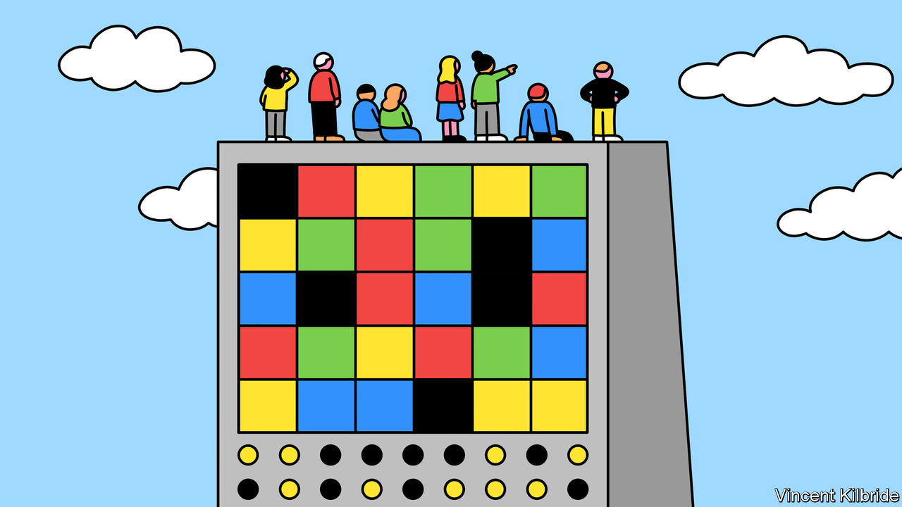
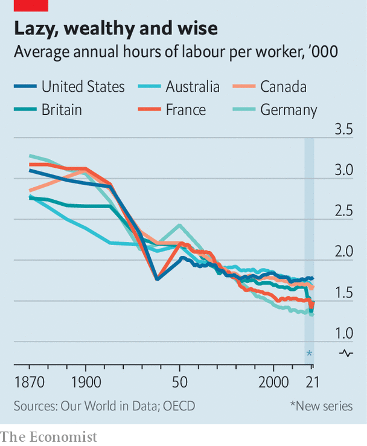

###### Love and conflict

# What would humans do in a world of super-AI? 

##### A thought experiment based on economic principles 

 

> May 23rd 2023 

In “Wall-E”, a film released in 2008, humans live in what could be described as a world of fully automated luxury communism. Artificially intelligent robots, which take wonderfully diverse forms, are responsible for all productive labour. People get fat, hover in armchairs and watch television. The “Culture” series by , a Scottish novelist, goes further, considering a world in which ai has grown sufficiently powerful as to be superintelligent—operating far beyond anything now foreseeable. The books are favourites of Jeff Bezos and Elon Musk, the bosses of Amazon and Tesla, respectively. In the world spun by Banks, scarcity is a thing of the past and ai “minds” direct most production. Humans turn to art, explore the cultures of the vast universe and indulge in straightforwardly hedonistic pleasures.

 


Such stories may seem far-fetched. But rapid progress in generative ai—the sort that underpins Openai’s popular chatbot, Chatgpt—has caused many to take them more seriously. On May 22nd Openai’s founders published a blog post saying that “it’s conceivable that within the next ten years, ai systems will exceed expert skill level in most domains, and carry out as much productive activity as one of today’s largest corporations.” Last summer forecasters on Metaculus, an online prediction platform that is a favourite of many techies, thought it would take until the early 2040s to produce an ai capable of tricking humans into thinking that it was human after a two-hour chat, had good enough robotic capabilities to assemble a model car and could pass various other challenging cognitive tests. After a year of astonishing ai breakthroughs, Metaculus forecasters now think that this will happen by the early 2030s. There is no shortage of money for research, either. Five new generative-ai unicorns (startups valued at $1bn or more) have already been minted this year. 

The road to a general ai—one better than the very best of humanity at everything—could take . Nevertheless, the rising possibility of ultra-powerful ai raises the question of what would be left for humans when it arrives. Would they become couch potatoes as in “Wall-E”? Here is a thought experiment, guided by the principles of economics, to provide something of an answer.

AI is your oyster

Inevitably, such a thought experiment involves some fairly heroic assumptions. For a start, we suppose that ai will be benevolent, controllable and distinguishable from humans. We also suppose that human culture will not be radically altered by technological progress to the point that people begin to love or even worship ais. Instead, we imagine ai as a tool: a virtual, super-smart, dirt-cheap bot. We assume that constraints on the widespread use of ai, such as energy limits, will be resolved. None of this is guaranteed, but it helps make an exercise like this possible. 

In 2019 Philippe Aghion, Ben Jones and Chad Jones, three economists, modelled the impact of ai. They found that explosive economic growth was plausible if ai could be used to automate all production, including the process of research itself—and thus self-improve. A nearly unlimited number of ais could work together on any given problem, opening up vast scientific possibilities. Yet their modelling carried an important caveat. If ai automated most but not all production, or most but not all of the research process, growth would not take off. As the economists put it: “Economic growth may be constrained not by what we do well but rather by what is essential and yet hard to improve.”

An idea put forward by William Baumol, a late economist, offers an explanation for this. In a paper published in 1965, he and William Bowen, a colleague, examined wages in the performing arts. They noted that the “output per man-hour of the violinist playing a Schubert quartet in a standard concert hall is relatively fixed”. Even as technological progress made other industries more productive, the performing arts remained unaffected. Because humans were still willing to spend on the arts even as prices rose—demand was “inelastic”—the arts took up more of gdp and therefore weighed on overall growth. 

Baumol’s example points to a broader principle. If the domains that ai is able to fully automate are only imperfect substitutes for those which it cannot, and the demand for non-automatable industries is hard to budge, then the unproductive sectors will grow as a share of gdp, reducing overall growth. Messrs Aghion, Jones and Jones note that this is in fact what has happened across much of the past century. Technology has automated swathes of agriculture and manufacturing, driving down the relative price of their outputs. As a result, people have spent a greater share of their incomes on industries such as education, health care and recreation, which have not seen the same productivity gains.

Will Baumol’s story matter in a world in which ai is more capable than the most talented humans? If the ai is not embodied—maybe because progress in robotics lags that in computing—then the answer is surely yes. Much of the economy, including construction and manufacturing, is decidedly physical. There are countless forms of employment, including many in health care, that require a combination of braininess and an ability to traverse the physical world. These jobs would only increase in importance in a scenario where ai began to dominate cognitive labour. Humans would work in the physical world, perhaps under the guidance of ai “chief executives” or “professors”.

 


But what if ultra-powerful ai develops super-humanoid robots, too? Material needs would almost certainly be met by machine hands. One might then expect humanity to give up on toil, much like in “Wall-E”. Indeed, in 1930 John Maynard Keynes, another economist, penned an essay entitled “Economic Possibilities for our Grandchildren”, in which he speculated that a century in the future people would work for less than 15 hours a week. The growth generated by technology would solve the “economic problem”, he predicted, and allow people to turn their attention to activities that are intrinsically pleasurable. Admittedly, Keynes’s 15-hour work week has not arrived—but higher levels of wealth, which may increase the appeal of leisure, have cut working hours much as he expected. The average number of hours worked a week in the rich world has fallen from around 60 in the late 20th century to under 40 today. 

There are, nevertheless, some wants that perhaps only humans can satisfy even in a world of supercharged, embodied ai. It is also worth noting that what is intrinsically pleasurable may include work. Consider three areas where humans may still have a role: work that is blurred with play, play itself and work where humans retain some kind of an advantage.

Fun and games

Start with the blurring boundary between work and play. Although working hours have fallen over the past century, most of the drop was before the 1980s. Increasingly, rich people labour for longer than poorer people. Keynes’s essay hints at an explanation for this odd development. He divided human desires in two: “Those needs which are absolute in the sense that we feel them whatever the situation of our fellow human beings may be, and those which are relative in the sense that we feel them only if their satisfaction lifts us above, makes us feel superior to, our fellows.” 

Keynes perhaps underestimated the size of this second class of wants. A cynic might suggest that entire academic disciplines fall into it: existing with no apparent value to the world, with academics nevertheless competing furiously for status based on their braininess. Economists would say that, for many, work has become a “consumption good”, offering far more utility than the income it generates. 

Games offer another hint as to why people may not stop working altogether. Millions of people are employed in entertainment and sports, competing for clout in activities that some consider immaterial. Perhaps when ais overtake humans, interest in watching such games will wane. But evidence from sports where humans are already second-rate suggests otherwise. Since ibm’s DeepBlue defeated Garry Kasparov, the world grandmaster, in chess in 1997, interest in the game has only increased. Other games that have been “solved” by ai, including Go, an ancient Chinese board game, and competitive video games, have witnessed a similar pattern. Across the world the number of video-game players has nearly doubled in the past decade, reaching 3.2bn last year. Nowadays a growing class of gamers compete or stream for a living. 

ai might supercharge this interest. As Banks speculated, humans might specialise in “the things that really [matter] in life, such as sport, games, romance, studying dead languages, barbarian societies and impossible problems, and climbing high mountains without the aid of a safety harness.” Other humans would presumably want to watch them, too.

It seems unlikely that people will give up control of politics to robots. Once ais surpass humans, people will presumably pay even closer attention to them. Some political tasks might be delegated: humans could, for instance, put their preferences into an ai model that produces proposals for how to balance them. Yet as a number of political philosophers, including John Locke in the 17th century and John Rawls in the 20th, have argued, participation in political procedures gives outcomes legitimacy in the eyes of fellow citizens. There would also be more cynical considerations at play. Humans like to have influence over one another. This would be true even in a world in which everyone’s basic needs and wants are met by machines. Indeed, the wealthiest 1% of Americans participate politically at two to three times the rate of the general public on a range of measures from voting to time spent on politics.

Last, consider areas where humans have an advantage in providing a good or service—call it a “human premium”. This premium would preserve demand for labour even in an age of superadvanced ai. One place where this might be true is in making private information public. So long as people are more willing to share their secrets with other people than machines, there will be a role for those who are trusted to reveal that information to the world selectively, ready for it then to be ingested by machines. Your correspondent would like to think that investigative journalists will still have jobs. 

The human premium might appear elsewhere, too. People value history, myths and meaning. Non-fungible tokens, for which provenance can be verified on a blockchain, are typically valued at many multiples more than images with identical pixels but a different history. In areas such as caregiving and therapy, humans derive value from others spending their scarce time with them, which adds feeling to an interaction. Artificial diamonds, which have the same molecular structure as those from the ground, trade at an enormous discount—around 70% by one estimate. In the future, items with a “made by a human” tag might be especially desirable. 

People problems

If this premium is big enough, it could even weigh on growth. Divide the sectors of the economy into those with a large human premium and those without. If humans do not substitute machine-produced goods and services for those made by fellow humans, the Baumol effect would only deepen. Measured economic growth could even hit zero. Indeed, if extremely powerful AI failed to supercharge growth, it would suggest that the economy had already moved beyond materiality towards play, politics and areas where what people value most of all is interacting with others. 

Perhaps one day AIs will produce entirely new goods and services that will outcompete the desire to please and interact with other humans. The manner in which such a contest played out would reveal something profound: just how much of a “social animal” is a human? ■


