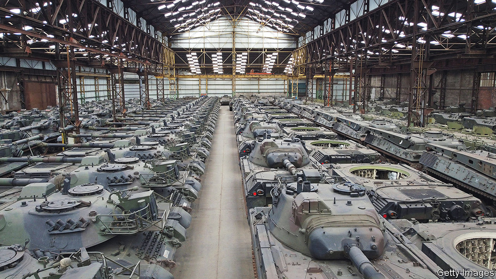
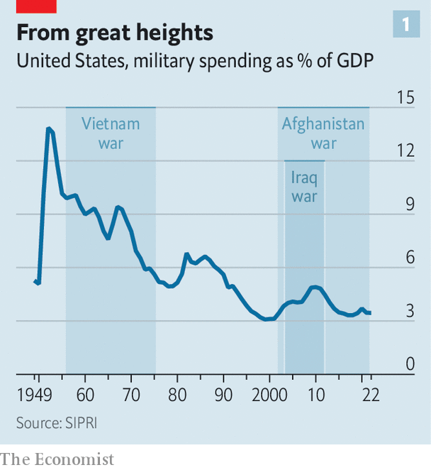
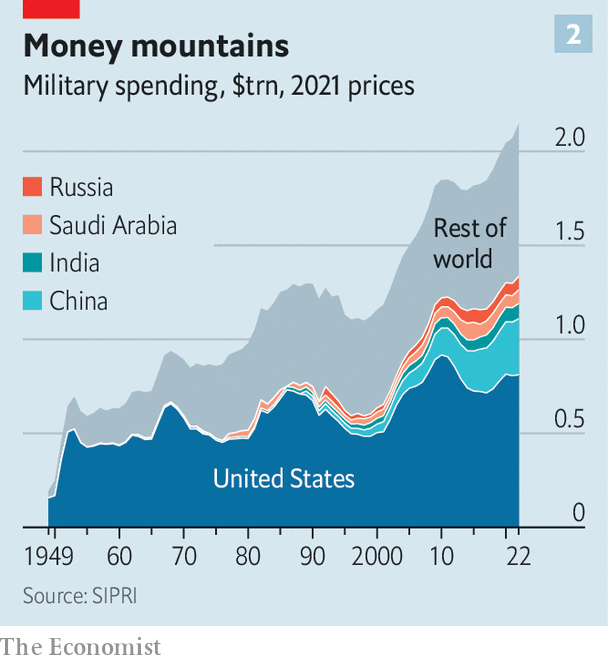
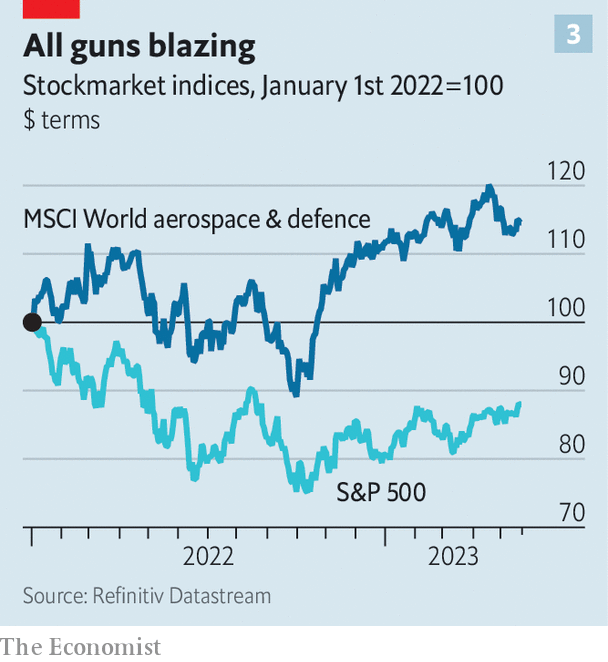

###### Farewell, peace dividend

# The cost of the global arms race 

##### What a “war tax” means for the global economy 

 

> May 23rd 2023 

A t the end of the cold war America’s president, George H.W. Bush, popularised the idea that cutting defence spending would boost the economy. “We can reap a genuine peace dividend this year and then year after year, in the form of permanently reduced defence budgets,” he declared in 1992. The world took note. America went from shelling out 6% of its gdp on defence in 1989 to roughly 3% in ten years (see chart 1). Then came the 9/11 attacks and conflicts in Afghanistan and Iraq. Now with Russia’s invasion of Ukraine, talk of war between America and China over Taiwan, and tensions concerning Iran’s nuclear ambitions, countries are tooling up as never before in this century. 

 


Last year defence spending worldwide increased by nearly 4% in real terms to over $2trn, according to the Stockholm International Peace Research Institute, a think-tank (see chart 2). The share prices of defence firms are performing better than the overall stockmarket (see chart 3). Many nato allies, notably Germany, plan to meet or exceed spending of 2% of gdp on defence—the alliance’s target. Other countries are planning to splurge, too. Japan plans to raise defence outlays by two-thirds through to 2027, turning it into the world’s third-largest spender. 

 


We estimate that total new defence commitments and forecast spending increases, if implemented, will generate over $200bn in extra defence spending globally each year. It could be a lot more. Imagine that countries which currently spend less than 2% of gdp per year meet that level and that the remainder increase spending by half a percentage point of gdp. Global defence outlays would rise by close to $700bn a year. 

 


Russia’s invasion of Ukraine “risks wiping out the peace dividend we have enjoyed for the past three decades”, declared Kristalina Georgieva, the head of the imf, in a speech in April. The West is sending ever more weapons, of ever growing sophistication, in order to help Ukraine launch a counter-offensive against Russia. It has equipped the best part of nine new armoured brigades with modern battle tanks and more besides. Soon it will start training Ukrainian pilots to fly American-made F-16 fighter jets. 

The number of nato countries hitting the 2% target rose from three in 2014 to seven last year. The club now says this should be “a floor, not a ceiling”, a notion that is likely to be enshrined at its summit in Lithuania in July. Some countries are moving well beyond. Poland aims to reach 4% this year, and eventually to double the size of its army. France speaks of shifting to a “war economy”. 

An arms race is intensifying on the other side of the globe, too. Taiwan is extending military service from four months to a year. Under the aukus deal, America and Britain will help supply Australia with nuclear-powered submarines; they will also aim to develop other weapons, including hypersonic missiles. In the past decade India’s defence budget has grown by about 50% in real terms, as has Pakistan’s. In the Middle East, Gulf states are again shopping heavily in the arms bazaar.

China’s defence budget has grown by about 75% in real terms in the past ten years. It wants to “basically complete modernisation” of its forces by 2035, and become a “world class” military power by 2049. America thinks China wants the capability to invade Taiwan as early as 2027. 

Some in America question whether its approach is adequate in a world riven by rivalry. Despite some recent increases, America’s defence budget has shrunk by about 5% since 2012. Squeezes on spending emerged in the aftermath of the financial crisis of 2007-09. Yet even before the acute tension of current times, Congress gave authority to a commission to consider American defence spending. In 2018 the body recommended raising it by 3% to 5% in real terms every year for at least five years. Overall America’s advantage over its rivals has eroded in the past century, reckons Andrew Krepinevich, an American strategist. During the first, second and cold wars America’s adversaries had much smaller economies than America did. No longer. Today China’s GDP alone is nearly 80% of America’s. 

In the decades after the cold war, the thinking was that to spend less on armies meant to spend more on infrastructure and public services and to lower debt or taxes. Since the 1960s the world has “released” about $4trn a year of spending at current prices in this way, equivalent to the global government budget for education. Now the peace dividend is turning into a “war tax”. How heavy will it be? 

Working out accurately who is spending what can be difficult. For international comparison, defence spending is usually reckoned as a share of gdp, at market exchange rates. By this measure global military expenditures appear close to a post-cold-war low, at around 2.5%. But market exchange rates greatly underestimate the true size of defence establishments in countries such as China and Russia, where a given dollar of military spending can pay for a lot more weapons and soldiers. The proportion will also increase in the coming years if great-power rivalry grows as expected. In a more insecure world, countries will arm themselves because their neighbours are doing so or because their allies encourage them to.

Splurging more on weapons raises several questions. What will countries buy, might money be squandered and could the global economy be damaged? 

America, by far the world’s largest defence spender, is devoting growing sums to research and development of future weapons. This includes hypersonic missiles, to catch up with China and Russia; “directed energy” such as powerful lasers to shoot down drones and missiles; and artificial intelligence and robotics. It is also buying as many munitions as its factories can produce—from 155mm artillery shells to anti-ship missiles. The war in Ukraine has exposed the extraordinary quantities of munitions needed in a conflict, as well as the inability of peacetime production lines to meet such demand. 

China is investing on all fronts and expenditures grew by 4.2% in real terms last year. The breakdown of its budget is opaque, not least because of “civil-military fusion” in technological development. It has developed a thicket of anti-access/area denial (A2/AD) weapons, with ground-attack and anti-ship missiles able to reach deep into the Pacific. It also has a lead in some types of hypersonic missiles (which are harder to intercept than ballistic ones). Its navy is already larger than America’s. 

America, Russia and China are investing in their nuclear arsenals, too. America is upgrading all legs of its “triad” of ground-, air- and submarine-launched nukes. Russia is working on esoteric weapons, such as the long-distance, nuclear-powered Poseidon torpedo designed to set off an underwater nuclear explosion that, propagandists boast, can cause destructive tidal waves. China is quickly expanding its arsenal, from several hundred warheads to 1,500 by 2035, according to the Pentagon. 

Equipment is also at the top of the shopping list for many smaller countries. Germany is buying stealthy new F-35 jets as well as command-and-control systems. Poland is spending heavily on land forces—buying tanks, howitzers, precision rockets and more from America and South Korea—as well as combat aircraft. Japan is seeking, among many other things, long-range “counter-strike” missiles to hit back at China and North Korea.

This shopping spree comes with several risks. Given the bottlenecks, one danger is escalating costs, in an industry where prices can be hard to control because of long development processes, changing requirements and because defence firms operate at the technological edge, with all the associated overheads. 

American defence budgets can be subject to the whims of politicians seeking benefits for their districts. Congress has persistently refused to let the air force retire obsolescent aircraft, for instance. European countries, for their part, are poor at co-ordinating procurement at scale. McKinsey, a consultancy, notes that they operate many more models of weapons than America does: 15 types of main battle tanks compared with one in America; 20 fighter jets versus seven, and so on.

Worse, the defence industry is especially prone to graft, notes Josie Stewart of Transparency International, an anti-corruption group. That is because of the secrecy that surrounds many of its dealings, its importance to national security and the “revolving door” of experts versed in its technicalities. An onrush of money could make everything worse.

There are wider concerns that big defence establishments, and the industries supplying them, will weigh down the global economy by stoking inflation or slowing growth, or both. Kenneth Rogoff of Harvard has noted that “the need to front-load massive temporary expenditures can easily push up borrowing costs”.

Expectations for inflation? 

Certain fears may be misplaced. Take defence inflation in America—the increase in prices facing buyers of military equipment. It is running at about 5% year on year, the highest rate in decades. During previous military build-ups this sort of defence inflation has sharply increased. In the early 1980s, a period in which Ronald Reagan built up America’s military capabilities, it easily outpaced economy-wide price rises. In the Vietnam war it briefly hit 48% on an annual basis. 

Even so, there is little reason to believe that the new cold war will be sharply inflationary. Not even the fiercest hawks are calling for defence spending, as a share of gdp, to return to the levels of the 1960s or 1970s. Barring a hot war between big powers, global defence spending is unlikely to grow above the low single digits of global gdp—meaning that its impact on global aggregate demand, and thus inflation, will be similarly small. 

Spending can remain historically low, in large part, because defence is more efficient than it used to be. Modern armies require ever fewer people—allowing military planners to cut headcounts (though service members can become more expensive). Brazil spends 78% of its budget on people compared with less than 50% in the West. In place of people you have better machines. Many planners bemoan the growing cost of each platform, but they improve with each iteration. “These days you can hit dozens of targets with a single bomber, rather than vice versa, which used to be the case,” argues James Geurts, a retired air-force colonel who advises Lux Capital, a venture-capital firm. 

Official data from America suggest that once you adjust for improvements in quality, the price of a missile has fallen in nominal terms by about 30% since the late 1970s. The price of military aircraft is about flat. Today a country can spend relatively modestly to acquire fearsome capabilities. As such, defence spending tends to fall relative to gdp, particularly in peacetime. 

Defence could continue to get better and cheaper in relative terms because of the changing nature of what Dwight Eisenhower, a general-turned-president, called the “military-industrial complex”. In the past defence departments exported technology to civilians—think of the global-positioning system and the internet. Increasingly, the opposite is happening, with military industries importing technology from outside. 

Technological trajectories

Cyber-security, drones and satellite technology straddle both the civilian and military worlds. SpaceX, founded by Elon Musk, has launched American military satellites. Ukrainian warriors make extensive use of his Starlink constellation of satellites. America’s defence department has identified 14 critical technologies deemed vital to national security. Perhaps ten or 11 of these areas are being led commercially. Tech firms such as Google and Microsoft help out with cyber-security, data-processing and artificial intelligence. Several firms provide cloud computing.

It all amounts to a change of cultural mindset from tech firms that once shunned defence as morally tainted. A defence-tech ecosystem has sprung up in America, with lots of engineering expertise in Colorado; regulation wonks in Washington, DC; aerospace types in Los Angeles; and investors in San Francisco. But it is not just an American phenomenon. About half of the biggest defence-and-aerospace firms founded within the past decade are headquartered in other parts of the world. “Founders no longer want to do the next social-media startup,” says Paul Kwan of General Catalyst, an American investment firm. 

Big investors in Silicon Valley, including General Catalyst and the venture-capital outfit Andreessen Horowitz, are increasingly interested in national security, broadly defined. Tech firms smell opportunity. Palantir, which specialises in big-data analytics, recently released a new defence platform powered by AI to speed up decision-making. Defence was one of the few sectors where there were more venture-capital deals in 2022 than in 2021. 

There is also a growing effort to inject defence firms themselves with tech’s dynamism. A recent parliamentary report in Britain noted that “old ‘legacy’ systems complicate tasks as routine as ordering a pair of boots”. It can take ten to 20 years to produce a new plane. But rather than develop new planes every decade or so, says Jim Taiclet, the boss of Lockheed Martin, the world’s largest defence contractor, his firm aims to mimic Silicon Valley by offering software upgrades to improve performance every six to 12 months.

The fiscal consequences of the new defence boom may be modest if the industry becomes more efficient. The defence-versus-everything-else trade-off was acute in decades past: in 1944 America spent 53% of its GDP on military forces. But it is less so today. If the world doubled its military spending overnight (assuming no increases in taxes or debt) public spending would need to be cut by about 5% to balance the books. Not easy, but not that hard. 

What of the impact on growth? Many historians argue that defence spending is a drain on the rest of the economy. Keeping a country secure has great economic value. But once you buy a missile, say, it tends to sit in storage rather than being put to productive use. During the second world war productivity growth slowed in America, as people were pulled from the fields into munitions factories and military units. Forced limits on military spending in postwar Japan and West Germany, by contrast, coincided with huge productivity improvements in both countries. 

This is only a partial story, however. Countries such as Israel and South Korea combine vibrant economies with big defence sectors. We analysed World Bank data from the 1960s to 2021, exploring the relationship between military spending and GDP growth. Both within a single country over many years, and between countries in a single year, we find practically no correlation between the two. Put simply, more guns need not mean less butter. 

More defence-related R&amp;D could boost wider innovation. And more investment in defence capabilities could also have positive spillover effects on the rest of the economy. A recent paper by Enrico Moretti of the University of California, Berkeley, and colleagues finds that “government-funded R&amp;D in general—and defence R&amp;D in particular—[is] effective at raising a country’s total expenditures on innovation in a given industry.” 

Of taxes and tanks

Governments have plenty of competing demands for their cash: among them caring for ageing populations, fighting climate change and paying higher interest on their debts. Some fear that higher taxes are inevitable, or that the cost will be passed to future generations as borrowing. Many governments will face pressure to backpedal on commitments to higher military expenditures. According to a recently leaked intelligence report, Justin Trudeau, Canada’s prime minister, told NATO leaders that his country would never reach the 2% target. It is not yet clear how Japan or Poland will pay for their big rises in defence. 

Goings-on in Washington, above all, will determine the size and duration of the boom. The mainstream still wants America to maintain primacy and fend off both Russia and China. But many on the “America First” populist wing want to cut support for Ukraine and, in some cases, even for the Pentagon. A third group favours redirecting military spending away from Europe and the Middle East to concentrate on China. And a fourth contains figures from the left who want less spending on defence and more on social matters. The first category, the internationalist hawks, seem to have the upper hand. Confronting America’s rival is one of the few issues where there is bipartisan support. 

Several things might push up spending. A crisis might escalate—or even draw America into direct fighting—forcing a military surge. Harry Truman, for instance, oversaw one as president during the Korean war. Short of conflict, a future president may opt for a military build-up. Many credit Reagan’s decision to boost defence outlays as crucial to bankrupting the Soviet Union and winning the cold war. 

One way or another, a new era of rearmament beckons. As General Mark Milley, chairman of America’s joint chiefs of staff, told the Senate recently: “Preventing great-power war through readiness and deterrence is very expensive, but not as expensive as fighting a war.” And the only thing more costly than that, as he explained, is losing one. ■


