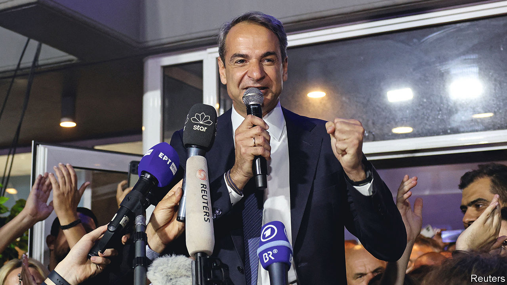

###### Carry on Kyriakos

# A stunning election result for Greece’s prime minister 

##### Kyriakos Mitsotakis deserves his unexpected triumph 

 

> May 25th 2023 

There is beating your political opponent, there is trouncing him, and then there is what Kyriakos Mitsotakis, Greece’s prime minister, did on May 21st to Alexis Tsipras, the leader of the radical-left Syriza party. Syriza ran the country from 2015 to 2019, a time when Greece came close to defaulting on its debts, crashing out of the euro and threatening the stability of the entire euro zone. Mr Mitsotakis then took over. Now Greek voters have decided, by a whopping margin, that they prefer stability and technocratic competence to drama. 

Mr Mitsotakis picked up 41% of the vote to Syriza’s 20%, a stunning result, especially given that pollsters had predicted only a six- or seven-point gap. Mr Tsipras’s future, and that of his party, are now in doubt. Yanis Varoufakis, the shaven-headed, leather-jacketed finance minister who propelled Syriza down the path of confrontation with Brussels but then quit and formed his own splinter party, is out of parliament. Mr Mitsotakis fell a few seats short of an overall majority. But he says he has no interest in forming a coalition; and no one else can. So a second election will be held, probably on June 25th; an interim prime minister will hold the reins until then. Mr Mitsotakis is sure to be back, because the next election will be held under a new electoral system that will reward the largest party, presumably his right-of-centre New Democracy, with up to 50 bonus seats, out of a parliamentary total of 300.

Mr Mitsotakis has earned it. Over the past four years he has governed, for the most part, with energy and skill. The economy has bounced back better than most from the disasters of covid-19 and the energy-price shock; its growth rate last year was around twice the euro-zone average, and is forecast to exceed it comfortably this year too. 

Greece’s sovereign debt now trades at investment-grade interest rates; the spread between what it must pay on its ten-year bond and what Germany pays is only 1.4 percentage points. During the crisis of 2015, it hit a terrifying 18.7 percentage points. The unemployment rate is still too high, at nearly 11%, but annual inflation is back down at only 3%. Greece, in short, has become a normal country, not a worry. Away from the economy, Mr Mitsotakis has done a reasonable job of managing tensions with Turkey, helped by his swift dispatch of aid to the earthquake-devastated Turkish south-east in February.

That is not to say that things are perfect. Mr Mitsotakis has three big blots on his record and, assuming he gets his second term, he will need to deal with them. The first is a nasty scandal involving the phone-tapping, actual and attempted, of dozens of politicians, journalists and businesspeople by the security services. Mr Mitsotakis’s government has yet to come clean about exactly what happened; until a lot more is disclosed, trust in his administration will remain badly dented. The second is persistent reports of Greek border guards beating up and robbing migrants trying to enter from Turkey: something that may not much bother Mr Mitsotakis’s more nationalist-minded supporters, but ought to bother him.

And finally, far more needs to be done to reform Greece’s sclerotic and sometimes corrupt public services. The shortcomings of the state were demonstrated in February by a train crash which took 57 lives and revealed a litany of duff equipment and shoddy working practices. It was the result of decades of mismanagement, but it sent Mr Mitsotakis’s polls reeling (they recovered in time for the election, which he put back by more than a month). The mission of modernising Greek government has a long way to go—and Mr Mitsotakis will have his work cut out in a second term. But he clearly deserves one. ■

