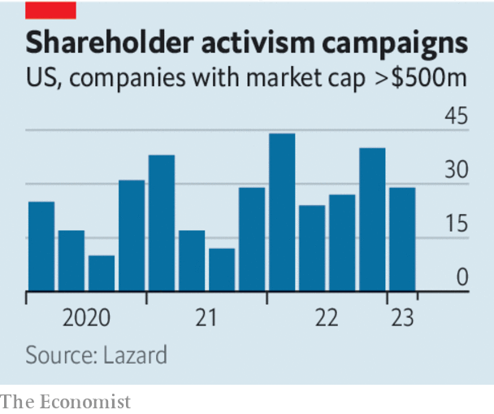

###### Seize the day (and the board)

# Activist investors are needed more than ever 

##### Low rates, passive investing and ESG have left opportunities for active shareholders 

 

> May 24th 2023 

Little scares the C-suite like shareholder activism. Bosses stay awake worrying about a call, a letter or a 100-page presentation in which a hedge fund outlines the depths of their ineptitude. At the start of the year executives were especially on edge. During this year’s annual “proxy season”—a succession of shareholder meetings—they have mostly avoided votes on dissident nominees to their boards. Nevertheless in recent months some of the world’s largest firms—including Alphabet, Bayer, Disney and Salesforce—have had to tussle with activists, who are increasingly focused on the biggest companies. On May 25th, as we published this article, the battle between Carl Icahn, a prominent activist, and Illumina, a genomics giant, was set to .

Activist hedge funds are often seen as villains who are nasty, brutish and focused on the short term. Sometimes the shoe fits. But more often activists are playing a role that is essential for shareholder capitalism. For several reasons, their campaigns are increasingly important.

 


One is the rise of passive investing, which attempts to replicate the returns of an index rather than surpass them. Only one in three dollars invested by institutions in America’s thousand largest public companies is actively allocated, according to Man Group, an investment firm. The biggest passive asset-managers, such as BlackRock, charge low fees and run lean investment-stewardship teams which are not designed to spot empire-building bosses or lazy boards. The result is an increasingly idle corporate electorate. Efforts to enfranchise the ultimate owners of funds are unlikely to solve the problem. They typically want to earn returns but leave the decision-making to somebody else. 

There are other channels by which bosses’ feet might be held to the fire. Since the 1980s leveraged buy-outs by private-equity firms have been a persistent threat to underperforming executives. The best way to deter a hostile takeover is to raise your company’s share price. Today, however, the buy-out industry is roiling from the effects of higher interest rates, and is unlikely to recover fully for some time.

While the routes by which managers are held to account have shrunk, the need to boost profits by applying discipline has grown. When interest rates were low, large technology firms hired aggressively and expanded into peripheral lines of business. Now profits are more important than growth. Over the past decade the demand for managers to respond to environmental, social and governance (esg) concerns has also grown. Some shareholders campaign for esg—as is their right—but the danger of firms losing focus and wasting money as they are drawn into politics has increased.

In such an environment the presence of activists is a welcome reminder that it is owners, not managers, in whose interest firms should be run. And because dealmaking is down, activists will be more likely to improve a firm’s operations than force it to sell itself in search of a quick buck. That should assuage the fears of those who see activists as corporate cowboys rather than drivers of efficiency.

Get out the vote

Fortunately, the job of activists is getting easier. New rules that came into force in America last September should make it simpler for them to obtain board seats by letting shareholders vote for candidates individually, rather than as a bloc. The wave of nail-biting shareholder votes some expected to follow immediately has not yet materialised. But more battles between activists and complacent managers would be no bad thing. ■

