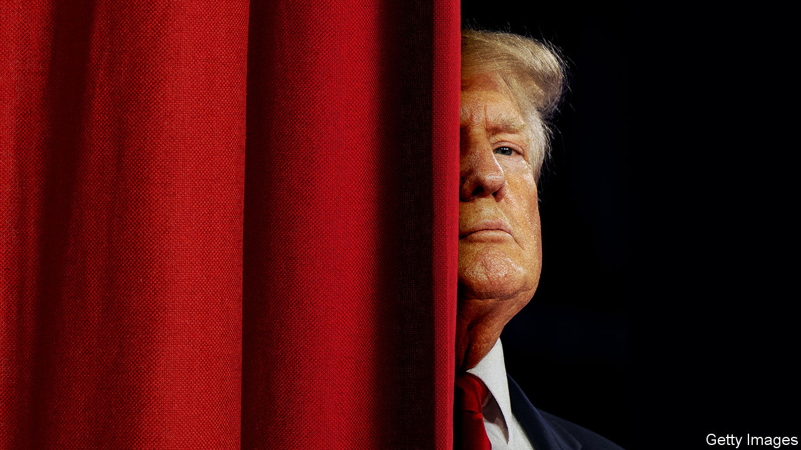

###### America’s presidential race

# Donald Trump is very likely to be the Republican nominee 

##### So his chances of re-entering the Oval Office are uncomfortably high 

 

> May 25th 2023 

A  glitch-plagued chat with Elon Musk, live on Twitter, is an unconventional way to launch a presidential campaign. But with the entry of Florida’s governor, , the race for the Republican nomination is now properly under way. The first states will not vote until January. Primaries are hard to predict, because it is expensive to conduct enough high-quality polls of primary voters in the key states. But, with that disclaimer over, one candidate has a huge, perhaps insurmountable, lead: Donald Trump. Mr Trump thus has a real chance of becoming America’s next president. Betting markets put his odds of returning to the White House at one in three.

If you decided to pay less attention to Mr Trump after he lost in 2020, to preserve your sanity, you may be wondering how this can be the case. Parties do not usually stick with losers. Mr Trump led the Republicans to defeats in the 2018 midterm and the 2020 presidential elections. After he encouraged his supporters to “stop the steal”, some of them broke into Congress, with the result that one police officer died of a stroke and four committed suicide. He has since been found liable for sexual assault, too. Would the Republican Party really nominate him again?

Yes, it probably would. In 2016 and in 2020 it made some sense to think of the Trump movement as a hostile takeover of the party. In 2023 it no longer does. He is the front-runner because a large proportion of Republicans really like him. His supporters have had their hands on the Republican National Committee for six years now. More than half of Republicans in the House of Representatives were elected for the first time since 2016, and therefore under Mr Trump’s banner. Almost all of those House and Senate Republicans who refused to make their peace with him have stood down or retired. Of the ten House members who voted to impeach Mr Trump in January 2021, only two are still there. They are outnumbered in their own caucus by more than 100 to 1.

Mr Trump’s campaign is also better organised than in either 2016 or 2020. Our  of the primaries shows how hard he will be to beat. He has a stunning lead: polling for  by YouGov suggests Republican primary voters prefer Mr Trump to Mr DeSantis by 33 percentage points. He also has a big lead in endorsements from elected Republicans, which are usually a good predictor of what will happen. In 2016, the last time Mr Trump contested a primary, he won the early primaries with much less support than he has now.

There are still Republican voters who would like an alternative—his 58% poll share means that close to half of primary voters must be open to choosing someone else. Yet the difficulties of co-ordinating the opposition to Mr Trump are daunting. People close to the Trump campaign say privately that the more candidates who enter the primary, dividing the field, the better for their candidate. Some big donors are giving money to non-Trump candidates on the condition that they drop out after South Carolina, an early primary, if told to do so. The idea is to engineer unity around a single non-Trump candidate, just as establishment Democrats united around Joe Biden in 2020 to stop Bernie Sanders, a leftist. Backroom manoeuvring by party bigwigs is less likely to work against Mr Trump, however, for the simple reason that he is the Republican establishment. 

The way the primary calendar and pending legal cases against Mr Trump intersect is nightmarish. His trial for falsifying records in New York will get under way , when more than a dozen states vote. Neither this case nor any of the other investigations he faces are likely to be resolved by the time the primaries are over. It is therefore possible that the candidate of one of the two great parties could be subject to criminal charges when he is on the ballot. America has had badly behaved presidents before. It has never had one who is also the defendant in a criminal trial.

You might think that, at this point, voters would abandon Mr Trump in large numbers. Maybe. But when, earlier this year, a jury found that he had sexually abused a woman 30 years ago, the verdict had no measurable effect on his poll numbers. Mr Trump, it turns out, is adept at persuading Republican voters that he is the real victim. Democrats, and plenty of America’s allies, think Mr Trump is a threat to democracy (as does this newspaper). His campaign is already turning this accusation back on the accuser: “The 2024 election”, a recent Trump campaign email announced, “will determine whether we can keep our Republic or whether America has succumbed to the dark forces of tyranny.” Those who accept that these are the stakes will probably overlook Mr Trump’s innumerable and obvious flaws.

Imagine, then, that it is November 2024 and Mr Trump and President Biden are having a rematch—the first since Dwight Eisenhower beat Adlai Stevenson back in the 1950s. Could Mr Trump win?

The general election will surely be close. The electoral college gives Republicans a slight edge. The most recent landslide was 40 years ago. America has since become evenly divided politically and calcified because voters seldom switch sides. Mr Biden has some under-appreciated strengths, but he is no one’s idea of formidable. Were the country to enter a recession, Mr Trump’s chances would go up. Some mooted post-primary tactics intended to stop him, such as running a third-party candidate, smack of desperation: they could easily backfire and boost him further.

Prima Donald

All of which means that you should take seriously the possibility that America’s next president will be someone who would divide the West and delight Vladimir Putin; who accepts the results of elections only if he wins; who calls the thugs who broke into the Capitol on January 6th 2021 martyrs and wants to pardon them; who has proposed defaulting on the national debt to spite Mr Biden; and who is under multiple investigations for breaking criminal law, to add to his civil-law rap sheet for sexual assault. Anyone who cares about America, about democracy, about conservatism or about decency should hope that Mr DeSantis or one of the other non-Trump Republican candidates can defy the odds and beat him.■


