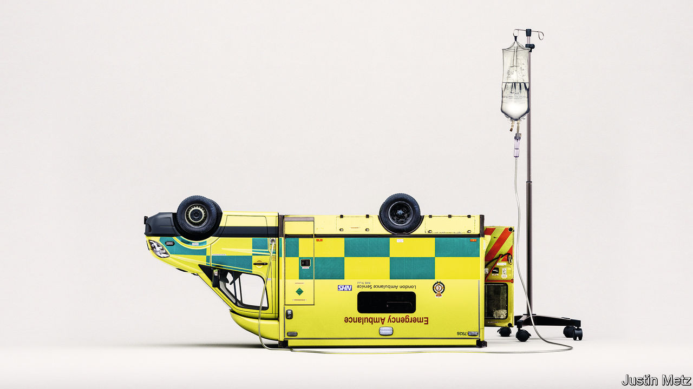

###### The sick factor

# How to fix the NHS 

##### Money will help. But a radical shift in focus is more important 

 

> May 25th 2023 

Britons are prouder of their health-care system than they are of the monarchy. But when the English National Health Service (NHS) turns 75 in July, the mood will not be celebratory. Hospital waiting lists in England spiral beyond 7m, forcing many to wait months or even years for treatment. Almost 300,000 adults are waiting for a social-care assessment. A record 2.5m Britons are out of work because they are sick. NHS staff are leaving the workforce in droves. On basic measures of health, Britain suffers by comparison with its rich-world peers. Its people barely live any longer than they did a decade ago, and have some of the worst survival rates for diseases such as cancer. During the pandemic the public clapped for the NHS. Now they are more likely to throw up their hands in frustration. 

When something is broken, the boldest reforms can often seem the most tempting. Some want to overhaul the NHS’s funding model, switching from a system funded by taxation to one based on social insurance, as in France or Germany. Others mull the case for much wider use of means-tested charges. But Britons will not easily ditch what Nigel Lawson, a former chancellor, once called their “national religion” of health care funded by taxes and free at the point of use. And the country’s recent record of revolutionary change does not inspire confidence.

It is also . The recipe for saving the NHS requires radicalism, but of a simpler sort: turning the NHS from what it has become—a sickness service—into what its name promises—a health service. That will mean spending more money. But to spend it productively requires a shift in focus: away from hospitals to the community, from treatment to prevention, from incentivising inputs to encouraging better outcomes. 

Health already absorbs the biggest single chunk of government spending. Of every pound the state spends on public services, 38p goes on the NHS. But Britain spends less on health care than countries like France and Germany as a share of GDP. It especially skimps on capital spending: no OECD country invests less on a per-person basis. And the demands on the health service are only going to go up. In the next 25 years the number of Britons aged 85 and older is set to double. The NHS is the largest single employer in Europe; the phenomenon of “cost disease” means that the pay of nurses and doctors needs to keep rising to compete with wages elsewhere in the labour market. 

The critical question is where the money is spent. At the moment, the answer to that question can be boiled down to one word: hospitals. Spending on public health (covid-19 prevention aside) and social care has fallen in real terms over the past decade. The share of total NHS spending allocated to primary and community care was falling even before the pandemic; the share doled out to hospitals had risen to almost two-thirds. As a share of GDP spent by rich-world governments and compulsory insurance schemes, only America spends more on hospitals. 

This makes no sense. A system focused on hospitals is one designed to treat people only after they have become really sick. That is the equivalent of buying more fire extinguishers while dismantling the smoke alarms. The majority of health and social-care spending now goes on treating long-term conditions like diabetes, high blood pressure and arthritis. Such conditions are managed best by patients themselves, in their own homes and with the support of networks of general practitioners and local specialists. The share of money going to primary care should be restored from 8% of the NHS budget to the 11% proportion it was two decades ago. Social care needs more money, too, and a proper long-term funding plan. 

The corollary of moving care out of hospitals and into communities is to focus on prevention: keeping people healthy for as long as possible. That means widening the lens on health care. For all the headlines it grabs, medical care contributes comparatively little to the state of the nation’s health: socio-economic factors, genetics and individual behaviour matter more. One obvious example is obesity. Britain is the third-fattest country in Europe; an obese patient costs the NHS twice as much to treat as one who is not. The government needs a more muscular strategy to tackle this problem before it turns up in waiting rooms and hospital beds, for example by making effective use of promising new anti-obesity drugs. 

The way that the NHS measures and motivates performance also needs to change. At the moment the system is geared towards inputs. Politicians conventionally compete to make promises about the number of new hospitals or the ranks of new doctors. Top-down metrics based on “activity” encourage hospitals to spend billions on unnecessary and unwanted treatments towards the end of life. Funding should be relentlessly focused on health outcomes; to encourage innovation, money saved by making people healthier should be made available to regional bodies to reinvest.

Will any of these changes ever actually happen? The good news is that these ideas are neither new nor even particularly controversial: just this week Sir Keir Starmer, the leader of the Labour Party, laid out in a speech the need to shift focus from acute care to chronic care. The establishment in England of “integrated care systems”, a set of 42 regional partnerships between NHS providers and local bodies, paves the way for a more decentralised approach to health provision. The covid-19 pandemic vividly demonstrated the power of data and technology to reach people quicker, from carefully targeted vaccination campaigns to online consultations. 

Faith healing 

But this refocusing of effort does require a radical shift in mindset, from politicians above all. Care workers and insulin pumps are less sexy during election campaigns than heart surgeons and new hospitals. No crisis is more urgent for a politician to fix than one involving desperately ill people waiting for ambulances to arrive—one reason why technology and capital budgets are raided to cope with each new winter crisis. The NHS can be saved. But only if the people who run it see their job as keeping Britons healthy at home rather than treating them on the wards. ■


