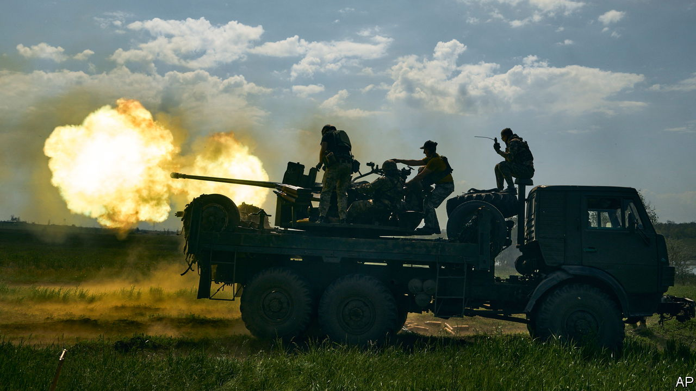

###### End of the peace dividend

# How to get more bang for the buck in Western defence budgets 

##### Lessons from the war in Ukraine 

 

> May 25th 2023 


The world is tooling up. The peace dividend it has enjoyed since the end of the cold war—releasing wads of cash from defence to spend on other things—is ending. Now comes the new “war tax”. Our  global defence spending may rise by $200bn-$700bn a year, or 9-32%. Blame fraught geopolitics—especially Russia’s invasion of Ukraine and China’s sabre-rattling at Taiwan. 

America and China are locked in a race for military ascendancy in Asia. European countries are scrambling to meet nato’s target of spending 2% of gdp on defence. Poland is aiming for 4% and wants to double its armed forces. Japan’s defence budget will rise by at least two-thirds by 2027, which may make it the world’s third-largest spender. Australia is developing pricey nuclear-powered submarines with America and Britain. 

Yet for Western governments, finding money for arms will not be easy. They must pay interest on debts and cope with fiscal pressures that did not exist in the 1980s, such as the need to care for ageing populations and curb climate change. Furthermore, as in the cold-war era, there is a risk that cash is blown on good-but-exorbitant equipment, thanks to red tape and cronyism. How to get the best value from defence spending in the 2020s?

The war in Ukraine offers some pointers. The first priority for Western governments is to restock depleted arsenals and boost the factories that make shells and missiles. War eats up vast amounts of ammunition. Ukraine has been firing roughly as many 155mm artillery shells in a month as America can produce in a year. In a war with China over Taiwan, America could run out of vital anti-ship missiles within days. Increasing output requires certainty for industry, in the form of multi-year contracts, and much work to find and clear production bottlenecks.

Next, governments should shake up procurement processes and disrupt the cosy structure of the defence industry. Western weapons have shown their value in Ukraine, and the war ought to be a “battle lab” for new ideas. Yet procurement is still woefully slow and costly. New entrants, notably dynamic tech firms, could end the oligopoly of the big contractors.

SpaceX, a satellite firm, has broken the hold of big, stodgy rivals and slashed the cost of putting objects into orbit. Its Starlink constellation of communication satellites has proved invaluable to Ukrainian forces. More Silicon Valley firms are helping with the fusion and analysis of data to create a “kill web”: a network of scattered “sensors” and “shooters” that is more powerful than any single weapon. Governments should welcome the flow of venture capital into experimental defence startups, and accept that some failures are inevitable.

Finally, Western countries need to create more of a single market for defence that boosts economies of scale and competition. Common standards, which nato can help set, are one part of this. With its tutti-frutti arsenal of donated weapons, Ukraine knows all about the incompatibilities of Western kit: British tanks have rifled guns, so they cannot fire ammunition made for smooth-bored German and American ones. American tanks run on petrol; European ones on diesel. Given the growing importance of data in weaponry, open-architecture software that allows kit to “plug and play” should be helpful.

Creating an integrated market also means resisting protectionism. Europe got into a needless twist—and wasted time—over French attempts to exclude non-European firms from the eu’s scheme to deliver 1m artillery shells to Ukraine in a year. Even mighty America could benefit from more co-operation. It has one supplier of rocket motors for many missiles; buying from trusted allies would make its supply chains more resilient. In an unruly world, liberal democracies must figure out how to bolster their security despite other pressing demands on the public purse. The best way is to embrace innovation, and ruthlessly pursue efficiency and scale. ■

