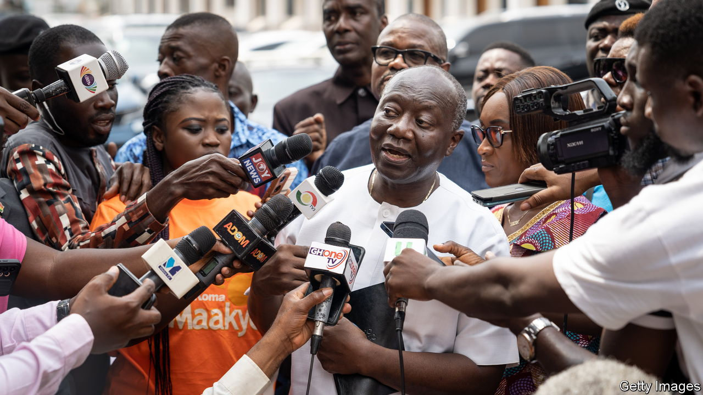
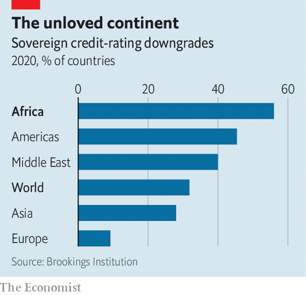

###### My ratings are better than yours

# African governments say credit-rating agencies are biased against them 

##### They claim that pessimism about debt sustainability is unwarranted 

 

> May 25th 2023 

Since the spring of 2022, no country in sub-Saharan Africa has issued a bond on international markets. The yields on  have climbed so high that most governments can no longer afford to borrow. The usual explanation is that investors are fleeing risky assets at a time of global uncertainty. But is African debt as perilous as foreign lenders assume?

African governments say no. “The perception of risk continues to be higher than the actual risk,” argued Senegal’s President , speaking as chair of the African Union (AU), in a speech to the UN last year. He pointed an accusing finger at the credit-rating agencies. So did Ghana’s finance minister, Ken Ofori-Atta, in the early months of the covid-19 pandemic, as funds dried up and downgrades loomed. “Are the rating agencies beginning to tip our world into the first circle of Dante’s Inferno?” he asked. In that poem the monstrous Minos wraps his tail around his body as he sorts sinners into nine tiers of damnation. 

Credit-rating agencies prefer to declaim in spreadsheets. They combine economic data with their own subjective judgment to assess whether a borrower is likely to repay on time and in full. Countries with lower ratings face higher interest rates on international markets. A sovereign downgrade also raises the cost of borrowing for firms and deters foreign direct investment. Only two African countries, Botswana and Mauritius, are now rated better than junk.

 


Misheck Mutize, an economist studying the issue for the AU, casts doubt on the rating agencies. When they look at Africa, they ignore good news and downgrade at the first sign of trouble, he reckons. They take a “blanket approach” to risk that can ignore the differences between African countries. Their jeremiads often become a self-fulfilling prophecy as investors flee.

Rating agencies respond that they apply the same methods everywhere. African governments have low ratings because they collect little tax, borrow in foreign currencies and face other genuine obstacles. A credit rating assesses risk; it does not indict policy, says Matt Robinson, who manages the team that rates African sovereigns at Moody’s Investors Service. Without trusted information, investors would put even less capital into African markets.

The debate hinges on how to weigh factors that are not easily measured, like the strength of institutions, or political will. Rating agencies say that expert discretion is where they add value. But their African critics worry that too much space is given to gut feelings. Studies find that agencies tend to look more favourably on their home country and on places which are culturally similar. The big three rating agencies that dominate the global market are all headquartered in America. Moody’s and s&amp;p Global each has one African office, in Johannesburg; Fitch has none at all.

A recent report by the UN Development Programme argues that Africa would save money if rating agencies were more “objective”. It compares the ratings assigned by the big three with country scores from Trading Economics, a data platform which uses a different economic model to assess risk and leaves little room for discretion. The rating agencies, it turns out, are sometimes (but not always) glummer. If ratings matched the Trading Economics scores, African governments could borrow more often and more cheaply: the cumulative value of these gains could be $75bn, the report estimates.

That is not clinching evidence of built-in bias, because human judgment may detect risks that pure number-crunching misses. Markets seem to think so. Some studies find that investors demand an interest premium of one or two percentage points on African debt, above what would be expected from economic data and credit ratings alone. Ghana’s bonds began to sell off even before the rating agencies issued gloomier judgments, notes Stuart Culverhouse of Tellimer, a British research firm specialising in emerging markets. When Moody’s issued a downgrade last year, Ghana’s government complained of an “institutionalised bias against African economies”. Yet it has now suspended repayments on much of its external debt.

The argument about credit ratings is one sign of Africa’s renewed assertiveness. From the distribution of covid-19 vaccines to the handling of economic crises, Africans complain they are treated like second-class citizens in the world order. Their case against the rating agencies is unproven. But the Africans may have a point. ■

