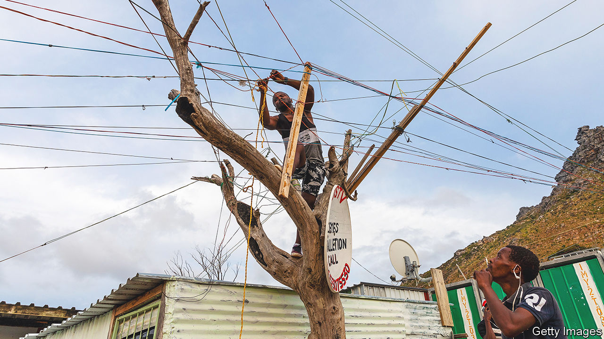
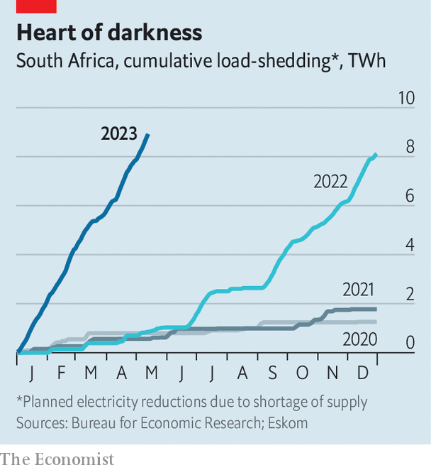

###### Downhill from rainbow nation

# Business leaders fear that South Africa risks becoming a failed state 

##### CEOs have realised that running the country cannot be left to the ANC 

 

> May 22nd 2023 

When Cyril Ramaphosa became South Africa’s president in 2018, business leaders were ecstatic. Here was one of their own: a pragmatic tycoon to fix the incompetent kleptocracy of Jacob Zuma. Yet five years on, bosses of large businesses are exasperated. CEOs from several different industries—such as Neal Froneman of Sibanye-Stillwater, a mining company; Daniel Mminele, the incoming chair of Nedbank; and Ralph Mupita, of MTN, a telecoms firm—have sounded the alarm. Could South Africa become a failed state?

 


Already in 2023, blackouts by , the electricity utility, have surpassed those of 2022, hitherto the worst year on record (see chart). Businesses are planning for the total collapse of the grid. “If this crisis continues, we will not be able to guarantee stable supplies of food, medicines and other essential goods,” wrote retail bosses in a letter to the president in February. Morale dipped further when the rand hit a record low after America’s ambassador earlier this month accused South Africa of covertly .

CEOs have all but given up on Mr Ramaphosa fixing the problem himself. So firms are sending staff to government departments, including his office: a very South African solution. Those with means find alternatives to a failing public sector, paying for private health care, schools and security, and installing solar panels to power their homes.

Links between big business and the government began before 1994, when Nelson Mandela and his African National Congress (ANC) came to power. As international firms and capital left South Africa in the 1980s, the domestic groups that dominated South African business got bigger. By the end of the decade three conglomerates controlled companies accounting for 75% of the market value of the Johannesburg Stock Exchange (JSE). But some tycoons saw that white rule was unsustainable. So in 1985, defying the wishes of the apartheid regime, the chair of Anglo-American took a group to meet exiled leaders of the ANC. One delegate, upon meeting Thabo Mbeki, joked to the future president: “Welcome to the capitalist class!” 

Those talks led to an unwritten deal. The ANC would drop its pledge to nationalise big companies. Business would embrace affirmative action and enrich a black elite including, most notably, Mr Ramaphosa. In other respects the basic structure of the South African economy changed little. Many of the same big firms still predominate—and feel less competitive pressure than peers in other parts of the world. According to research by the IMF, mark-ups by publicly listed firms increased by 25% from 2000 to 2016. The average rise globally was 6%. Sustained mark-ups, namely prices above the marginal cost of production, imply a lack of competition.

Problems have been thrashed out in private. In 2015, Mr Zuma tanked the rand by replacing a respected finance minister—who had helped block a multi-billion dollar nuclear-power deal with Russia—with an obscure MP. Captains of industry called a meeting with ANC bigwigs, including Mr Ramaphosa, who by then had amassed a fortune and returned to politics. Mr Zuma changed tack. 

Yet today’s crises cannot be solved with a quiet word. Bosses typically cite three issues: power, logistics and crime. Last year power cuts may have reduced GDP by 7-8%; 2023 could be even darker. The blackouts caused South Africa to go from being the most reliable among MTN’s 19 African networks at the start of 2022 to possibly the worst a year later. The largest supermarket chain says spending on diesel for generators cut profits by 7% in 2022. 

Transnet, the state-owned firm that operates freight rail has, like Eskom, been battered by allegations of corruption and mismanagement. Last year miners lost out on 300bn rand ($16bn) worth of exports, roughly a third of what they managed to sell abroad, according to Jan Havenga of Stellenbosch University, because they could not get their goods out of the country. Transnet moved less general freight—excluding minerals and metals—than at any time since the 1940s. 

The crook factor

Crime makes everything worse. In 2019 at least 183 infrastructure projects were disrupted by “construction mafia” demanding jobs and bribes. The theft of cables from Eskom, Transnet and passenger railways cost South Africa an estimated 50bn rand in 2022, roughly akin to the economic contribution of the wine industry. Andre de Ruyter, Eskom’s former head who courageously tried to root out graft, was nearly fatally poisoned in December. (Do not use a personalised coffee mug, he says, when asked if he has advice for his successor.) Western officials worry that South Africa is becoming to money-laundering what Silicon Valley is to venture capital. In February the Financial Action Task Force, a global watchdog, put the country on its “grey list”, meaning that South Africa’s banks and authorities will come under greater scrutiny. 

Mr Ramaphosa has repeatedly pledged to get a grip. Alas, he has failed. One CEO sketches out a two-by-two diagram, the sort beloved by management consultants. One axis is labelled “morality”, the other “competence”. Mr Ramaphosa is placed in the moral but incompetent square, whereas Mr Zuma is in the one marked immoral and incompetent. When Janet Yellen, America’s treasury secretary, visited South Africa earlier this year, CEOs asked her to talk sense into the president. 

“Earlier this year we came to the realisation that we’re on the edge as a country,” says Martin Kingston, chair of Business for South Africa, a pan-industry body. “We realised the status quo was just not tenable.” Drawing on the experience of procuring protective gear and vaccines during the pandemic, business groups formalised what had previously been only ad hoc efforts to assist the government. 

For several years firms have sent staff to help run government departments, paying their wages. Corporate lawyers work at the prosecuting authority; bankers toil in the department of industry. Several secondees are involved in Operation Vulindlela (“Make Way”), a joint initiative of the presidency and finance department that is meant to beat bureaucratic inertia. 

Last year a new unit, sitting in the presidency, was set up to reform the electricity industry. In March Mr Ramaphosa said that the private sector would pay into the Resource Mobilisation Fund (RMF), a whip-round designed to hire outside consultants. The RMF may well pay for a private team to try to reform logistics, too. “The aim is to create a parallel system of institutions to make things work in the moment,” says Morris Mthombeni of Gordon Institute of Business Science, based in Johannesburg. Business groups stress that their efforts will be transparent. And the approach offers a better chance of success than relying on cabinet ministers who are instinctively sceptical of the free market. 

But critics still worry about how business is behaving. Organised business has, at least until recently, had a case of Stockholm syndrome, argues Ann Bernstein of the Centre for Development and Enterprise, a think-tank. “They have covered up for a failing president.” It would be better if business leaders explained to the public the true extent of South Africa’s crisis. 

South Africans might listen. As part of a global poll published earlier this year by Edelman, an American consultancy, South Africans said they trusted business more than government, the media or NGOs. Indeed, the gap of 40 percentage points between trust expressed in business (62%) and in government (20%) was larger than in any of the other 27 countries polled. 

Mr de Ruyter argues that business is still too timid when it comes to calling out corruption. After he was poisoned he was “disappointed” by the reaction of other business leaders, many of whom sent private messages but stayed quiet in public. “But that’s the culture,” he sighs. 

According to Mcebesi Jonas, a former deputy finance minister, “Until you recognise that the ANC is unfixable you can’t fix the country’s problems.” The ruling party, he explains, is “fundamentally statist”. The situation is so dire, he contends, that society could “explode at any minute”.

Enter the bosses

“This is a 1985 moment,” argues Songezo Zibi, a former business-newspaper editor and corporate executive, who in April set up his own political party. Though he concedes that no single firm has the power that the Anglo-American conglomerate did in the 1980s, he says business must show similar courage today. Rather than take part in yet more state-led initiatives, the top 40 or 50 CEOs should gather with unions and NGOs to thrash out a new “social contract”. No amount of technocratic assistance will reform the government, he insists. “Until you change the politics, you’re not going to solve the problems.”

Business is unlikely to embrace such proposals—and not just because they are fuzzy. “Whether you like it or not, the ANC is the government today and will be the largest party tomorrow [ie, after the next election, due in 2024]. It would be foolish not to talk to them,” says Mr Kingston. Firms are already wooing Paul Mashatile, who became Mr Ramaphosa’s deputy in March and is his most likely successor. “He seems like a man we can do business with,” says a CEO. He omits to mention that the same was said of Mr Ramaphosa. 

The insourcing of help to Mr Ramaphosa’s office does, however, show that large firms no longer feel insulated from South Africa’s problems. Potential competitors are relatively scarce: the World Bank suggests that South Africa has one-third of the small businesses it should have, given its GDP per person. Much of the revenue earned by the 40 largest JSE-listed firms comes from outside South Africa.

But there are limits to what even the biggest firms can do to protect themselves. Mike Brown, Nedbank’s CEO, says that large firms will perhaps be able to ride out problems in the short run. “But in the long term our fates are inextricably linked to the success or failure of the South African economy,” he laments.

Mr de Ruyter puts it more starkly. Over unpoisoned coffee, he worries about what will happen if the country continues on its downward trajectory. “You can put solar on your roof, live in a gated estate, have private security, own a holiday home. But if 90% of the population are suffering, how is that sustainable?” ■

