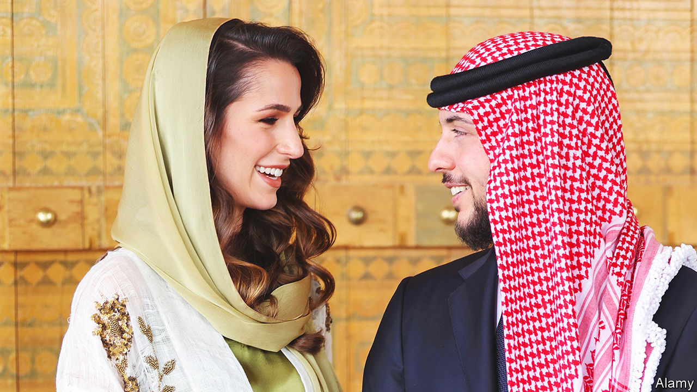

###### A wishful wedding

# Can Jordan fall in love with Saudi Arabia? 

##### Dynastic alliances don’t always last 

 

> May 25th 2023 

When Britain had an empire, Jordan’s King Hussein took British and American wives, among others. Seeking to keep a constituency closer to home happy, his son Abdullah, the present king, married a Palestinian. Now Jordan’s crown prince, another Hussein, is to marry a Saudi architect.

A century ago the Hashemites, who have always occupied Jordan’s throne, were the Middle East’s leading dynasty but later became poor relations to their oil-richer rivals in the Gulf. Some fear that Saudi Arabia under its bearish crown prince, Muhammad bin Salman, better known as MBS, wants to turn Jordan into a kind of fief. Two years ago Jordan’s security courts accused unnamed foreign powers (guess who?) of  with his half-brother, Hamzah, a charge vehemently denied. 

Might the wedding curb MbS’s ambitions, since the bride is related to the Sudairis, an influential clan that has often married into the House of Saud? And might the new alliance encourage the Saudis to pay off Jordan’s grinding debts? The Jordanian royal family, including the crown prince’s mother, Queen Rania, has recently been careful not to display its wealth too showily. The wedding may be relatively modest.

Gulf-watchers will note whether MbS attends. He has scant regard for many of his relatives, having imprisoned a bunch of them. He has a habit of embracing with one arm and casting adrift with the other. Earlier this month he hugged President Bashar al-Assad of Syria on his first visit to Saudi Arabia in over 12 years. Some say he then denied him a private audience and refused to promise any cash to rebuild the devastated country.

One person who cherished Jordan’s link to Saudi Arabia is in jail. For years ran King Abdullah’s court, before moving to the Saudi capital at Riyadh to advise MbS. But after he came back to Jordan he fell out with its regime and was sentenced to 15 years in prison there, allegedly for plotting with Hamzah. King Abdullah may need more than a marriage to make the Saudis more generous. “We’re becoming irrelevant,” laments a Jordanian former official. ■

