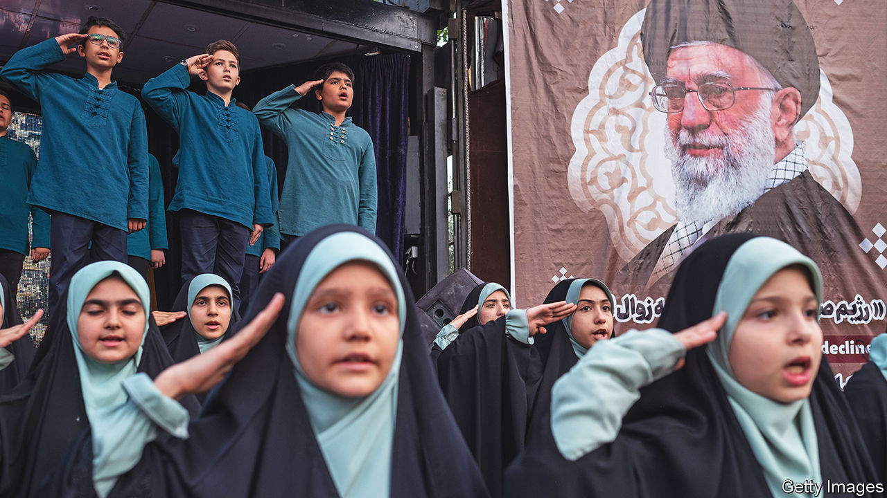

###### Waiting for God’s choice

# Who will be Iran’s next leader? 

##### Nobody knows who might grab the reins of power 

 

> May 25th 2023 

When Ayatollah Ruhollah Khomeini, the charismatic leader of Iran’s Islamic revolution, died in 1989, hundreds of thousands of mourners packed the streets, fearful of what might happen next. Nowadays the mood is very different. For more than six months Iranians have been , chanting death to Ayatollah Ali Khamenei, the founder’s ailing successor as supreme leader. Yet no one knows who might fill his shoes when he goes—or whether the Middle East’s last theocracy will actually survive.

Despite several cancer scares, the 84-year-old may hang on for years yet. But doubts about his health—and the strength of his system, the , or rule of the cleric—are growing. Even religious-minded Iranians have begun to lose faith in theocracy.

The regime is patently unpopular. Elections have long been a charade. Non-alignment in foreign policy looks increasingly phoney as the regime  and Russia. The succession is bound to shake the status quo, says Pejman Abdolmohammadi of the University of Trento in Italy. “It could speed up a full authoritarian takeover or spark a democratic transition.”

On paper the succession should be smooth. As things stand, the supreme leader has the final say on all matters of state, making him far superior to the president, who is elected under undemocratic conditions every four years. The supreme leader, by contrast, is picked by an assembly of 88 clerics. If this turbaned elite is unsure whom to choose, a triumvirate composed of the president, the chief justice and a senior jurist decides and a referendum confirms their choice. In 1989 the triumvirate, including a son of Mr Khomeini, wangled Mr Khamenei, a middle-ranking cleric who was already the president, into the job behind the assembly’s back. A constitutional referendum duly followed. 

Three decades later, Mr Khamenei has shrunk from naming a successor. Meanwhile the regime has been rocked by demonstrations and dissent after the death last September of a young woman in the custody of the so-called morality police. 

The two prime contenders have even weaker religious pedigrees than Mr Khamenei’s. , formerly the chief justice and now an arch-reactionary president, spent a relatively short time studying in seminaries. “He’s only as qualified as a mosque imam,” says Mustafa Fahas, a Shia Muslim academic in Lebanon who monitors events in Iran. Mr Raisi’s father-in-law is an ultra-conservative cleric who, among other things, wants to ban music. This alienates him from most Iranians.

The other front-runner is Mr Khamenei’s second son, Mojtaba. He runs the supreme leader’s office and is close to Hossein Taib, until recently the powerful intelligence chief of the  (IRGC), the regime’s praetorian body. Mr Khamenei junior has lately been hailed on state TV as an ayatollah, the clergy’s highest rank, but has never held an official post and is rarely seen in public. Many regime stalwarts dislike the prospect of a dynastic succession: their revolution was founded on the overthrow of a shah. 

The big new factor, compared with the situation in 1989, is the rise of the IRGC. It now has the whip-hand over the clerics. For three decades Mr Khamenei has built up its power as a defence against his rivals among the clergy—and against the risk of opposition in the street. The IRGC’s membership in parliament has risen from 6% in 1980 (a year after the revolution) to 26% today, according to Chatham House, a think-tank in London, while clerical representation has dropped from 52% to 11%. The clergy used to post clerics to IRGC units; now the IRGC trains its own clerics and posts them to the seminaries, says Ali Alfoneh, an expert in America who wrote a book about Iran’s leadership succession.

As the IRGC has gained strength, many Iran-watchers think its commanders could keep the supreme leader in place but reduce him to a figurehead. It might prefer Mr Raisi as “a useful idiot who fits the bill”, says Saied Golkar, another Iran expert in America. The IRGC could conceivably take charge and junk clerical rule altogether, replacing it with an equally authoritarian alternative. The IRGC may be more pragmatic than the ruling clergy and try harder not to clash with the already disgruntled middle class. In foreign policy, however, it could be just as forceful, dropping Mr Khamenei’s vaunted against nuclear weapons and openly racing to build a nuclear bomb. While continuing to oppose America’s presence in the Gulf, it may nonetheless be more flexible in negotiating with “the Great Satan”.

Some argue that the IRGC could impose a new social contract whereby Iranians would have more freedom to dress, drink and dance as they pleased. Iran might have a female education minister, the first in over 40 years. (An Islamist firing squad killed the last one, in 1980.) Political freedom, however, would shrink still more. 

That process may have begun. The morality police often leave unveiled women alone. But repression against dissent and crime is as harsh as ever. Executions rose last year by more than 80%, to 576. If an authoritarian IRGC regime were to bring back stability while relaxing personal mores, many Iranians might accept it. 

But true reformists would surely bid for a secular civilian system, rather than rule by either the IRGC or the clergy. Earlier this year, a former president, Muhammad Khatami, called for “a fundamental transformation”. A popular former presidential candidate, Mir Hossein Mousavi, broke his silence after 12 years of house arrest to call for a referendum on whether to keep Iran as an Islamic republic. 

Whatever the shape of the transition, it could well be messy. Only one thing is certain, says Mr Fahas, who is close to clerics within the regime. Mr Khamenei will be “the last real ”. In other words, rule by clerics as envisaged by the 1979 revolution’s founding father will be over. ■

