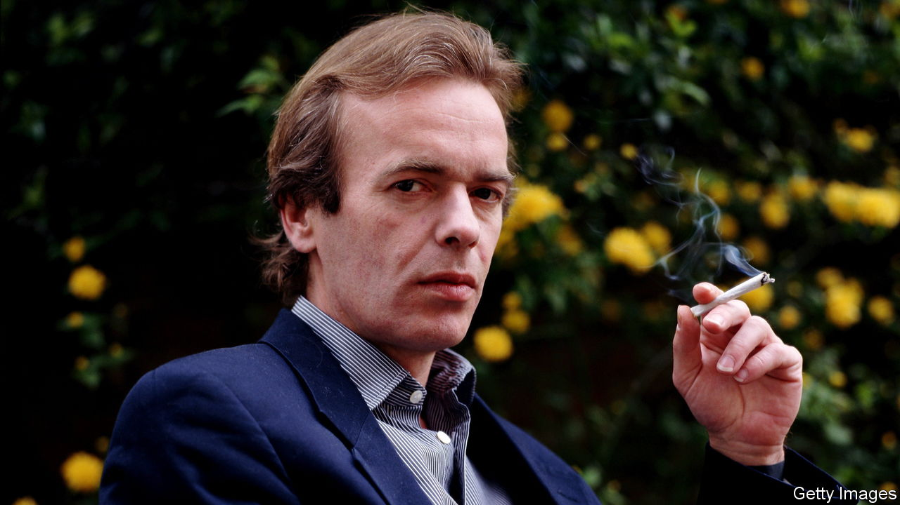

###### L’enfant terrible

# Martin Amis was the lurid chronicler of a whole generation 

##### The novelist, essayist and provocateur died on May 19th, aged 73 

 

> May 24th 2023 

It began with a throb. A recognition of something he had probably buried long ago in his subconscious, which could be exposed now. A calorific infusion, announcing the next novel he had to write. The throb went into his notebook, and when he had set up the morning—a double espresso, then that first cigarette his lungs were sobbing for—he went to his desk to work. 

Eleven til one were his writing hours, in biro on paper for the first draft. With computers there was no provenance, no sense of crossing-out struggle. For much of that time he was apparently doing nothing much: staring at the ceiling, trolling around, picking his nose. He was making himself receptive to shaping the destinies of his characters and himself. Where they would go, he wasn’t sure; once they started creating, he couldn’t stop them. Where the book was going, he hoped, was on a long shelf of titles by Martin Amis, with challenging jackets and good blurbs on their backs. 

 There had been 14 novels, eight non-fiction collections, two volumes of short stories. His first novel, “The Rachel Papers” in 1973, featuring a horny young man’s pre-university adventures, had won the Somerset Maugham award, but after that he was not much garlanded. His books did not unite people, let alone judges. They were verbally prodigious, structurally wayward, profane and often vividly experimental. He might look, and speak, like a shy public schoolboy, but as a writer he smashed plates. 

 He came closest to winning the Booker in 1989 and 1991, but in 1989 two female judges objected to his portrayals of women. True, his main interest was masculinity of the toxic, lowlife, rabidly competitive sort: Lionel Asbo, violent criminal and Lottery-winner, a metaphor for moral decrepitude; ad director John Self in “Money”, “200lb of yob genes, booze, snout and fast food”; or magisterial Keith Talent in “London Fields”, fanatical darts-player and professional cheat. Set against these, his women characters could look tame; but not Nicola Six, also of “London Fields”, with her wardrobe of alluring underwear, her joyful scheming and her unabashed enjoyment of sodomy. He had first seen her as a “murderee”; but as she sat on the sofa with her legs folded seethingly underneath her, she was arranging her murder herself. 

 Real victims were hard to write about. He produced two books on the Holocaust, two on Stalin; in “Time’s Arrow”, about a doctor in Auschwitz, time was reversed so that the doctor, in his own warped mind, restored his patients rather than destroying them. In “House of Meetings” (2006) about Stalin’s gulag, he felt he had not suffered enough to tell the tale. The story itself began to beg him to set it aside, perhaps stop writing altogether; and that very thought so pained him that he managed to finish the book. 

 His father, Kingsley Amis, had been famous for comic novels, but he did not believe that talent was inherited. Their relationship was vexed. At times the Amis franchise was a burden; he suspected that his first novel had been published only out of “mercenary curiosity” to see how the son would compare. He read his father’s books, but his father soon gave up on his, hurling “Money” across the room for “buggering about with the reader”. His father wrote carefully, with hearty guffaws he heard as a child; he himself went headlong into the voice of whichever grotesque had strayed across his path. Yet they were oddly united, father and son, in respect for a good English sentence—as well as jointly believing that writing was a feasible, even fine, way to make a living.

 His father envied him, perhaps. It was the besetting sin of writers. “The Information” detailed the worst horror, a man’s best friend becoming more celebrated than he was. His own inner egomaniac dreaded any blazing talent coming up on his flank, even though he moved in the most sparkling and influential literary set of the 1980s and 1990s—with Ian McEwan, Julian Barnes, Salman Rushdie and “Hitch”, Christopher Hitchens, his closest friend, who still lived for Trotskyist struggle. All were trying to write their own version of Trollope’s “The Way we Live Now”, and he had to believe he was the best at it. 

 The very best, he admitted, were in America, his “Moronic Inferno”: loudmouth Mailer, terrifying Nabokov, “sacramental” Saul Bellow with his stevedore’s shoulders. These men dared to write vast superpower novels about the whole of society. His own smaller efforts were symptomatic of Britain’s decline: its aura of filthy pub carpets, its morbidly obese children, phone booths “slobberingly coated with thick red paint”, London “like the insides of an old plug”. Purpose had been lost along with the empire, and under Thatcher, that old witch, civility and civilisation had fallen apart. Nothing but weak left-liberalism remained to confront the ruins; that, and the scathing onslaught of his prose.

 Yet he did not feel appreciated. In the mid-1990s he was crucified by the press for having asked his publisher, Cape, for an advance of £500,000 for “The Information”. (Cape refused; HarperCollins obliged.) He needed the money for his divorce and to get his awful teeth fixed, the flaw in his good looks; not cosmetic, like a boob job, but essential. In 1995 he left not only Cape but his agent and his wife. Eventually he abandoned England, settling for three years in Uruguay with Isabel Fonseca, his second wife, and then in Florida. In Uruguay he found the quiet life he wanted almost always. It made a striking contrast to the jet-setting party animal of his past: cigarette in hand, Hitch at shoulder, swagger in his look. 

 Increasingly, he fretted about time. In “Time’s Arrow” Dr Unverdorben looked steadily towards the past, away from death. But everyone, with gravid arrest, would find it waiting. It loomed as he slowly added to his shelf of books, the only particle of him that might stand the test of time. He had felt, not far into the 21st century, an outsurge of essence, an anti-afflatus, that signalled the dying of his creative powers. The exit was coming closer, time hurtling like a runaway train. The Zeitgeist had moved on, fast, from the one he knew: the one in which he had strolled leonine towards that throb only he felt, the next novel that could illuminate and eviscerate the age. ■

