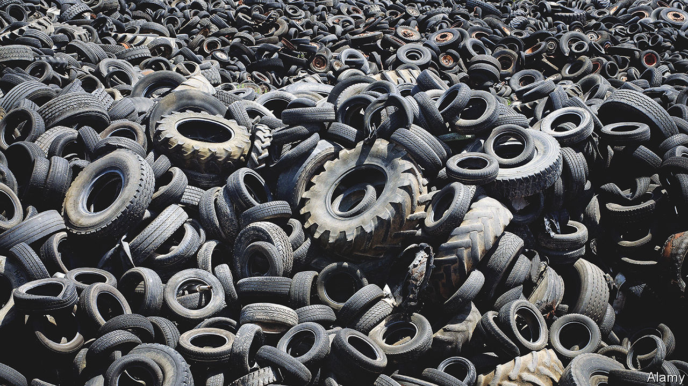

###### Recycling old tyres

# Old tyres can become a climate-friendly fuel 

##### Getting fuel from your wheels 

 

> May 24th 2023 

GETTING rid of old tyres has long been a problem. Every year more than a billion reach the end of the road. Until recently, most were thrown into landfills or piled up in storage yards, which occasionally caught fire. Tougher environmental laws mean many countries now insist tyres are recycled. And they are, sort of. Some of the methods might be better than dumping them, but they are not especially green. 

Energy recovery is one common method. This involves burning tyres in an incinerator to generate electricity, or as a supplementary fuel to provide heat for cement kilns and other industrial processes. But that produces planet-warming pollution. Tyres can be used whole or shredded in construction projects, such as building embankments or repairing roads. There are, however, concerns about chemicals from the tyres leaching out and contaminating the ground. 

Some firms, therefore, have begun exploring an alternative, pleasingly symmetrical idea. Since tyres are mostly made from hydrocarbons, it should be possible in principle to turn old tyres into low-carbon fuel which can be used to run the vehicles they came from. 

One of the most ambitious firms pursuing the idea is Wastefront, which is based in Oslo, in Norway. Later this year the company will start building a giant tyre-recycling plant in Sunderland in north-east England. In a couple of years, when the plant is fully operational, it will be able to turn 8m old tyres into new products, including some 25,000 tonnes of a gooey black liquid called tyre derived oil (TDO).

The process works by deconstructing a tyre into its three main components. One is steel, which is used to brace the structure of a tyre and which can be readily recycled. The second is carbon black, a powdery, soot-like form of carbon used to improve the durability of the tyre. The third is rubber. Some of that will be natural rubber obtained from the sap of rubber trees. Some will be the synthetic sort, which is made in factories from crude oil.

In order to do the deconstructing, the tyres are first shredded and the steel bracing removed. The remaining material then goes through a process called pyrolysis. This involves exposing a material to high temperatures in the absence of air. That causes the rubber to decompose into a mix of hydrocarbon gases, which are drawn off. What is left behind is pure carbon black. 

Once the drawn-off gas has cooled down, a proportion of it liquefies into TDO. The remaining gases, which include methane, are funnelled back around to be burned, fuelling the reactor. This, says Vianney Valès, Wastefront’s boss, creates a closed-loop system that prevents emissions. The overall output of the process by weight is 40% TDO, 30% carbon black, 20% steel and 10% gas.

The carbon black can be re-used to make new tyres. That is of interest to tyre-makers because it helps efforts to become carbon neutral. Producing new carbon black requires the partial burning of heavy oil residues or coal, which produces plenty of greenhouse-gas emissions. 

The recovered TDO is similar to crude oil fresh from the ground, and is well-suited for making diesel. To do that, Wastefront is working with Vitol, a Swiss company that is the world’s largest independent oil trader, and which operates a number of refineries around the world.

While not completely carbon-neutral, diesel made from TDO does produce an 80-90% reduction in emissions of carbon dioxide, the main greenhouse gas, compared with the conventional fuel. The future market for cleaner fuels is likely to remain substantial, even though electric vehicles are steadily replacing those with combustion engines. Fossil-fuelled vehicles will remain on the road for decades to come, particularly large commercial vehicles like lorries, which are harder to electrify and which are big burners of diesel. The fuel will also be needed by trains and ships. So, anything that helps to clean up overall emissions during what will be a long transition to the electrification of transport is useful—especially if it also shrinks a mountainous waste problem. ■


