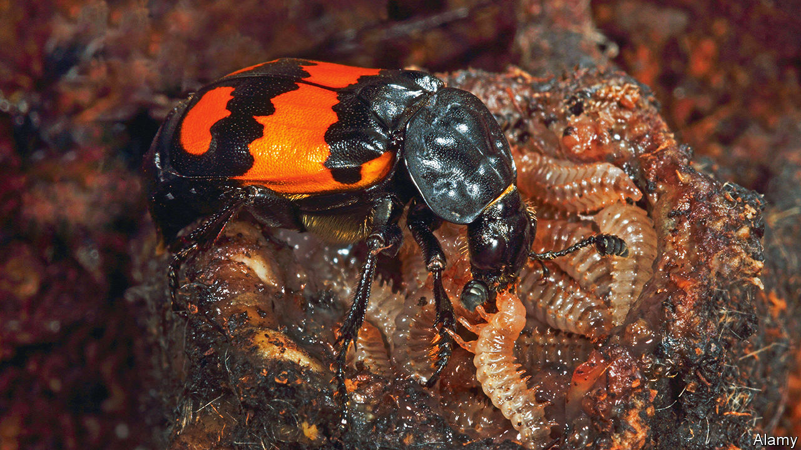

###### Helicopter beetles

# Parenting can be bad for the kids 

##### At least, from a genetic point of view 

 

> May 24th 2023 

Parents often fret about whether they are doing their jobs properly. Take too hands-off an approach and the kids will grow up feral. Smother them with attention, though, and the risk is of raising offspring unable to function on their own. 

Evolution, it seems, faces similar trade-offs. In a paper published in  on May 24th, Rahia Mashoodh and Rebecca Kilner, a pair of biologists at the University of Cambridge, offer an explanation for a curious fact: once a species has evolved to care for its young, the trait is almost never lost again. They argue that parental pampering comes with a genetic price that makes returning to the  difficult.

The price in question is mutations—random changes in an organism’s genome. Some are seriously harmful, and quickly weeded out by natural selection. But many are only mildly deleterious, and do not much hamper an individual’s chances of reproducing as long as conditions are good. With that in mind, researchers have long speculated that doting parents provide exactly the sorts of pleasant environment that allow offspring with mildly damaging mutations to survive when they otherwise would not. 

Testing the theory requires tracking species over many generations. That is tricky, for many species that provide parental care are irritatingly long-lived. Dr Mashoodh and Dr Kilner turned to the burying beetle, which combines parental care with a relatively short lifespan. The beetles breed in the corpses of small mammals and birds, turning them into carefully tended nests and regularly spraying them with disinfectant chemicals to keep them clear of bothersome pathogens. When their young hatch, the parents protect them from predators and feed them bits of the carcass. 

The researchers set up two populations. In one, beetles were raised by doting parents. In the other, beetles hatched out of eggs near a dead mouse but had no parents to make life easier. This split was maintained for 20 generations. 

Drs Mashoodh and Kilner then inbred the resulting descendants. Inbreeding amplifies damaging mutations, and often results in extinction. But the rate at which inbreeding drives a species off the evolutionary cliff varies with how many damaging mutations are present in the first place. 

The population of beetles whose ancestors had been pampered by their parents died out in just two generations of inbreeding. By contrast, beetles that had a history of surviving alone endured for four. That strongly suggests that the hatchlings denied parental care over the course of many generations ended up with considerably healthier genomes than those that had been looked after by mum and dad. 

Parental care, in other words, is a one-way evolutionary street because it generates a problem that only it can solve. That makes going backwards hard. But it is not all bad news. Although most mutations are harmful, the researchers point out that a few are helpful. They speculate that a species full of helicopter parents might expose its young to more of the evolutionary bad—but also more of the good. ■


