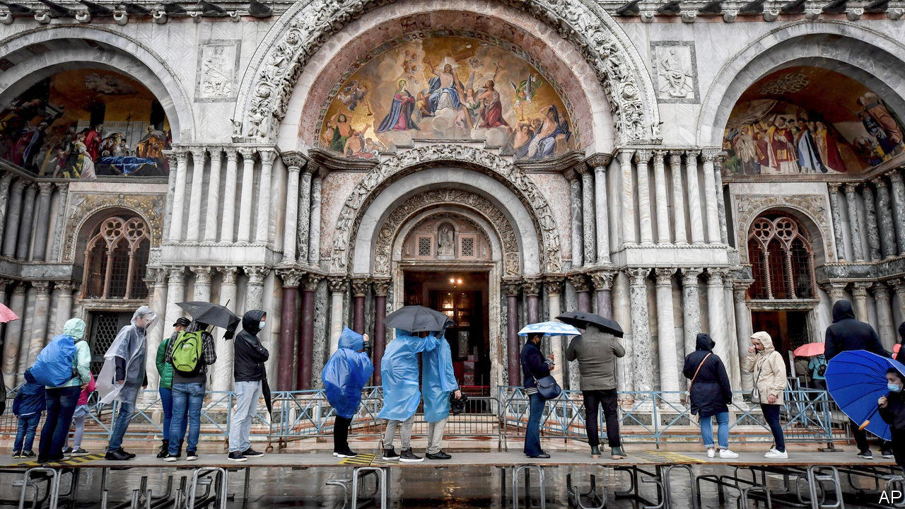

###### Saving Venice

# Why Venetians are pondering raising their entire city 

##### A €5.5bn flood barrier has bought only a temporary reprieve 

 

> May 24th 2023 

The relief in the City of Canals is palpable. For centuries, regular high tides— to the locals—have flowed through , submerging walkways, flooding buildings, and stopping boats from passing under its many bridges. 

For most of the city, at least, that is no longer the case. In operation since last year, after nearly two decades under construction, a giant piece of hydraulic engineering called the Experimental Electromechanical Module—known by its Italian acronym MOSE—now protects Venice and . In a city where waders were as easy to buy as postcards and ice cream, most people can now go about their business without consulting tide charts. Property prices are up, especially for flats and shops on the ground floor.

Or at least, they are for now. Although MOSE is up and running, there are questions about how long the barrier will last. The flood-defence scheme was designed to serve for a century. But Hermes Redi, the director-general of Consorzio Venezia Nuova (CVN), the Venetian engineering consortium that built it, fears that, thanks to a combination of climate change and the gradual sinking of the city itself, its useful lifespan might be just half as long. 

MOSE is made up of 78 hinged steel floodgates that run for 1.6km along the sea floor beneath the three inlets to the Venetian lagoon. When a high tide begins, machines that consume enough electricity to power “a small town”, as a technician puts it, compress air that is blasted into each floodgate. As seawater is forced out, the floodgates rise into nearly vertical positions. The resulting barrier holds back the Adriatic until the tide retreats.

That sinking feeling

For all its technological whizzyness, the system has downsides. Cost is one. Mr Redi reckons each raising of the barrier costs about €150,000 (other estimates are higher). Maintenance costs add up, too. Sand must be cleared from the machinery. Each floodgate is designed to be removed every five years for defouling. Last year, when MOSE was used 36 times, the operating cost was more than €70m ($76m). 

The barrier also disrupts maritime traffic, causing protests from both fishermen and the big container ships that call at Marghera, a busy port in the lagoon. Antonio Revedin of the North Adriatic Sea Port Authority says a delay can cost an individual cargo ship €80,000 a day—though a system of locks, due to come online later this year, should help. 

There are environmental issues, too. Most of Venice’s sewage flows into its canals. As Luigi Tosi, a geologist with Italy’s National Research Council (CNR), puts it, a lagoon that is sealed off too often would become “first a bathtub, then a sewer”. All that means that mose is only used when tides exceed 110cm. That means that some low-lying parts of the city, including St Mark’s square, still flood.

Rising sea levels will make those downsides more apparent as the barrier is raised more and more frequently. One paper, published in 2021, predicted a rise in water levels of between 32 and 110cm in the Venetian lagoon by 2100, depending on how sharply the world cuts its carbon emissions. 

What is needed, then, is a plan to extend the system’s life. Dr Tosi is among those who think that seawater could be the answer as well as the problem. They propose to pump seawater underground, and in doing so to raise the land. That may seem outlandish but, in principle, it is merely the reversal of something that has already happened. Between the 1940s and 1970s the extraction of groundwater for use by industry caused Venice to sink by about 15cm. Pietro Teatini, a hydraulic engineer at Padua University, points out that there is precedent from the oil-and-gas industry, which has shown that storing gas in underground reservoirs can lift the land above.

The area’s geology is promising. Its sandy subsoils should be relatively expandable. Those sandy layers are capped with watertight clay which would prevent injected seawater seeping upwards to contaminate freshwater aquifers. 

Giuseppe Gambolati, a semi-retired hydraulic engineer at Padua University, thinks it should be possible to achieve a rise of 25cm across the entire city within a decade. His proposal calls for drilling three test wells. If those reveal no show-stopping problems, then the full job would involve a dozen wells 600 to 800 metres deep around the city. Dr Gambolati reckons the city could be raised for something like 2% of MOSE’s €5.5bn construction cost. Maintaining the uplift, by continual pumping of water, might cost 5% as much as the flood barrier’s operating expenses. 

For now seawater injection remains just an idea. But if something is not done, then the rising waters may eventually force more drastic changes. Dario Camuffo, who studies both the environment and Venice’s cultural heritage at cnr, says one option would be simply to abandon the city’s ground floors. Raised pavements could allow people to enter buildings on the storey above. Another, he says, is that prized structures might be taken apart for reassembly elsewhere. Mr Redi worries that Venice’s lagoon may need to be permanently cordoned off from the sea with a dyke. For a city proud of its maritime heritage, that might be seen more as a humiliation than an adaptation. ■


