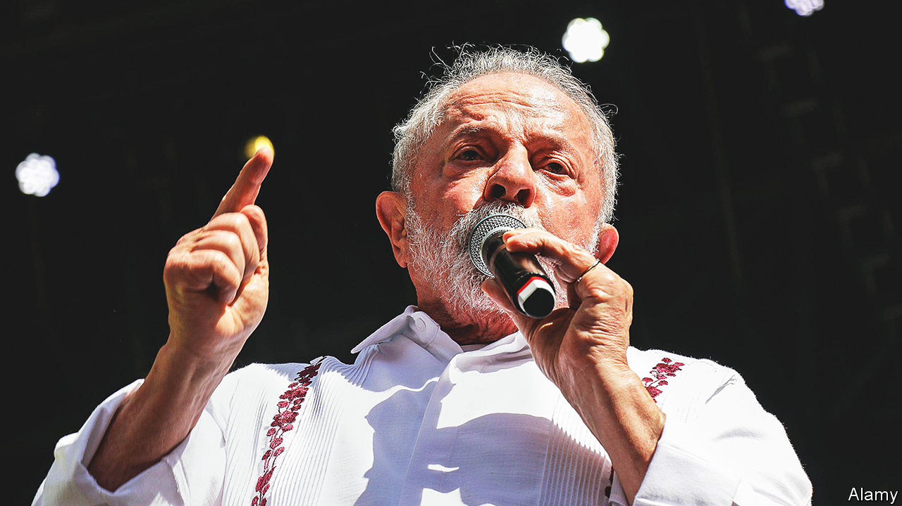

###### A power struggle

# Lula wants to purge Brazil of Jair Bolsonaro’s influence 

##### He faces resistance from evangelicals, gun owners and big tech 

 

> May 25th 2023 

Luiz Inácio Lula da Silva, Brazil’s new left-wing president, has a tricky job ahead of him. The country is more polarised than at any time since its return to democracy in 1985. In January supporters of Jair Bolsonaro, his right-wing populist predecessor, stormed Congress, the presidential palace and the Supreme Court in Brasília, the capital. They did so to try to overturn the election result, in which Lula (as he is known) won by just 1.8 percentage points. Fully 39% of those polled still think that the election was rigged; younger Brazilians are particularly prone to support the former president. The parallels with the United States are uncanny. But Lula wants to ensure that, unlike Mr Bolsonaro’s idol Donald Trump, his predecessor cannot make a comeback. 

In his first few months in office Lula has tried to overturn Mr Bolsonaro’s programme. He prevented ten state-owned enterprises from being privatised. He also repealed policies which pandered to Mr Bolsonaro’s base, including expansive new gun decrees. In February he suspended new gun permits and introduced a deadline of May 3rd for gun owners to register their firearms or have them confiscated. On April 30th Lula’s allies in Congress announced they would put forward legislation to curb online disinformation, which Mr Bolsonaro is being investigated for spreading. The law would force tech firms to remove fake news or face fines of up to 10% of their revenues in Brazil.

Similarly, on May 3rd Mr Bolsonaro’s home was raided by police over allegations that he falsified his covid-19 vaccination certificate. He is being investigated in another two dozen cases. He denies all wrongdoing. Lula has also dismissed 189 federal-government soldiers for failing to prevent the riots in January.

But his desire to purge Brazil of his predecessor’s Trumpist legacy faces several problems. For a start, Mr Bolsonaro can still count on a band of ardent supporters. An inquiry into the January riot is due to begin soon in Congress. Two-fifths of Brazilians do not think Mr Bolsonaro played any role in the attack, as Lula suggests. 

Second, Mr Bolsonaro’s supporters are unlikely to respond well to attempts to change the status quo. Take gun owners. The right-wing president passed at least 32 decrees to allow Brazilians to buy more guns. The number of outstanding permits granted to buy firearms increased from 117,000 to 695,000 during his four-year term. Many gun owners are not going to give them up easily: over 6,000 people failed to register their weapons by the deadline. Marco Aurélio Carvalho, a lawyer who helped formulate Lula’s gun policy, admits that registration is just the first step and more could be done, such as encouraging owners to sell their guns.

And Lula’s attempts to regulate social media have brought disparate groups together to oppose it. On May 2nd the president’s allies were forced to postpone a vote on the bill, after failing to gather congressional support for it. Many worry that the bill curtails free speech. Conservative types are against it, not least as it could incriminate Mr Bolsonaro. Two days after the attack on Congress, Mr Bolsonaro posted and quickly deleted a video claiming the election was fraudulent (he later told police he had uploaded the post by accident). 

Tech companies and evangelical Christians also oppose the bill. Google altered its search-engine results so that news articles which opposed the bill would appear at the top of the page, according to a study by the Federal University of Rio de Janeiro. In response, antitrust regulators opened an investigation against the company at the request of a senator who is a Lula ally. Evangelicals fear that it will prevent them from posting passages of the Bible that could be considered homophobic. 

Even some supporters of stricter regulation rejected certain points of the draft, such as one which would have given immunity to legislators who spread falsehoods online. Critics also feel that the bill could give the courts too much power. Last year the Supreme Court ordered the removal of thousands of social-media posts, mainly by . It ordered the police to raid the homes of eight businessmen after some joked on WhatsApp that they would support a coup to keep Mr Bolsonaro in power. 

The final problem for Lula is that his predecessor managed to reshape aspects of the Brazilian state. Mr Bolsonaro’s party, which controls nearly a fifth of Congress, will probably water down any version of the fake-news bill. The public security caucus, made up mostly of pro-gun congressmen, has swelled from 25 legislators across both houses in 2018 to 37 today, out of a total of 594 representatives. Mr Bolsonaro’s heirs still wield power. In April one of his sons, Flavio, a senator, proposed a bill that would loosen gun restrictions again. 

Jair’ll be back. Maybe

Even if a fake-news bill is eventually passed, it will be hard to control what Brazilians post online. In the United States, viral posts spread on Facebook and other platforms, the content of which can be easily analysed. By contrast, in Brazil it circulates on encrypted messaging groups like Telegram which are harder to access, says David Nemer of the University of Virginia.

All this means that ridding Brazil of Mr Bolsonaro’s influence will not be easy. With one exception. Under American law, Mr Trump can run for the presidency next year even if he is convicted in one of six inquiries investigating him for alleged wrongdoings. In Brazil Mr Bolsonaro would become ineligible for office for eight years if convicted in one of the 15 criminal probes pending against him. ■

