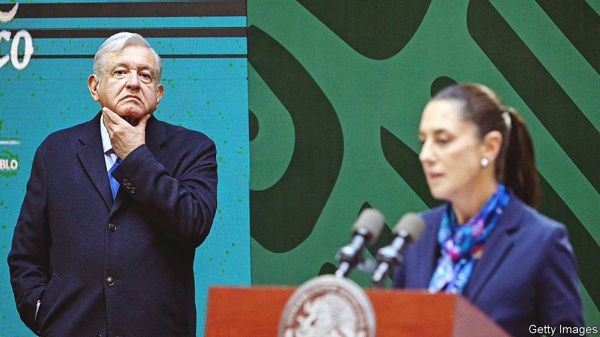
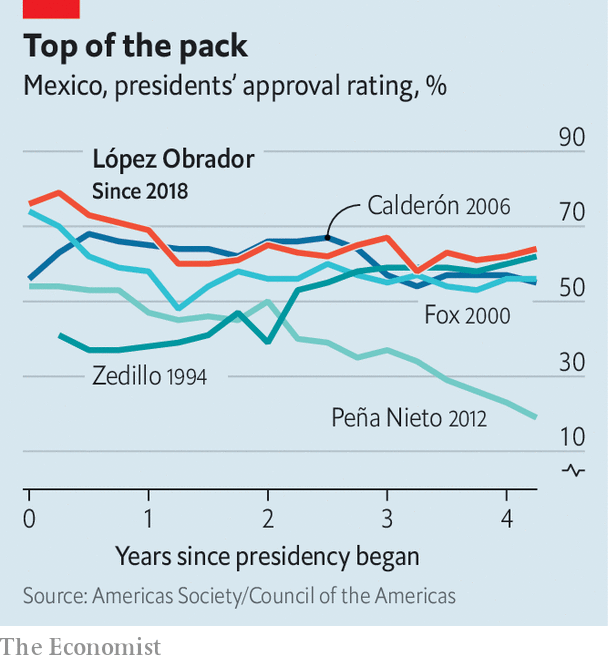
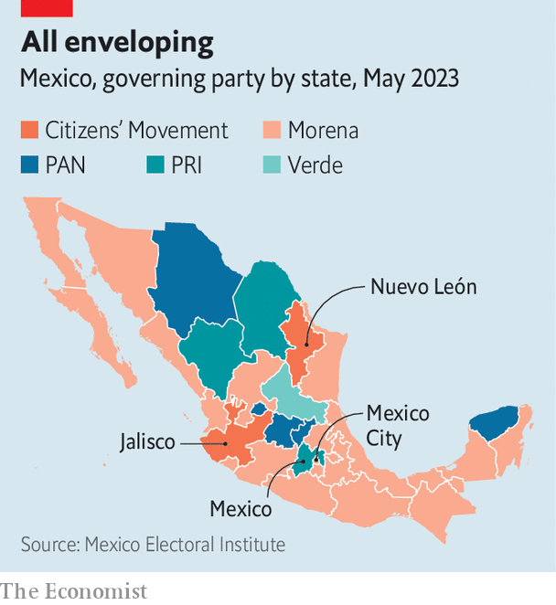
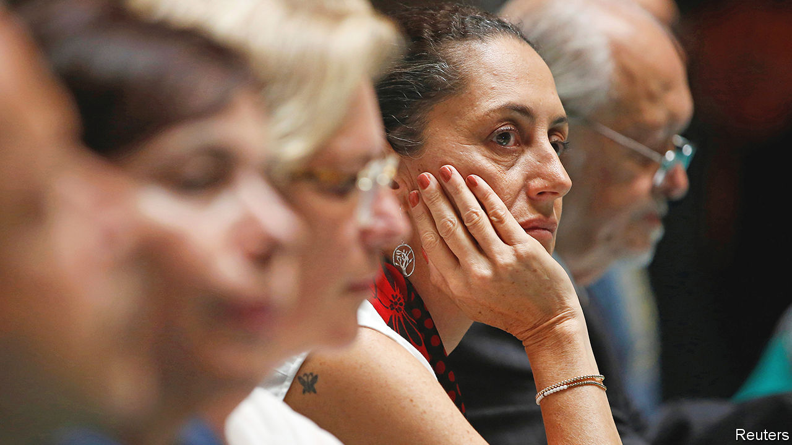

###### The race to succeed AMLO

# Mexico could elect its first female president next year 

##### Will Claudia Sheinbaum be overshadowed by Andrés Manuel López Obrador? 

 

> May 23rd 2023 

On June 4th voters in the state of Mexico, the most populous in the country of the same name, will elect a new governor. The vote is widely seen as a testing ground for general elections due next year. Delfina Gómez, a former education minister, is polling far ahead of her rival. If she wins, it will suggest her party, Morena, is well positioned for next year’s polls. Morena was founded by Andrés Manuel López Obrador, Mexico’s leader. He cannot run again. As a result the presidential vote next year could see another woman win big: Claudia Sheinbaum, the mayor of Mexico City. She would be the first female head of state. But she could struggle to shake off the legacy of Mr López Obrador, her mentor.

When Mr López Obrador won the election in 2018, with 53% of the vote, it appeared to mark a sea-change in Mexican politics. For decades the country had been dominated by the Institutional Revolutionary Party (PRI), a centre-right party that ruled Mexico for 71 years until 2000. Opposition had been provided by the National Action Party (PAN), a conservative group that held the presidency for two terms from 2000 to 2012, and the Party of the Democratic Revolution (PRD), a left-wing outfit. By 2018 many voters fed up with the status quo felt hopeful that Mr López Obrador could deliver change. He promised to end corruption, reduce inequality and tackle gang violence. 

Once in power Mr López Obrador began executing his political project, a contradictory mix of policies he grandly calls the “Fourth Transformation”. They combine a penchant for 1970s-style nationalism with fiscal hawkishness. Although the president’s rhetoric sounds left-wing, his policies are a more complicated mix. He did away with Mexico’s health-care system for the uninsured, scrapped child-care subsidies for working mothers and canned a conditional cash programme for the poor. 

His main instinct is statism. The president boosted the state oil and electricity companies at the expense of clean energy, including by building a new oil refinery. He also wants to nationalise Mexico’s lithium. He handed sweeping power to the armed forces, and has tried to undermine the Supreme Court and the electoral body. On May 19th he expropriated a railway from Grupo México, a mining company. On May 24th Citigroup, an American bank, announced it would abandon a deal to sell Banamex, a Mexican retail bank, to Grupo México. It was unclear if Grupo México had pulled out because of the expropriation, or if Citibank had decided not to go ahead because of frequent comments made by the president in public about the sale.

 


Despite this ideological ragbag of policies, the president is popular. Fully 65% of survey respondents approve of him. That is higher than any recent Mexican president at a similar point in their terms (see chart). Many investors are put off by Mr López Obrador. But the country is faring better than other countries in Latin America, such as Brazil. Its proximity to the United States helps, making it a beneficiary of “friend-shoring”, as do Mexico’s 13 trade agreements with 50 countries.

Ms Sheinbaum is not the only contender to be Morena’s candidate for the presidency. Her closest rival is Marcelo Ebrard, the foreign minister. He is “the firefighter-in-chief” for Mr López Obrador’s government, says someone close to him. His ministry leads talks with the United States on everything from migration to energy. After Mr López Obrador initially refused to condemn Vladimir Putin’s invasion of Ukraine, it was Mr Ebrard who reassured President Joe Biden’s administration that Mexico remained an ally. His diplomacy also ensured that Mexico received vaccines during the pandemic. Until recently, he was better known among Mexicans than Ms Sheinbaum.

However, Ms Sheinbaum enjoys a widening lead over Mr Ebrard. Opinion polls place her eight percentage points ahead of him. It helps that she is the president’s preferred candidate. For several months Morena’s activists have plastered signs declaring “Es Claudia” (“It’s Claudia”) across the country—possibly in violation of Mexico’s strict campaign laws. 

Her nomination seems assured. Mr López Obrador says Morena’s candidate will be decided by two surveys this summer. But concerns abound about their fairness, such as over which company will run them and what questions the public will be asked. Many worry, including some within Morena, that the process will be akin to that under the PRI, when the leader chose his successor, a process known as the , or big finger. “This is the  in disguise,” says Mariel Ibarra, a journalist. 

A tricky inheritance

But Ms Sheinbaum is a competitive figure in her own right, too. Mayors of Mexico City enjoy national prominence because they govern 7% of the country’s 126m people, who generate 15% of its GDP. For the most part she has done a good job. On her watch murders almost halved between 2018 and 2022, compared with a national fall of 8%. She has attempted to clean up the state police force by paying them a decent wage. In a country where politicians are dogged by allegations of graft, she is seen as clean. 

Ms Sheinbaum tends to take a rational approach to policymaking. Unlike the president, she surrounds herself with competent people and is willing to take advice. During the pandemic she quietly distanced herself from Mr López Obrador, relying on data, masks and free tests to control covid-19 while he declared, mask-free from his pulpit, that there was no need to worry. (Mexico’s absolute death toll was among the highest in the world.) Over the past five years her administration has built centres around the capital to help poor people to study and to access services.

Assuming she secures the candidacy, the election looks like Ms Sheinbaum’s to lose. In 2018 the three main opposition parties (the PRI, PAN and PRD) formed a coalition known as Va por México. The coalition is running again, but no one contender has emerged, while their main message is that they are not Morena. “We need to do more than be the option that voters hold their nose to vote for,” says Fernando Belaunzarán, a former PRD lawmaker. 

 


Citizens’ Movement, a left-wing party that holds the governorships of Jalisco and Nuevo León, two important states, has a well-liked figure in Luis Donaldo Colosio, the son of a popular reformist PRI presidential candidate who was murdered in 1994. However, he has said he will not run. Mr Ebrard would be competitive were he to break with Morena, but few reckon he will.

If Ms Sheinbaum becomes president, how different would she be from her mentor? So far, she appears to be sticking fairly closely to Mr López Obrador’s contradictory ideology. It is hard to imagine that the mayor, who holds a doctorate in energy engineering, agrees with the president’s approach of favouring the national oil and power companies over clean and cheap power. But she has defended this signature part of the president’s platform. Similarly, Ms Sheinbaum has blamed “neoliberal” economic policy for Mexico’s inequality and criticised the electoral body. She may be tempted to follow Mr López Obrador’s lead and boost social handouts that buy loyalty but do not solve poverty.

Some policies would be hard to reverse. Mr López Obrador has deepened the involvement of the armed forces in fighting crime. He has also handed over 70 civilian functions to them, according to a study by Mexico United Against Crime, an NGO. Soldiers now control the ports and customs facilities, and will build, run and keep the profits from airports and a new tourist train. Ms Sheinbaum is unlikely to be able to remove these privileges, even if she wanted to. But she has also used the same playbook: she deployed the National Guard, a notionally civilian organisation that has replaced the federal police, to help run Mexico City’s subway system after several crashes in 2021, to the outrage of subway workers. 

 


It is doubtful, however, that Ms Sheinbaum will continue Mr López Obrador’s attempts to undermine the Supreme Court. Partly that is because she will not enjoy his political strength. She will find it harder to lead Morena, which is more a fan club for Mr López Obrador than a political party. She is also likely to preside over a more divided Congress: analysts predict 2024 will mirror midterm elections in 2021 when Morena lost ground, including its coalition’s congressional supermajority. 

Heir today, gone tomorrow

It is also a matter of personality. Ms Sheinbaum is nowhere near as inflammatory as her boss, who takes aim at critics from hours-long daily press conferences. She is a “very different figure” from the president, says Patricia Mercado, a senator for Citizens’ Movement. Even so, some worry that Ms Sheinbaum will merely be Mr López Obrador’s proxy. The president says that he will retire to his ranch after stepping down at the end of 2024. But if Morena were to somehow win a supermajority in 2024, he has pledged to use his last month in power, when his successor is president-elect, to pass constitutional reforms that have already been rejected by the Supreme Court. Whether or not he remains on the political scene, his influence on Mexico will be felt for years to come. ■

