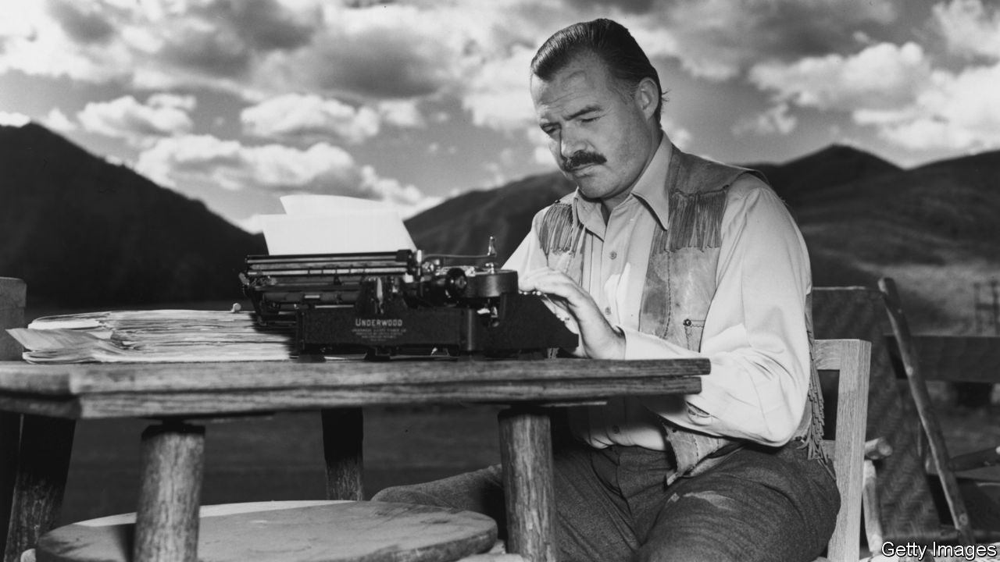

###### Spies and scribes

# The spy who read me: authors under surveillance 

##### The books that show espionage agents are not the most subtle literary critics 

 

> May 24th 2023 

ERNEST HEMINGWAY thought his phone was tapped. Doris Lessing reckoned that British spies were following her every move. Claude McKay suspected that the FBI was monitoring his travel in Europe. Their instincts were right. During the 20th century intelligence agencies in Britain and America spent countless hours investigating “dangerous” authors. This was in part an alternative to censoring or  the work of troublesome writers, which dictatorships do more readily than democracies. The literary snooping eased up, though did not cease, after America won the cold war. Writing by novelists and essayists came to seem less dangerous and files on them became thinner. 

Most snoops are not very good readers. They sometimes get basic facts wrong. In one file MI5, Britain’s domestic-intelligence agency, adds an extra “e” to “Orwell” (spelling it “Orewell”) and mistitles his book “Down and Out in Paris and London” as “A Down and Out in London and Paris”. The FBI’s assessment of McKay, a important figure in the Harlem renaissance, is true but unenlightening: he “is apparently a poet, or at least he has written considerable verse”. One FBI agent describes James Baldwin, an American writer, as “white… 6’, neat”. (He was black and five foot six.) Some investigations last a few dull days. Others take decades. Here are six of the best books by and about authors under surveillance. They show how the security state watched, read and sometimes influenced writers whose approaches to literature ranged from modernist to postmodernist and whose ideologies stretched from libertarianism to communism. 

By JPat Brown, B. C. D. Lipton and Michael Morisy. 

J. Edgar Hoover, director of the FBI from 1924 to 1972, assumed that left-leaning writers were radicals and communists. His agents snooped on American authors from Allen Ginsberg to Susan Sontag. They listened in on phone calls, followed writers to meetings and spoke to their associates. Sometimes agents read and annotated their books. They targeted authors who were socialists, civil-rights activists or critical of the government, or who had friends with those attributes. This volume explores the intelligence files of 16 prominent writers, acquired with freedom-of-information requests. The documents are reproduced in facsimile—typewritten, stamped and scribbled on. JPat Brown and his co-editors provide context and close readings of the files. Readers learn that Ray Bradbury, who wrote “Fahrenheit 451”, a novel that condemns censorship, had no idea why the FBI was watching him. Hemingway, on the other hand, knew that he was being followed and once drunkenly called the FBI Nazis and cowards. “Writers under Surveillance” shows how state surveillance worked in mid-20th-century America. It is vital, the editors argue, that the public learn about the agency’s literary espionage, which probably continues today. 

By Ernest Hemingway. 

For 40 years FBI agents followed and read Hemingway. A newspaper clipping in his FBI file suggests that “For Whom the Bell Tolls”, his novel about the Spanish Civil War, published in 1940, was “so miserable, so slanderous, that it met with excellent reception among the Fascists, the Trotskyists and the Munichists [appeasers of Hitler]”. The FBI saw the novel as sympathetic to the Republicans who were fighting Spanish fascism, and therefore to Stalinism. Its themes—such as treason and extramarital sex—unsettled the conservative Hoover. But he eventually dismissed the charge that Hemingway was a communist. In a short note Hoover wrote, “Knowing Hemingway as I did, I doubt he had any communist leanings.” Some scholars have interpreted his dogged interest in Hemingway as revenge for something the novelist said or did while he was working in the service of the American government in pre-revolutionary Cuba (ironically, just after “For Whom the Bell Tolls” was published). 

By William J. Maxwell. 

Almost half of the writers in “The Norton Anthology of African American Literature” were anthologised in FBI files. “F.B. Eyes” describes the bureau as “perhaps the most dedicated and influential forgotten critic of African American literature”. In some 14,000 pages of files its agents delved into the socialist politics of some black authors and dwelled on the supposed dangers of African-American activism. The FBI sent an agent to see an early staging of Lorraine Hansberry’s “A Raisin in the Sun”, about a poor black family in Chicago. He filed a surprisingly sensitive review, offering a droll commentary on its characters and confirming that it contained “no comments of any nature about Communism”. The book also records black authors’ creative responses to their spy-readers. William Maxwell contends that McKay’s restless sentences, Baldwin’s exasperated tone and Richard Wright’s sardonic analogies were in part reactions to the agents who not only read their books but followed them to their homes and stopped them at state borders. Both the agency and its targets were energised by their fear of and respect for one another.

 By James Baldwin. 

Hoover is “history’s most highly paid (and most utterly useless) voyeur”, quips Baldwin in this book-length essay from 1976, which surveys racism in American movies. The author’s own surveillance record seems to bear him out. FBI snoops trailed and photographed him from 1960 to 1973. They labelled him “a pervert” (because he was gay) and “a communist” (because he signed a petition sponsored by the Fair Play for Cuba Committee, a leftist group). The files they compiled are sloppily written, full of spelling mistakes, terrible grammar and repetition. Hoover added Baldwin to his “Security Index”, a list of citizens who were a threat to the state and who, in a state of emergency, would be the first to be arrested. The surveillance took a toll on Baldwin. He wrote less than he normally did during those years, all the while promising to blast Hoover “to the wall” in an exposé, which he never finished. His witty musings on Hoover in this collection hint at the acerbic insight such a book might have provided. 

By James Smith. 

Britain’s domestic intelligence agencies kept secret records on many left-wing writers after the first world war. James Smith has written a comprehensive account of the clandestine surveillance of British literary culture, which encompassed artists from W. H. Auden, a poet, to Joan Littlewood, a theatre director. Mr Smith describes how MI5 intercepted their letters, followed their families and recruited their close friends to be informants. Especially fascinating is the relationship between the agency and Arthur Koestler, a Hungarian-born author who became disillusioned with communism and did a spot of clandestine work himself for the British government during the cold war. His dealings with MI5 involved mendacity and blackmail by both sides. Mr Smith sometimes plods like the agents he writes about. His advice to MI5’s reluctant literary critics, though, is sound: to know a writer, don’t listen to their phone calls, read their books. Although his book sometimes lapses into unfounded speculation and tiresome abstraction, it is well worth reading. 

By George Orwell. 

MI5 and Britain’s India Office were not the Thought Police. The British prime minister was hardly Big Brother. Yet the surveillance from 1936 to 1951 of George Orwell, who called himself a democratic socialist, helped inspire those terrifying inventions. It was sporadic and cursory, gathering less than 40 pages of material all told. The India Office took an interest in him when he was offered a job as an assistant editor of , an Anglo-Indian newspaper in Lucknow. Despite their mistrust, agents didn’t uncover any evidence that Orwell was a communist. (Indeed, he was a fervent foe of Stalinism.) The India Office quickly lost interest when Orwell withdrew from the job on medical grounds. His MI5 file—glib, repetitive and often scribbled with red ink—refers to his “bohemian fashion” and “many Indian friends”. It is evidence to support Orwell’s dim view of the police: “the policeman who arrests the ‘Red’ does not understand the theories the ‘Red’ is preaching”, he wrote in an essay published in 1941. The Thought Police of “Nineteen Eighty-Four” are less hapless and far more sinister. Yet they owe something to the snoops who followed him around. 


Our recent coverage of espionage includes an article about how the war in Ukraine has  of Russian spies. China’s spies know how to hack and harrass dissidents but in other areas they have .  we explain why companies need to take corporate espionage more seriously. As  from 2016 points out, scribes sometimes become spies, which isn’t surprising because they have much in common. Read  that explain how espionage and intelligence work. ■

