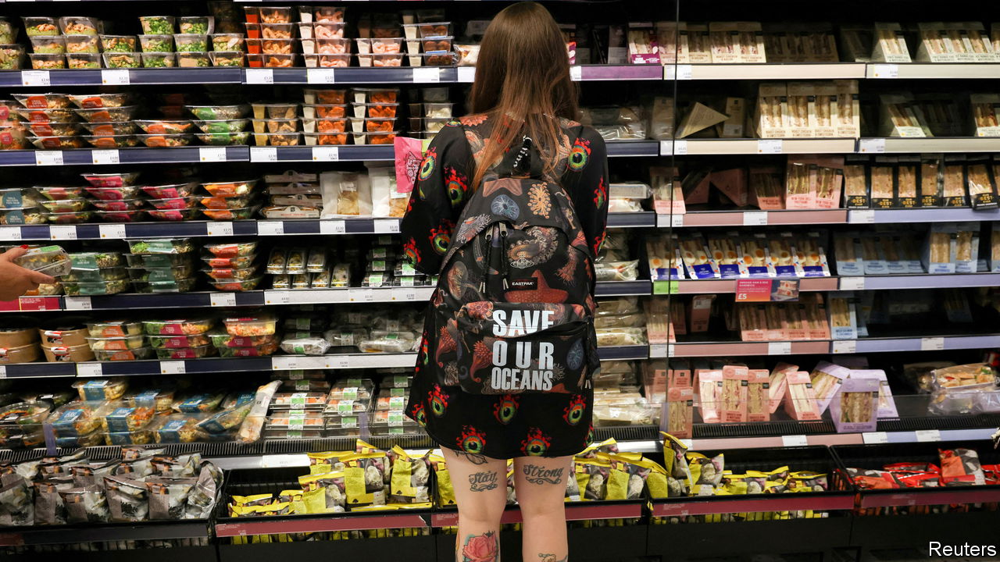
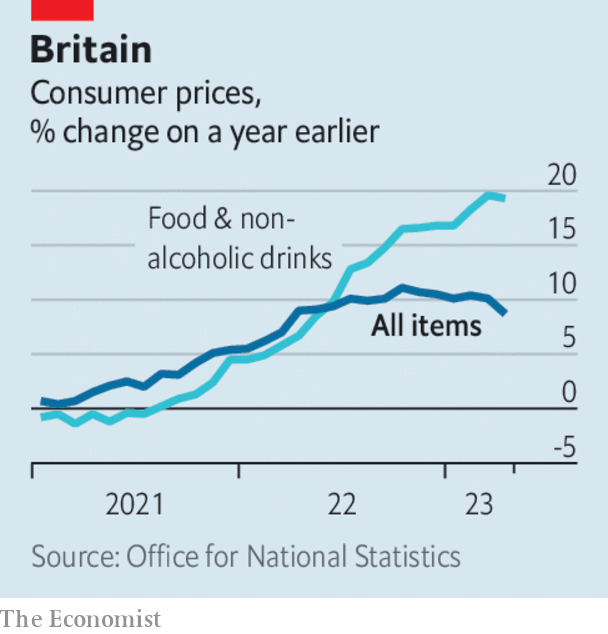

###### The world this week

# Business 

#####  

 

> May 25th 2023 

 


Britain’s headline rate of annual  fell sharply in April, to 8.7%. But the fall was less than expected, given that last April’s rise in energy prices dropped out of the annual comparison. The core rate of inflation, stripping out energy and food, rose again to 6.8%; food prices were up by 19.1%. The yield on British government bonds jumped as markets bet that interest rates would increase further. Earlier, Andrew Bailey, the governor of the Bank of England, admitted that there are “big lessons to learn” from the failure of the bank’s economic models to predict the persistence of high inflation. 

An updated estimate of   in the first quarter showed the economy shrinking by 0.3% over the previous three months. That means that Germany is technically in a recession, as the economy contracted by 0.5% in the fourth quarter of 2022. 

The European Union slapped a €1.2bn ($1.3bn) fine on , the owner of Facebook, for breaching rules on the transfer of personal data from the EU to America. It is the biggest penalty imposed by the EU on a company for privacy violations. The decision gives Meta six months to stop processing data in America that it holds on EU citizens. Meta described the actions as “unjustified” and said it would appeal against the fine. 

 banned memory chips made by , an American company, from being used in the country’s infrastructure development, a tit-for-tat move in response to America’s prohibition on Chinese technology. China claimed Micron’s chips “posed significant security risks”. America has  to dissuade Samsung and SK Hynix, which make similar chips to Micron, from filling the gap in the Chinese market that will be left by Micron’s absence. 

 filed a lawsuit against Montana for its decision to ban the social-media app, the first statewide prohibition of TikTok in America. The Chinese firm argues that the ban is unconstitutional, and that Montana’s claim that TikTok shares data with the Chinese government is based on “unfounded speculation”. 

announced an agreement in which , a big American maker of semiconductors, will supply 5G components for the iPhone. Sensitive to claims that it relies on China for the assembly of its devices, Tim Cook, Apple’s chief executive, said that all “of Apple’s products depend on technology engineered and built here” in the United States. 

China overtook Japan as the world’s  in the first quarter, mostly because of its expanding production of electric vehicles. China exported more than 1m vehicles in total during the three months, compared with Japan’s 950,000. 

Lady Luck smiles again

There was more evidence that  is on the rebound from covid and a crackdown on betting by the authorities. Galaxy Entertainment, which owns hotels and casinos in the Chinese territory, said its net revenues were 72% higher in the first quarter than a year earlier. Other resort operators have reported similar results. Macau’s casinos are now focused on catering to ordinary punters, rather than the high rollers who attracted the ire of officials. 

Citigroup abandoned plans to find a buyer for , a bank chain in Mexico that it bought in 2001, and will instead spin off the business in an IPO, probably in 2025. 

 annual general meeting was seriously disrupted by climate-change protesters. Led by green investors, 20% of the shareholders present rejected the company’s energy-transition plan, claiming its timetable for reducing fossil-fuel production is too slow. 

Facing what it described as “volatile circumstances”,  removed some products related to LGBT pride from its stores. The retailer said that in some cases customers have confronted staff over the merchandise. The pride range includes books aimed at young children with titles such as “I’m Not a Girl” and “The Pronoun Book”. 

 was wound down, less than two months after filing for bankruptcy protection. A sale of the rocket-launch company’s assets fetched just $36m, around 1% of the $3.7bn it was valued at when it floated on the Nasdaq stock exchange in 2021. 

The terminator

 began its long-trailed crackdown on sharing passwords. The streaming giant sent emails to subscribers in 100 countries reminding them that only one household can watch Netflix on a single account. Viewers will get prompts when they tune in; those who share passwords outside the household will be booted off. The decision to get tough now has nothing to do with the company’s PR naming Arnold Schwarzenegger as a new “chief action officer”. 

