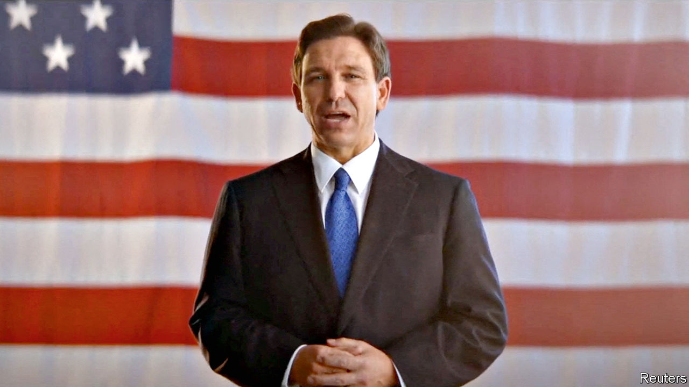

###### The world this week

# Politics 

#####  

 

> May 25th 2023 

 launched his campaign for the Republican presidential nomination. The governor of Florida made his announcement in an audio conversation with Elon Musk on Twitter, though the event was marred by technical glitches for the first 20 minutes. Mr DeSantis said he would revitalise America and criticised Joe Biden for being woke; as governor Mr DeSantis has made a point of clashing with the left on gay issues and identity politics. He didn’t mention Donald Trump, who holds a big lead in the Republican race at this early stage. 

Swimming with the current 

Seven states in the American west reached an agreement to protect the sustainability of the , which provides water and electricity to 40m people. Described as “historic” by the White House, the deal will see Arizona, California and Nevada reduce their intake of water from the Colorado river system. 

America signed a security pact with , a deal that seeks to counter the rise of Chinese influence in the Pacific. The prime minister of PNG, James Marape, tried to reassure domestic critics that America would not be allowed to launch “offensive military operations” from his country. The pact was signed at the US Pacific Islands Forum. Joe Biden had to miss the event, as he continued haggling with Republicans in Washington over the federal-debt ceiling. 

In separate negotiations America signed agreements with  to expand economic assistance to the Pacific island nation. The State Department said the deal would “support freedom, security, and prosperity in the Indo-Pacific”. 

The opposition won a general election in . According to preliminary results the National Congress for Timorese Reconstruction took 42% of the vote, increasing the chances that Xanana Gusmão, its leader and a war hero during the country’s resistance to Indonesian rule, will return as prime minister. The legislature makes that appointment. 

It emerged that Alejandro Encinas, a  official close to President Andrés Manuel López Obrador, had his phone hacked by Pegasus, a type of spyware. Pegasus has been deployed in Mexico before, but Mr López Obrador had said he would stop its use. Yet the armed forces continue to spy on human-rights campaigners. Mr Encinas was hacked last year while investigating the armed forces’ role in the disappearance of 43 students in 2014.

An internationally monitored ceasefire in , due to last a week, lessened the intensity of the civil war, though violence persisted here and there. The UN said that 60,000-90,000 people had fled into Chad from Sudan’s western region of Darfur, where fighting has been especially fierce. 

The secretary-general of the ruling African National Congress said that  risks becoming a “”, causing business leaders to lament the state of the economy more forcefully than ever. 

The trial of Ousmane Sonko, a opposition leader accused of rape, resumed. He was absent, denouncing the trial as politically motivated. If found guilty, he would almost certainly be ruled out of running in the presidential election due next February. 

Over a hundred green-minded members of the European Parliament and the American Congress called for the designation of Sultan al-Jaberas as head of the coming COP28 climate conference in the  to be rejected. He is CEO of the Abu Dhabi National Oil Company. 

Net migration exceeded 600,000 in  last year, a record figure. The number was boosted in part by arrivals from Ukraine and Hong Kong. The news is a big embarrassment for the Conservative government, which for years has been promising to 

reduce migration. 

Sinn Féin, the main republican party in , claimed victory in local elections, and now has the most council seats. Michelle O’Neill, Sinn Féin’s provincial leader, called on the Democratic Unionists to return to the Stormont Assembly, so that the power-sharing executive can start again. Stormont has been suspended for over a year. 

The  , which was dominated by a collective effort on how to tackle China and Russia. The forum criticised China over Taiwan, nuclear arms, human-rights violations and economic coercion. It adopted a strategy of “de-risking” the West’s trade and financial links with China. Chinese media denounced the meeting as an “anti-China workshop”. 

 

Volodymyr Zelensky attended the G7 summit to discuss his plan to end the war in , which includes a demand that Russia restore Ukraine’s territorial integrity. The G7 announced new sanctions on Russia, notably on its diamond business, and said it would support Ukraine for “as long as it takes”. America reversed its position, and will now support a plan to train Ukrainian pilots to fly  , but it has not yet decided whether to send F-16s directly to Ukraine. 

Russia claimed to have repelled an attack on its  region that came from across the Ukrainian border. It was the biggest incursion into Russian territory since the start of the war. Russia blamed Ukrainian “militants”. Ukraine said the fighters belonged to pro-Ukrainian Russian groups that want to topple Vladimir Putin as president. Responding to Russia’s assertion that it destroyed American-made weapons in the skirmish, the State Department said “it is up to Ukraine to decide how to conduct this war.” 

Greek revival period

The centre-right governing New Democracy party was the biggest winner in the . It took 41% of the vote, double that of its closest rival, the left-wing Syriza party. But New Democracy fell just short of gaining an outright majority of seats. Rather than form a coalition, Kyriakos Mitsotakis, the prime minister, wants to hold another round of voting, probably on June 25th. 

At least 75,000 people attended a rally in  calling for the country to join the European Union. It was organised by the government, which again accused Russia of meddling in its affairs. 

 dictator, Alexander Lukashenko, popped up on state TV to scotch rumours that he is dying. Speculation mounted that he is seriously ill after he appeared in poor health at Russia’s Victory Day parade. Unfortunately for the people of Belarus, Mr Lukashenko is seen telling officials, “You’ll have to struggle with me for a very long time.”

