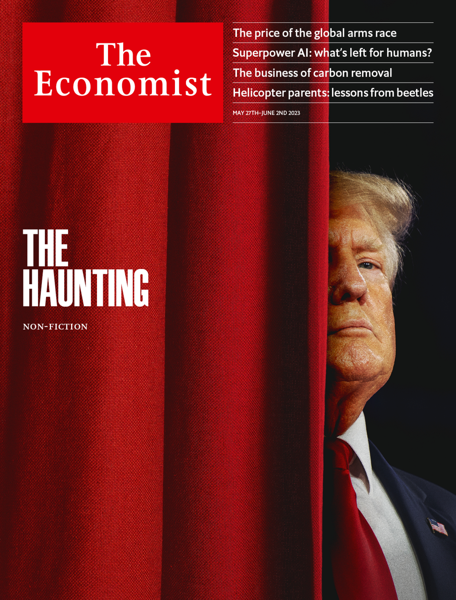
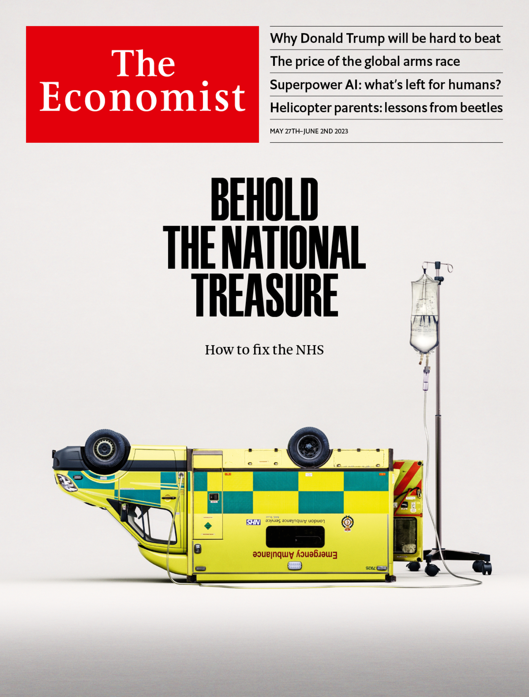

###### The Economist

# This week’s covers 

##### How we saw the world 

> May 25th 2023 

IN MOST of the world this week our cover shows a familiar face. The race to become the Republican nominee for the presidential election in America next year is properly under way. And Donald Trump has a huge, perhaps insurmountable, lead. The difficulties of co-ordinating the opposition to the former president are daunting. Anyone who cares about America, about democracy, about conservatism or about decency should hope that Ron DeSantis or one of the other non-Trump Republican candidates can defy the odds and beat him.

 


: 

: 

: 


In Britain, however, readers will see something different. A traumatised ambulance sums up the state of the country’s National Health Service. The recipe for saving it requires radicalism: it must be turned from what it has become—a sickness service—into what its name promises—a health service. This will mean spending more money. But to spend it productively requires a shift in focus: away from hospitals to the community, from treatment to prevention, from incentivising inputs to encouraging better outcomes.

 


: 

: 

