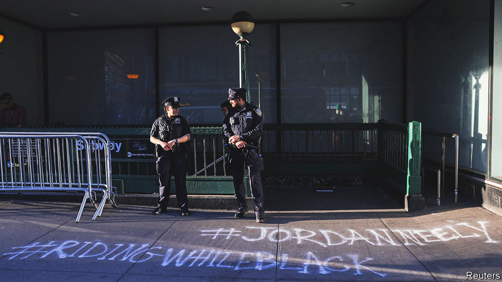
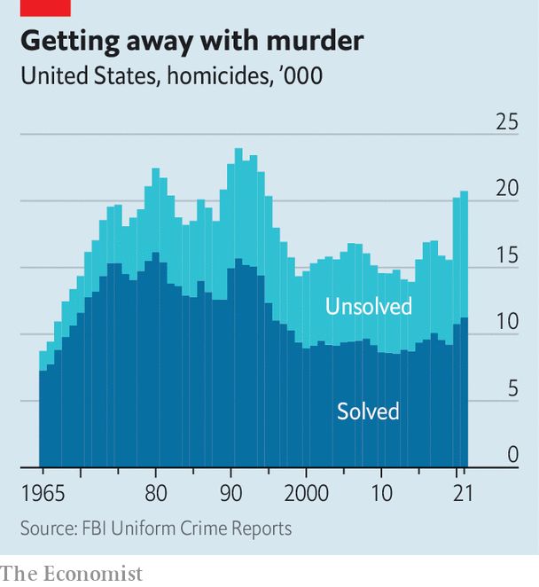

###### The too few and the less proud

# American policing has changed since George Floyd’s murder 

##### It needs to change further, and be better funded 

 

> May 25th 2023 

TALK WITH Chris Thomsen and Rick Zimmerman, two longtime homicide investigators with the Minneapolis Police Department (MPD), and they’ll tell you their job has changed markedly over the past three years. Restrictions now forbid officers from stopping drivers for expired tags or something dangling from a rear-view mirror; those stops often yielded guns, drugs or people evading arrest warrants. A chokehold ban and body-worn-camera footage of every interaction mean officers worry that accidental contact with a suspect’s neck during a physical altercation could be grounds for a lawsuit or dismissal. Prosecutors and jurors used to defer to cops’ words in court; now they demand video or audio evidence. 

But talk with Dave Bicking and Emma Pedersen—members of Communities United Against Police Brutality, an activist group—and they will tell you the opposite. The city council vowed to “defund the police”; instead the MPD’s budget has grown. Police killings, Mr Bicking asserts, “go on at the same rate as always”. The MPD’s culture, says Ms Pedersen, is “getting worse”.

These two poles define a roiling debate. Leftists argue that policing has changed far too little since a Minneapolis police officer murdered George Floyd three years ago. Police killings in America rose from 2020 to 2021, and again from 2021 to 2022. Politicians who promised reform have backtracked; changes have been cosmetic. Conservatives argue that public suspicion of police and policy changes driven by progressive politicians have hamstrung law enforcement, leading directly to a rise in violent crime. The consensus that 30 years ago led politicians from both parties to espouse “tough on crime” rhetoric and policies has disappeared. As in so much else in American life, the centre has not held.

What is beyond dispute, however, is that big-city departments across the country face shortages. Minneapolis had over 900 officers at the time of Floyd’s murder. As of May 6th it had just 583, well below the 731 required by the city’s charter. Baltimore, which in 2022 had more than 1,000 homicides and non-fatal shootings, lost nearly 157 officers that year, and is short more than 500. Between 2011 and late 2022, the size of Memphis’s police force shrank by nearly one-quarter; some wonder whether that contributed to the widely seen beating death of Tyre Nichols by lowering the department’s hiring and training standards.

Nationally, between April 1st 2020 and March 31st 2021 (the most recent period for which data are available), resignations rose by 18% and retirements by 45% year-on-year. Some of those departures were expected: the Violent Crime Control and Law Enforcement Act, passed in 1994 and championed by then-Senator Joe Biden, funded the hiring of tens of thousands of officers, many of whom are now at retirement age. Though critics now decry that bill for fuelling mass incarceration, at the time 49% of whites, 58% of African-Americans and a majority of the Congressional Black Caucus supported it.

A related phenomenon has seen officers transfer from departments in big cities with high crime rates to agencies in wealthier, smaller cities with less crime, a lower cost of living and higher salaries. According to the , the New York Police Department saw more resignations last year than at any time in the past two decades. At least 14 of the department’s officers moved to Aurora, Colorado; others have accepted $5,000 signing bonuses to move to Florida. 

This leaves departments short-staffed, which means officers have to work more overtime with less supervision; that combination, notes a veteran west-coast officer, leads to “more stress and bad decisions on the street”. And the more cases that pile up, the harder it gets to solve them: officers lack investigatory time, leads go cold, newer cases assume greater importance.

Compounding the problem of mass departures is that hiring has not kept pace: from April 2020 through March 2021 the hiring rate actually declined by 5%. A poll of 10,000 police officers taken in June 2020 found that just under 17% were either “extremely satisfied” or “pleased” to be in law enforcement, and only around 7% would recommend that their child go into it. For that state of affairs many blame a changed national attitude towards police. “It used to be that policing was a job for helpers, it’s honourable,” says one veteran officer. “Now the story is that policing is an inherently racist institution, and if you go into policing you’re complicit in supporting structures of white racial hegemony.”

Art Acevedo, who headed the Austin, Houston and Miami police departments and is now interim chief in Aurora, Colorado, said that “the push by some elected officials to defund the police…had an impact on recruitment and retention.” That shift in attitudes did not begin with Floyd’s murder: the shooting of Michael Brown, a young black man, by a police officer in Ferguson, Missouri, in August 2014 also sparked widespread protests, though Barack Obama’s Justice Department, after an extensive investigation, found the officer’s actions were not “objectively unreasonable”, and declined to press charges. But Floyd’s death pushed previously fringe positions, such as police defunding and abolition, to the fore.

Peter Moskos, a sociologist and former Baltimore beat cop who now teaches at John Jay College of Criminal Justice, said that “pre-George Floyd, reformers would work with the police.” He sees much of the post-Floyd legislation—such as limiting when police can stop drivers, as San Francisco has done, or eliminating most cash bail, as New York has done—as coming from activists who see policing as malign. “The idea that you can reform police in opposition to the police is crazy.”

The public’s appetite for reform seems to be waning. San Francisco’s voters recalled Chesa Boudin, their reformist chief prosecutor; Seattle’s elected a tough-on-crime Republican prosecutor over a far-left candidate. In late February Ron DeSantis, Florida’s Republican governor, made a pre-presidential-campaign trip to Illinois, New York and Pennsylvania to talk up his tough-on-crime credentials. Perhaps sensing the shifting political winds, the following week Mr Biden disappointed progressives by refusing to veto Congress’s repeal of a crime bill that would have reduced sentences for some offences.

Yet the ground on which police operate has changed. Ten years ago, police facing a crime spike might have embarked on a “flood-the-zone” strategy: pour officers into a neighbourhood with a lot of violent crime, and start arresting people and writing tickets to show “zero tolerance”. That strategy will no longer work. Some of those arrests will involve displays of force that, thanks to mobile-phone cameras, will end up on social media. More importantly, ticketing and bothering law-abiding citizens for jaywalking or drinking a beer on a street corner will turn the community against police, and police need community trust and witnesses’ help to solve crimes.

Goodness gracious that’s why it’s a mess

People in crime-ridden communities do not say they want to defund or abolish the police. They want better, more accountable policing. That starts with better training. Whereas military officers get four years of training and education in an institution such as West Point or the Naval Academy, police officers get an average of 20 weeks in their academy, often with a few months of field training afterwards. Military tours in active duty generally comprise a minority of a career officer’s time; many patrol officers spend almost their entire career deployed. In-career training is often cursory: California, for instance, requires officers to undertake just four hours of use-of-force training every two years.

National training standards are non-existent, largely because America’s police forces, unlike those of most other countries, are decentralised, run at the state and local level. But better training will require more money, both for its direct costs and to ensure that forces have enough active officers to cover those getting trained.

That may be a tough sell. Left-leaning politicians sceptical of police may be unwilling to teach officers how to use violence more effectively, even though, in the long run, it could save lives. A recent study conducted in Cambridge (Massachusetts), Houston and Tucson found that well-trained officers reduced offences in crime hotspots better than officers who received standard police training.

 


But the most important thing police could do to bring down the violent-crime rate is to catch more violent criminals. Nationally, just over half of all murders, and less than half of other violent crimes, go unsolved (see chart). By contrast, more than 95% of murders are solved in South Korea and Japan, as well as 80% in Sweden, 87% in Switzerland and 98% in Finland. 

Some departments, recognising that solving murders often requires sifting through massive amounts of data, have begun hiring civilian data analysts, who trawl digital traces while homicide detectives talk to witnesses and chase down leads. Others have focused investigative resources on places—trouble tends to occur in remarkably small geographical areas—rather than simply reacting to crimes after they occur. 

Whatever path departments choose to follow, they will need to hire more people to walk it. That will require young folk who see policing as a desirable, honourable occupation. And politicians, especially in big, liberal cities, will need to recognise that police have an essential role in keeping the public safe.

That does not preclude holding police accountable. Officers, says Jacob Frey, mayor of Minneapolis, “need to be paid more, fired more and trained more”: the first to attract good recruits to a dangerous, necessary job; the second to ensure that those who abuse their badges can be got rid of; and the last to keep them effective.

Police must accept increased scrutiny and oversight. And politicians, argues Michael Shellenberger, an author and activist who ran for governor of California in 2022, need to do more than just promise to fund the police. They need to make it clear that they are valued, like teachers and firefighters. Yes, “there are some bad actors,” but “it’s a noble profession full of people who want to do the right thing.” ■


