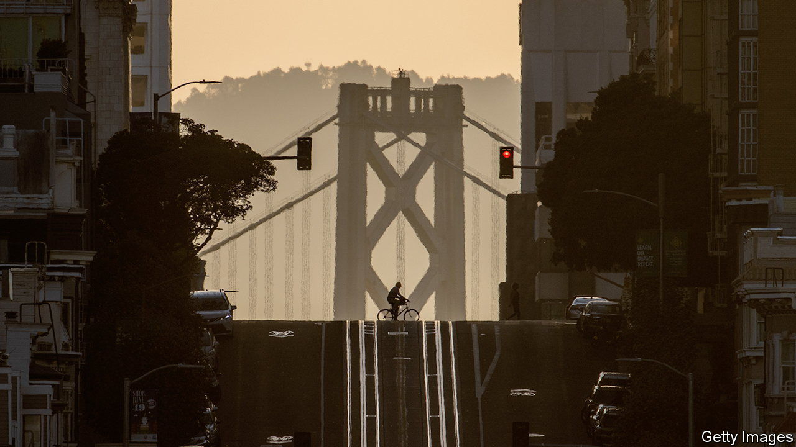

###### The doom loop

# Downtown San Francisco is at a tipping-point 

##### The city faces several crises, but one stands out 

 

> May 25th 2023 

MANY IMAGES have symbolised San Francisco over the years. Fog enveloping the Golden Gate Bridge. Hippies tuning in and dropping out on Haight Street. Tents lining the pavement. These days, a “Retail for lease” sign in a vacant storefront seems appropriate. San Francisco itself has become a symbol, too, though what it represents depends on your politics. It is a hub of technological innovation or a bastion of inequality; a laboratory for the country’s most progressive policies or a fief of the radical left. No mid-size American city—San Francisco has fewer people than Indianapolis—has had a bigger effect on global culture or financial markets. 

But with stardom comes scrutiny. When you’re famous, everyone likes to kick you when you’re down, says Marisa Rodriguez, of the Union Square Alliance, the business-improvement district for downtown’s luxury shopping area. Local and national media are publishing obituaries for the city. Local officials decry the coverage, but they also admit that something is deeply wrong. “San Francisco has had what felt like an endless, year-after-year boom,” says Aaron Peskin, president of the Board of Supervisors, the city council. “And now the bubble really burst.” 

There are two groups of problems. The first is characterised by homelessness,  and property crime. Nearly 7,800 people are homeless in San Francisco, slightly fewer than in 2019, but higher than at any other time the city has counted since at least 2005.

Local leaders point to Los Angeles or Seattle as proof that theirs is not the only pricey west-coast metro area unable to care for its vulnerable citizens. That is small consolation. All three cities have some of the  in the country. The difference is that San Francisco is more densely populated. Nearly 42,000 homeless people live in Los Angeles, but in neighbourhoods across the sprawling city, from Skid Row to Venice Beach. A high share of San Francisco’s rough sleepers are in a single neighbourhood, the Tenderloin, next to downtown.

The second problem is financial. “When the pandemic happened, a good portion of San Francisco was able to literally pick up their laptops and go home,” says Rodney Fong of the city’s chamber of commerce. The University of Toronto has been measuring pandemic recovery in 63 American downtowns, since March 2020, by comparing mobile-phone use in city centres with pre-pandemic numbers. San Francisco’s recovery ranks last. The office-vacancy rate is nearing 30%, a record high. 

These woes could spread beyond the city centre. Downtown generated at least 75% of the city’s GDP in 2021, and city revenues depend on downtown property and business taxes. As that pot of money shrinks—property taxes paid by offices could decline by up to 35% by 2028—the city will not be able to provide the same services. People and firms may leave, perpetuating the cycle. The  calls this the city’s potential “doom loop”. 

The doom loop is not inevitable, but avoiding it would take investment at a time when the city faces a $780m deficit, almost 6% of the annual budget, over the next two fiscal years. Local officials want the state to prop up the Bay Area subway system, BART, which ferries people downtown, but Gavin Newsom, California’s governor, has to plug a $32bn budget shortfall of his own. “It’s hard when your best-case scenario is bad,” says Ted Egan, the city’s chief economist.

Some things may yet stop the bleeding. The city’s network effects are diminished by the rise of other tech hubs, but remain mighty. Several leading AI startups are based in San Francisco, including OpenAI, which created ChatGPT. The Bay Area still gets more venture-capital funding than any other region, though its share of the pie is shrinking. Mr Peskin wants to incentivise firms to . But in the meantime, things look grim. Mr Egan says he recently visited a class of Stanford University students who were discussing their post-college plans. “How many of you are moving to San Francisco after you graduate?” he recalls their professor asking. Incredulous, they responded: “Why would anyone do that?”■


