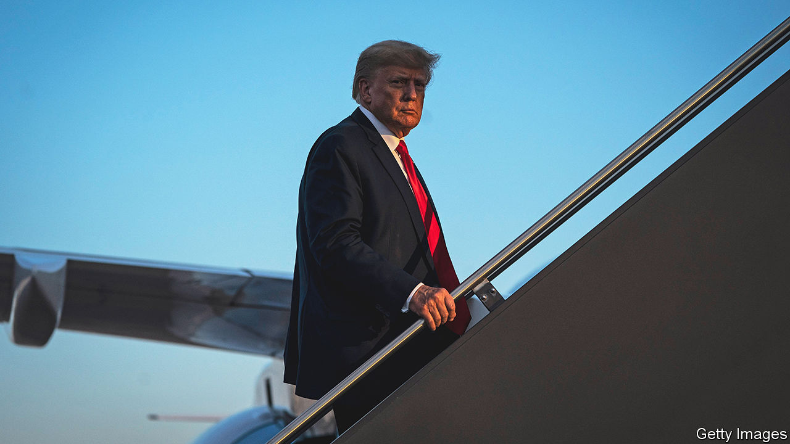

###### Tribulations and trials

# How Donald Trump’s trials and the Republican primary will intersect 

##### Where the rule of law clashes with the will of the people 

 

> May 25th 2023 

Only FOUR qualifications are necessary to become an American president. Article II of the constitution requires presidents to be natural-born citizens who have reached 35 years of age and lived in America for 14 years. The 22nd Amendment adds that candidates must not have been elected twice to the job previously. Donald Trump satisfies those conditions, including the final hurdle—despite his insistence that he won both the 2016 and 2020 elections. Nothing prevents candidates dogged by legal troubles, including criminal convictions, from running for president. Several presidential aspirants have even sought the office from behind bars.

The cases and the primaries will overlap in ways likely to set the rule of law against the will of the people. This month Mr Trump was found liable for sexually assaulting and defaming E. Jean Carroll (he is appealing against the judgment). He may soon owe more than the $5m the jury ordered him to pay, as Ms Carroll’s lawyer is asking for new damages stemming from Mr Trump’s doubling-down at an appearance on CNN the day after the verdict. 

Jail time is a risk, too. Mr Trump became the first former president to be criminally indicted on April 4th when he was charged with 34 counts of falsifying business records in a Manhattan courtroom. The indictment involves an alleged cover-up, just before the 2016 election, of payments to hide alleged trysts with Stephanie Clifford, an adult-film actress (also known as Stormy Daniels) and Karen McDougal, a model. According to Alvin Bragg, the Manhattan district attorney, Mr Trump illegally concealed hush-money cheques to Mmes Clifford and McDougal as well as to Dino Sajudin, a former doorman at Trump Tower who allegedly knew about a child Mr Trump had fathered out of wedlock. 

On May 23rd the judge in  announced that the trial will begin on March 25th 2024, two months into primary season. The Republican front-runner will therefore be campaigning in 15 states for Super Tuesday delegates three weeks before standing trial in New York and, as proceedings begin, preparing to woo voters in about 20 more states. Mr Trump could serve up to four years in prison for each of the 34 counts. But few first-time offenders on these charges are put behind bars. And some legal experts have doubts about Mr Bragg’s strategy. Falsifying records is a misdemeanour under New York law; turning those charges into felonies requires piggybacking them on another crime. 

Mr Trump’s attention may be further divided in the primaries—and, if he prevails, in the general election—by indictments in other criminal matters. Georgia Republicans hold their primary on March 12th. By then, Mr Trump may be preparing for a trial focused on allegations that he sought to swing the Peach State in his favour after the 2020 election. A year ago, a special grand jury began considering evidence that Mr Trump and his allies may have made “unlawful attempts to disrupt the administration of the 2020 elections”. The former president sought help from Brad Raffensperger, Georgia’s secretary of state, to “find” nearly 12,000 votes to reverse Joe Biden’s victory there. The probe has also looked into the Trump team’s efforts to recruit a fake group of electors to present to the vice-president, Mike Pence, when he counted electoral votes on January 6th. 

Fani Willis, the Fulton County district attorney, appears ready to move forward with indictments over the summer. The head of the special grand jury said in February that she and her fellow jurors recommended charges for as many as a dozen people—including, she hinted, Mr Trump. Ms Willis will submit evidence to a regular grand jury in late July. Indictments are “highly likely” to appear in August (which is when the first primary debate is scheduled), says Ryan Goodman, of New York University, but the case may be “tied up in pre-trial litigation” for some time.

The Department of Justice has been gathering evidence on two sets of similarly serious potential charges. Both are in the hands of Jack Smith, the special counsel appointed by Merrick Garland, the attorney-general, in November. Mr Smith is investigating Mr Trump’s efforts to overturn the 2020 election and his role in the January 6th insurrection. Last month Mr Pence testified before a grand jury in this probe. And Mr Smith appears poised to charge Mr Trump in connection with troves of classified documents the former president removed from the White House and brought to Mar-a-Lago, his Florida home. 

After a few months’ delay from a federal district-court judge’s decision to appoint a “special master” to sift through the documents, in December an appeals court put an end to the hold-up and delivered all the files to Mr Smith. He seems to have broadened his sights. He recently issued subpoenas looking into Mr Trump’s business dealings with seven foreign countries stretching back to 2017. The new line of inquiry could be spurred by an attempt to explain why Mr Trump took all those files with him when he left the White House. Joyce Vance, a law professor at the University of Alabama and a former US attorney, predicts charges in the documents case “before the summer vacation season hits”.

At every turn, Mr Trump has condemned investigators for unfairly targeting him. In a letter to Mr Garland on May 23rd, his lawyers accused Mr Smith of bias. “No President of the United States has ever, in the history of our country, been baselessly investigated in such an outrageous and unlawful fashion,” they write, before requesting a meeting with the attorney-general to discuss the “injustice that is being perpetrated by your Special Counsel”.

The accumulation of cases against Mr Trump could yet hurt him. But, so far, their impact among Republicans has been quite the opposite. It has fired them up, not led them to say: “You’re fired!” ■


