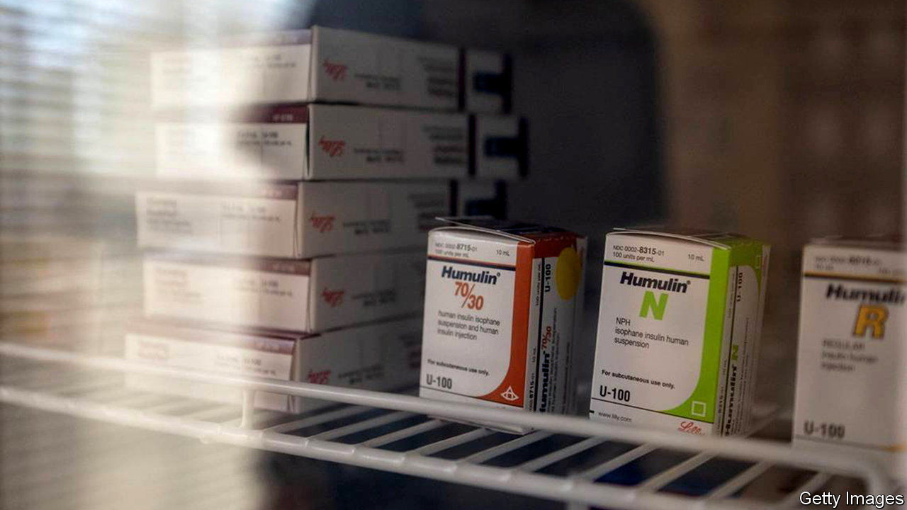
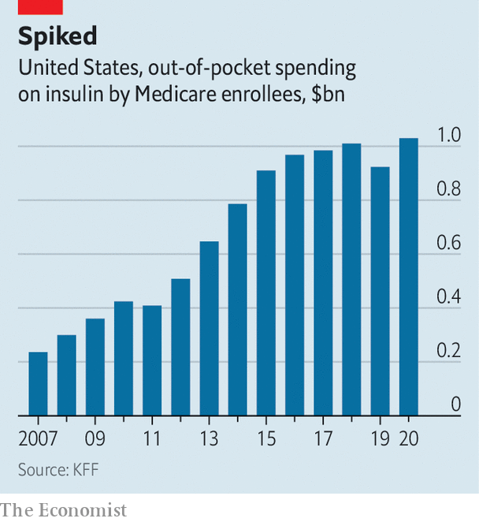

###### Drug pricing

# The push to bring insulin prices down in America 

##### But not all patients are able to use the available schemes 

 

> May 25th 2023 

“Move to the back if you’ve lost your life savings to the drug companies,” shouts a woman walking by your correspondent. A spirited group follows her to the end of a long queue for a Senate hearing on insulin prices on May 10th. In the room David Ricks of Eli Lilly, a large American drug firm, testifies that insulin, used to regulate blood-sugar levels for diabetics, is cheap and even free in some instances. “If you contact Lilly today, we will ship you a month’s supply at no cost with one question: ‘What’s your address?’” he says. Those dressed in gear with slogans like “Insulin for All” shake their heads in disbelief. Drug companies may be offering cheap insulin, but it is not reaching all patients.

The high price of drugs is a long-running grievance for Americans—and insulin is a flashpoint, since more than 8m of them depend on it to survive. A standard unit that costs on average $9 in other rich countries sets Americans back $99. A study in 2021 in the , a journal, found that 1.3m people skipped or reduced insulin doses due to cost.

 


According to GoodRx, a company that helps customers find low drug prices, the average cash price of insulin rose by 54% between 2014 and 2019. The price then dropped by 11% between January 2020 and May 2023. Despite the recent dip, insulin prices remain high.

For older patients, the cost is now coming down. The Inflation Reduction Act, one of President Biden’s landmark laws, allows Medicare to negotiate with manufacturers for lower drug prices. It also requires companies to pay back Medicare if prices rise faster than inflation, and it capped insulin prices at $35 a month for Medicare.

The new law seems to have nudged drug companies into offering lower prices for everyone. On March 1st Eli Lilly announced an automatic $35-a-month cap on all insulins for those with private insurance at select pharmacies, and a similar programme for the uninsured. The firm also promised to sell one of its non-branded insulins for $25 a vial, from May 1st. Sanofi, a French drug company, followed suit with a similar deal for one of its insulins, starting next year. Novo Nordisk, a Danish firm, likewise announced lower prices for 2024. 

These deals are eye-catching, but when patients turn up at pharmacies, they may find they cannot grab a bargain. Shaina Kasper of T1International, an advocacy group for diabetes patients, is a type-1 diabetic. She says she tried to buy Eli Lilly’s non-branded Insulin Lispro, the specific drug available from May 1st for $25. Her pharmacy in Vermont quoted her $90.

Perhaps Eli Lilly’s programme needs time to work out the kinks, or the pharmacy charged more on top. But this is not the first time such a scheme has caused problems. For years pharma firms have offered a patchwork of plans to help customers afford insulin and other drugs. Some are for almost anyone, others for the poor or uninsured. But they tend to be difficult for people to access, says Stacie Dusetzina, a drug-pricing expert at Vanderbilt University. 

First patients must be aware that the scheme exists and that they are eligible, which is often unclear. Then they must jump through hoops. Some need applications, doctor’s notes, proof of residence, tax documents and more. Pharmacies must also know about the programme and participate in it. It can be hard to know whom to blame—the drug companies for the faulty deals or the pharmacies for failing to implement them properly.

These programmes can also end at any time. “What the Lord giveth, the Lord can taketh away,” says David Mitchell of Patients For Affordable Drugs, an advocacy organisation for patients. That is why Mr Mitchell and others are pushing for laws to lower drug prices rather than relying on a mishmash of special schemes.

Some states have given up on waiting. Colorado was the first to pass a cap on insulin, at $100 a month, in 2019. Since then nearly half of states have introduced caps, but these cover only state-regulated health plans. In March Gavin Newsom, the governor of California, announced that he had signed a contract with a manufacturer to make and distribute insulin to Californians for $30. Maine, Michigan and Washington may follow. There are also bills in Congress to tackle insulin prices and increase access to generics. Perhaps insulin’s cost will eventually come down further and become more predictable. ■


