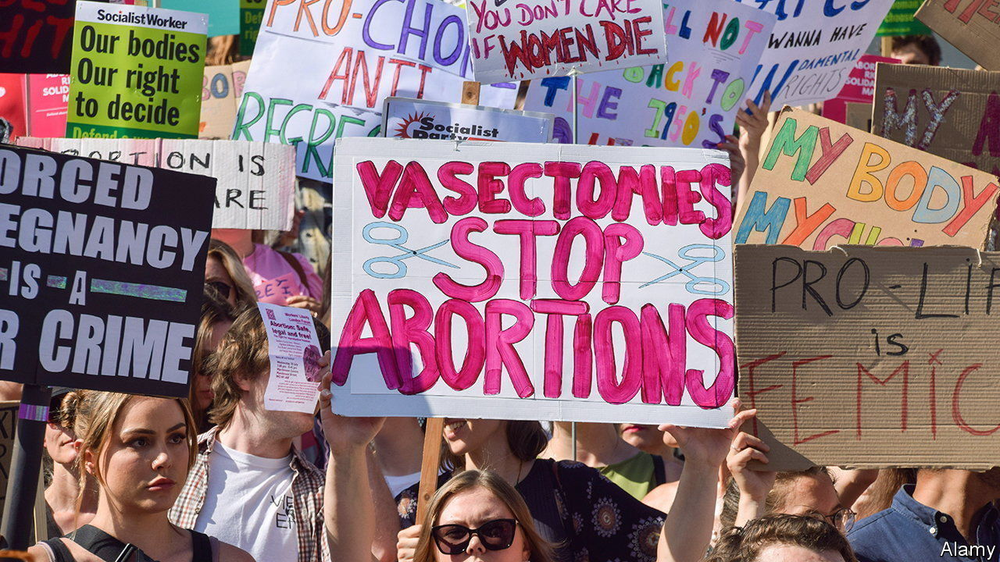
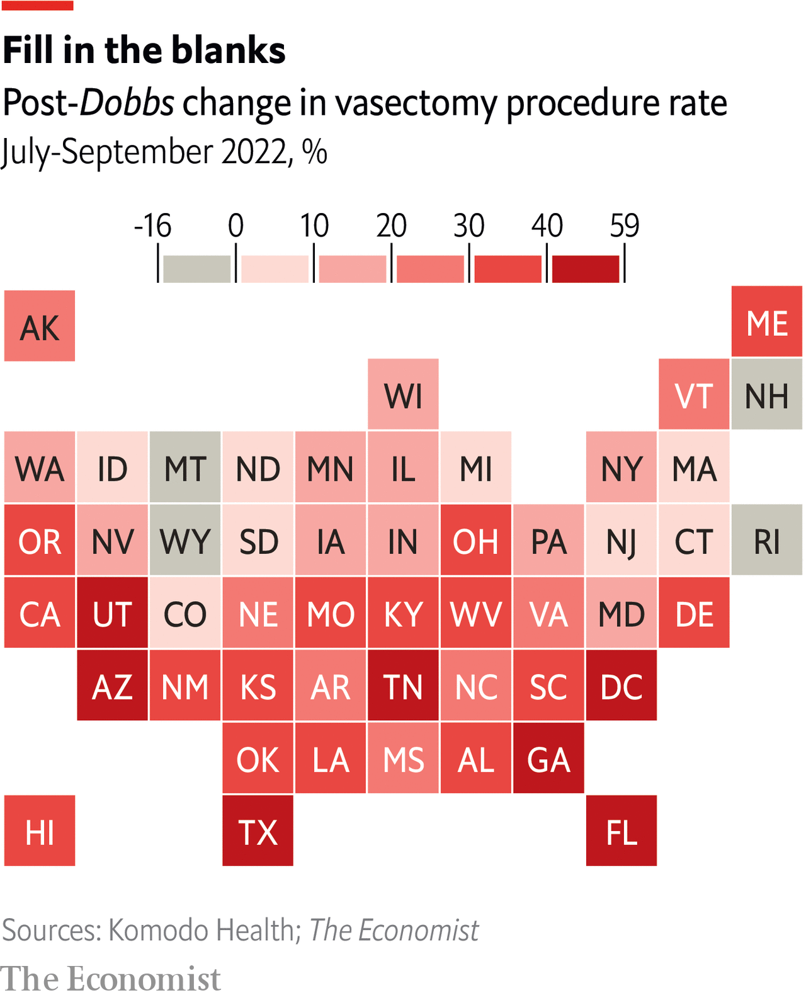

###### Solidarity snips

# Vasectomies rose by 29% in the three months after the end of Roe 

##### Brothers are doing it for themselves 

 

> May 25th 2023 

Dr Doug Stein estimates that he has performed around 50,000 vasectomy procedures. He has been practising urology for 40 years, but still, achieving that impressive tally has meant “a lot of sunny Saturdays in windowless rooms hovering over scrotum”, he explains. Dr Stein’s experience and reputation, built up over the decades, make him a popular choice for Floridian men looking to get the snip. But in the summer of 2022 demand for his services suddenly surged. 

On June 24th last year the Supreme Court issued its ruling in the case of , reversing its decision in , and allowing states to ban abortion. Dr Stein saw registrations from potential vasectomy patients almost triple the next week.


It wasn’t just interest in the procedure that soared. Data on insurance claims from Komodo Health, a health-care-technology company, shows that in the second half of 2022 vasectomy rates across America were far higher than in previous years. Accounting for previous trends,  calculates that the  ruling was associated with a 17% increase in procedures in the six months after the ruling, and a 29% increase between July and September.

The number of vasectomies has been on the rise. Between 2017 and 2021, the rate at which surgeries were performed increased by an average of 4% each year. But the number of American men who report having had the procedure is lower than it was 20 years ago (and vasectomy rates still lag far behind rates of tubal ligation, the more invasive equivalent for women). In 2002 national health surveys estimated that 6.9% of the male population aged 18-45 had been snipped. The most recent round of surveys, carried out between 2017 and 2019, put the figure at 5.4%. 

We estimate that around 20,000 extra men chose to undergo the short, mostly painless, surgery between July and December 2022. Normally, the number of procedures peaks towards the end of the year, when patients are more likely to have reached their insurance deductible (although this is probably overstated in our data, which do not capture vasectomies paid for in cash). Surgery rates also get a boost in March, which some urologists market as “vasectomy season”, a time when men can spend the day or two needed for recovery from the procedure watching March Madness basketball.

 


The bump in vasectomies following  could be seen in 46 states. The rise was larger in states with “trigger bans”, where abortion was severely limited right after the ruling. There, the average increase between July and September was 41%, compared with 26% elsewhere. In Arizona, Florida, Georgia, Tennessee, Texas and Utah rates rose by more than 40%.

As well as being clustered in more conservative states, these new post- patients also tended to be younger than the normal vasectomy candidate. Data from Komodo show that, across the country, there was a small but consistent drop in the average age of patients in the second half of 2022. In Dr Stein’s practice, the number of childless men under 30 who opted for the procedure has increased by around 50% since the ruling. 

What is it about restricting abortion access that has driven men to the operating table? Among his patients who reported that they were motivated by , Dr Stein says they tended to cite one of three reasons. Some worried that, without access to abortion, they lacked a genuine backup if their primary contraception method failed—vasectomy has a success rate of more than 99%. Others, who had been considering the procedure for a while, were apparently spurred by a concern that vasectomy could be outlawed next. A final set of men saw their surgery as an act of solidarity with women. 

Vasectomy often represents a sacrifice. Like any surgery, it involves recovery time and risk of complications, however small. And for many men there are also misconceptions and concerns about how the procedure might affect their sense of masculinity. But making the sacrifice lifts the burden of responsibility for contraception from women. Studies have shown that high rates of vasectomy tend to go hand in hand with gender equality. Overturning  has been a brutal blow for women’s rights in America. The rise in vasectomies may be one very small consolation. ■


