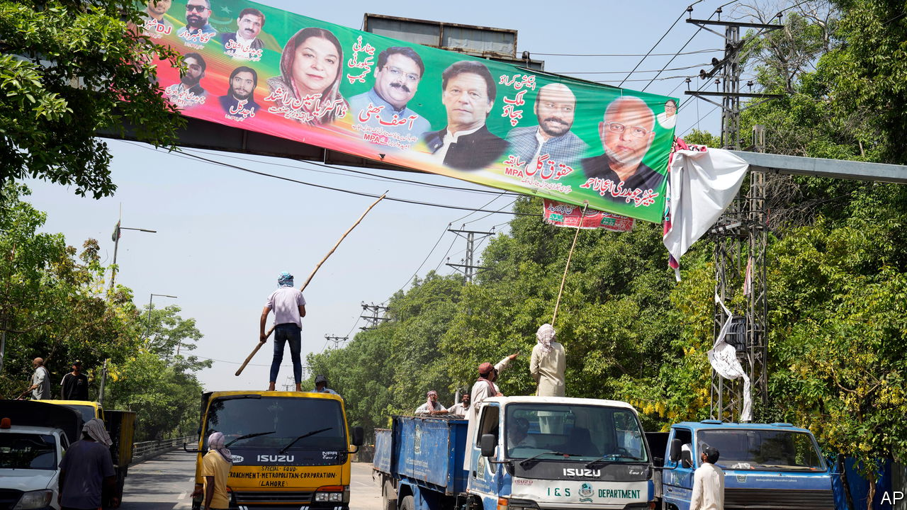

###### A military defeat

# Imran Khan loses his battle with Pakistan’s army 

##### The generals have gone to war with the country’s most popular politician 

 

> Jun 1st 2023 

NOT LONG ago  looked like a man who had defied Pakistan’s all-powerful generals and got away with it. After  by paramilitary goons on May 9th, the former prime minister was freed by a Supreme Court order—even though his outraged supporters had had the temerity to smash up military installations around the country. As Pakistan’s most , with a legion of committed activists and apparently no fear of the army, Mr Khan looked odds-on to win a general election due later this year.

Barely three weeks later, the political walls have caved in on him. The generals have in effect dismantled the party Mr Khan founded in 1996, Pakistan Tehreek-e-Insaf (PTI). Scores of its senior leaders have defected and thousands of its supporters have been arrested. The government of Shehbaz Sharif is openly mulling banning the party. Mr Khan, who faces dozens of charges including corruption and blasphemy, could be tried by a military court—and perhaps expect a long political exile at best. Pakistan’s beleaguered civilian institutions appear, for now, to be firmly back under the army’s sway.

Whether under orders from the military or out of sheer opportunism, the government of Shehbaz Sharif is backing the PTI’s dismantlement. It cites the urgent need to restore economic and political stability. Pakistan’s economy barely grew over the past year. Due to a collapse in the rupee, annual income per person dropped by nearly $200 in dollar terms, to $1,568. Annual inflation is estimated to have hit 37% in May. With foreign exchange reserves barely sufficient to cover a month’s worth of imports, there remains a real risk of sovereign default. The IMF this week urged the government to respect constitutional means in resolving the political crisis and reiterated that Pakistan must obtain “sufficient financing from partners’‘ before it releases a long-stalled $1.1bn in bail-out funds. China is expected to roll over $2.3bn in loans in June.

An irony of Mr Khan’s fall, not lost on Pakistanis, is that he was once promoted by the army as a means to suppress other civilian parties, including Mr Sharif’s. After he became prime minister in 2018 some observers described his government as a civil-military “hybrid”. But the generals eventually tired of his grandstanding and narcissism, leading to his ouster last year in a no-confidence vote.

The attacks unleashed on army buildings by his supporters on May 9th, including the ransacking of a house belonging to the commanding general in Lahore, were unprecedented and, it is now clear, intolerable to the generals. An army spokesman promised a crackdown on all “planners, instigators, abettors and perpetrators” of the violence. Penitent PTI leaders have since been paraded before journalists, condemning the violence, dissociating themselves from Mr Khan and pledging fealty to the army. Many of them have renounced politics altogether. Rights organisations accuse the government of using the crackdown to detain peaceful opponents alongside alleged rioters.

The generals will now be weighing their options. On the basis of their past campaigns against civilian politicians who dared to disappoint them, these will include jailing Mr Khan, nudging him into exile, disqualifying him from politics and, though it seems unlikely, allowing him to contest the election at the head of whatever remains of his party. Or they may decide that the election will not be held—there are rumours that they mean to form a technocratic government instead. Mr Khan, for his part, remains defiant. Challenging the government to “break as many people as you want”, he has called for early elections.

In any event, political and economic stability is likely to remain elusive. Mr Khan’s sidelining will not make him less popular. Mr Sharif and, for that matter, whoever the generals pick to lead the country next will have to contend with vast numbers of disaffected PTI supporters. And so will the generals, whose relentless political interference has, thanks to Mr Khan, now made them a principal target for Pakistanis’ justified rage. “The army can’t help itself,” says Zahid Hussain, a political commentator. “Its urge to intervene is irresistible.” And yet it has never seemed more self-defeating. ■

