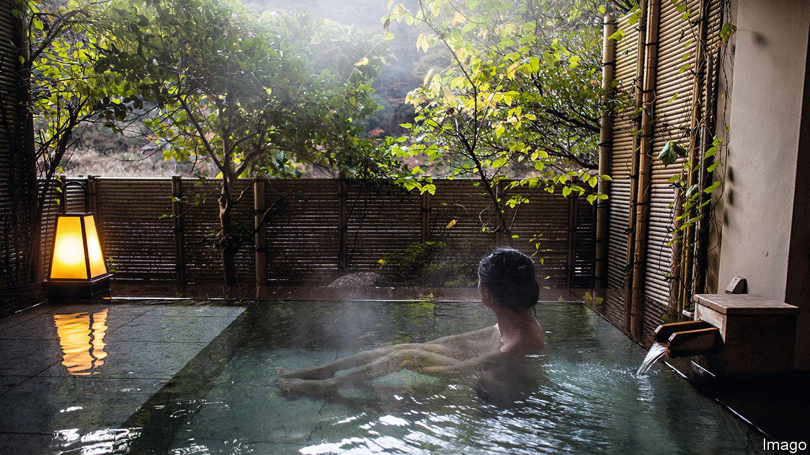

###### In hot water

# Japan’s hot-spring resorts are blocking geothermal energy plants 

##### A centuries-old leisure industry is a powerful, but not insurmountable, obstacle to progress 

 

> May 28th 2023 

WHITE STEAM rises from the waters of Okuhida Onsengo in snowy northern Japan. Each year thousands of bathers from across the country travel to soak in these hot springs. Down the road, meanwhile, the spring’s underground reservoirs are being put to a new use: last December the Nakao Geothermal Power Plant began using steam from them to generate electricity. With a maximum output of almost two megawatts (mw), the plant could supply electricity to 4,000 households.

With over 100 active volcanoes, Japan is estimated to have a potential geothermal resource of 23 gigawatts, equivalent to the output of 23 nuclear reactors. But the Nakao plant is a rarity—Japan has hardly developed its geothermal reserves. Geothermal energy accounts for just 0.3% of its electricity supply. Japan holds the third-largest geothermal potential in the world, after  and Indonesia, but ranks tenth in terms of geothermal power generation. For a country heavily dependent on imported energy and struggling to honour its  its economy by 2050, this represents a huge missed opportunity. 

Japan’s sprawling onsen (hot spring) industry is the main obstacle to geothermal development. Though many geologists reckon there is little chance of geothermal plants negatively affecting bathing pools (which are generally filled by much shallower aquifers than the geothermal reservoirs energy companies look for), the onsen industry is unconvinced. “The government relies on hot springs for its tourism—what are they going to do if the hot springs disappear because they keep building geothermal power plants?” asks Sato Yoshiyasu of the Japan Onsen Association, a big industry group. Japan’s 3,000 hot-spring resorts routinely withhold the consent necessary for development to proceed. And the fact that they are deeply rooted in Japanese culture, and attract around 130m visitors a year, has largely deterred the government from pushing back. 

There are other obstacles to geothermal development. Some 80% of Japan’s reserves are in national parks. Much of Japan is mountainous. Its underground geology is relatively complex, with layers of hard rock that are difficult to drill through. Whereas countries such as Indonesia that produce a lot of geothermal power often have relatively large, well-connected power stations, Japan’s tend to be small and scattered. Geothermal in Japan is “promising” but requires “diligent effort”, says Ehara Sachio of the Institute for Geothermal Information, a think-tank near Tokyo.

With enough political will, none of these barriers is insurmountable, however, as Japan demonstrated in its response to the oil crisis of the 1970s. Back then it launched an initiative, known as the “Sunshine Project”, to promote alternative energy sources, including solar, hydrogen and geothermal. The New Energy and Industrial Technology Development Organisation (NEDO), a government institution established in 1980, conducted a nationwide assessment of geothermal potential. By the late 1990s, dozens of geothermal power stations were built across the country, adding over 500MW of generating capacity.

As oil prices stabilised and more nuclear power stations came online, Japan’s spurt of enthusiasm for geothermal petered out. But the meltdown at the  in 2011, which turned public opinion against nuclear power, has brought another spurt. Japan now hopes to triple geothermal output by 2030. Businesses and local governments are considering more than 50 possible sites to build new geothermal power plants.

To that end, the government is eyeing next-generation technology. Japan and America recently signed an agreement to collaborate on geothermal projects, including on research for supercritical geothermal—which involves drilling deep wells to access ultra-hot fluids. Mr Ehara reckons such advanced technologies could ensure geothermal provides more than 10% of Japan’s energy. (America is aiming to get 8.5% of its electricity generation from geothermal by 2050.)

In the short run, conventional geothermal plants remain a better way to reduce Japan’s carbon emissions. Developing them is becoming slightly easier. The timeline for environmental assessments was recently shortened from over a decade to eight years. The rules on developing national-park land were eased around a decade ago. Perhaps more promisingly, some geothermal-energy producers, such as Cenergy, which runs the plant at Nakao, are developing their own innovative ways to mollify the objectors. 

Hot water extracted at the plant is piped to the local onsen. The two parties enjoy a “win-win” situation, says Uchino Masamitsu, a local onsen owner. This co-operation appears to be sparking interest in using the hot waters in other ways, too. Some local householders are using their heat to grow tropical fruits such as bananas and dragon fruit. “Geothermal,” sighs Mr Uchino, “opens up so many dreams.”■


