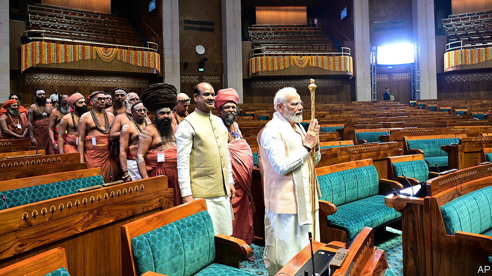

###### India’s new parliament building

# Narendra Modi is rebuilding New Delhi 

##### The revamp reflects the prime minister’s Hindu nationalist vision 

 

> Jun 1st 2023 

INdia’s new parliament building reflects the dreams and aspirations of all Indians, according to the government of Narendra Modi. Yet the opening on May 28th of this new edifice of democracy, built in concrete and stone to a grand hexagonal design, was remarkable for its focus on one man: the prime minister himself.

Mr Modi performed a lengthy a Hindu worship ritual, at the ceremony. He then installed a golden sceptre associated with an ancient Hindu kingdom in the spanking-new parliamentary chamber. He also presided over multi-faith prayers and addressed members of the assembly. But this note of inclusiveness was dulled by the fact that 20 opposition parties boycotted the occasion to protest against the ruling Bharatiya Janata Party (BJP) politicising such a significant public building.

It is not just a replacement for the country’s smaller, rather decrepit British-built parliament building. The new home of Indian democracy reflects in many ways the BJP’s idea of Indian nationhood. It signifies an obvious break with the country’s colonial past. The impressive scale of the building, which sits next to its predecessor in central Delhi, also illustrates the Hindu nationalists’ ambition. Mr Modi said it reflected a country that was “gaining back its pride” after having its “glorious past …snatched away by years of slavery”.

The building’s interior, which Mr Modi inaugurated on the birthday of Vinayak Damodar Savarkar, the foremost architect of his party’s Hindutva ideology, is more contentious. The government says its design represents “Indian culture”, but by that it mostly means Hinduism. The chambers of the parliament’s lower and upper houses are shaped as a peacock and lotus, respectively. These national emblems are also considered auspicious and holy in Hinduism. The lotus features in the BJP’s own insignia. The golden sceptre that Mr Modi installed in the chamber is, similarly, associated with Hindu ideas of good governance.

The new building is part of a wider redevelopment of central Delhi, spearheaded by the prime minister’s favourite architect, Bimal Patel. Critics say this grand project is manifestly political. “The government is using architecture as a tool for politics,” says A.G.K. Menon, an architect who has challenged the plan in court. Some BJP ideologues agree. The new parliament, wrote one in an op-ed this week, “is part of the holistic efforts of the BJP government to renew nationalist fervour”. The conversion of the old parliament into a museum would be “the beginning of the rewriting of history on our own terms”.

Indians keen to know whether the new parliament building reflects their dreams and aspirations must be patient. For now the building remains closed to the public, with much of its expanse hidden behind a construction fence. But passers-by could be seen this week peering through a gap at the building’s flower-clad entrance—before the police shooed them away. ■

