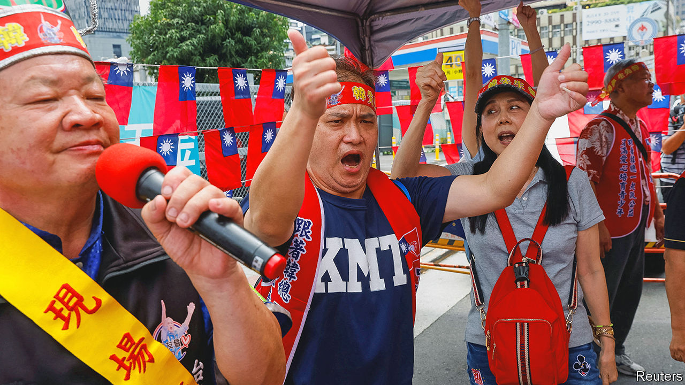

###### Taiwan’s elections

# Who will be Taiwan’s next president? 

##### The election will be fought on how the island should navigate a superpower showdown 

 

> May 31st 2023 

THE CHINESE COMMUNIsT PARTY (CCP) has never ruled Taiwan. But how to deal with it and its insistence on eventual unification with the island has always been the central issue in Taiwan’s national politics. As campaigning begins for the presidential elections due next January, the stakes are especially high. Almost every day China sends fighter jets into the Taiwan Strait, often crossing Taiwan’s de facto maritime border;  is expanding its military bases and stepping up exercises with allies across the Indo-Pacific. The next president will take office with the island at the centre of a bubbling .

Already, as always, the two main parties are attacking each other for provoking or appeasing Beijing. The “appeaser”, the main opposition Nationalist Party, known as the Kuomintang or KMT, calls the election a choice between “war or peace”. The “provoker”, the ruling Democratic Progressive Party (DPP), says it is a choice between “democracy or autocracy”. The parties have competing visions of how best to protect the island. The DPP proposes forging alliances with other democracies; the KMT wants to talk to the cCP.

Unusually, a third-party candidate, Ko Wen-je of the Taiwan People’s Party (TPP), may also be a serious contender. In the past Taiwan’s voters tended to split along identity lines. The KMT’s origins were as the party of Mandarin-speaking mainlanders, who fled China as the CCP won its civil war in the 1940s, and their descendants. The DPP’s were as the party of the native-Taiwanese majority, many of whose members wanted formal independence from China. Now, more than half of voters are not committed to either party; 40% of those in their 20s claim to be neutral.

The DPP’s candidate is Lai Ching-te, the vice-president, a softly-spoken former doctor. He is leading in the polls, with about 30% support, but is haunted by past statements. In 2017 he called himself a “Taiwanese independence worker”, antagonising China and providing an uncomfortable reminder to America of Taiwan’s first DPP president, Chen Shui-bian (2000-08), whose talk of independence unsettled American negotiations with China.

Mr Lai knows he needs to tone down his language. He has said his priority is not , Taiwan independence, but , Taiwan democracy, and has moderated the DPP’s slogan from “resist China and protect Taiwan” to “peacefully protect Taiwan”. He promises to stick to the careful dictum of the current president, Tsai Ing-wen, that, since Taiwan is already independent, it needs no further declarations. But all that is unlikely to wash with the cCP, which will continue to threaten and seek to isolate Taiwan as long as the DPP is in charge—fuelling the KMT’s criticism that the DPP makes Taiwan unsafe.

The DPP also has an image problem at home. It grew out of opposition to the KMT’s four decades of one-party rule. Its founders were activists seeking both democracy and independence. Ms Tsai’s elections in 2016 and in 2020 both followed student movements in Taiwan and Hong Kong that drew voters to the DPP as a symbol of resistance to Chinese authoritarianism. But after eight years in power, its oppositionist credentials have faded. Many young people see the DPP as the “establishment”. At a recent campaign event, a student asked Mr Lai how he planned to change the DPP’s “habitual arrogance”.

The KMT has chosen a candidate it hopes will counter its own establishment image. Hou Yu-ih, a burly, calm-seeming former cop, is a moderate with a reputation for efficiency and, in the words of a former DPP legislator, a “Taiwanese flavour”. He won re-election as the mayor of New Taipei City last year with a wide margin. He is said to speak Taiwanese better than he speaks Mandarin. The KMT hopes he will appeal to voters outside the party’s traditional base. 

That will depend on his cross-Straits policy, which is so far vague. Mr Hou has said Taiwan should not be a “pawn of larger nations”, adding that he means both China and America. He has stuck to generalities, like rejection of “one country, two systems”, China’s discredited model for Hong Kong. Mr Hou “has been able to persuade people that he is everything to everyone,” says Nathan Batto of Academia Sinica, a Taiwanese research outfit. But the campaign will soon force him to clarify his approach to China—which will make or break his chances of winning.

Then there is Mr Ko, a former mayor of the capital and founder of the tPP. Mr Ko, who says he has Asperger’s syndrome, has a blunt, sometimes awkward, way of speaking. His campaign focuses not on relations with the mainland but on domestic concerns such as energy and housing, which has proved popular. In recent polls Mr Ko has hovered just a few points behind the KMT’s candidate, on more than 20%.

Mr Ko says he offers a “third choice” for voters between provoking China and deferring to it. In fact his policies have been closer to the KMT’s. As Taipei’s mayor he oversaw annual forums between the Taipei and Shanghai city governments. He once told Shanghai officials that the two sides of the Taiwan strait are “one family”, alienating DPP supporters. Critics accuse him of being under CCP influence. Supporters say Mr Ko is “extremely pragmatic”. At a recent campaign event Liang Jih-chang, a student who plans to vote for Mr Ko, agreed, pointing by way of illustration to his ability to engage Shanghai officials.

The TPP’s popularity makes Taiwan’s elections far less predictable. The polls show Mr Lai in the lead, with Mr Ko and Mr Hou vying for second place. If Mr Ko and Mr Hou team up, as some of their parties’ representatives have suggested is possible, they may overturn DPP rule. That might lead to a superficial easing of tensions in the Taiwan Strait. But it would slow the advance neither of China’s military build-up nor of its contest with America. Taiwan’s would-be presidents all promise a way to peace. Sadly, it is not entirely within their power. It, too, depends on China. ■

