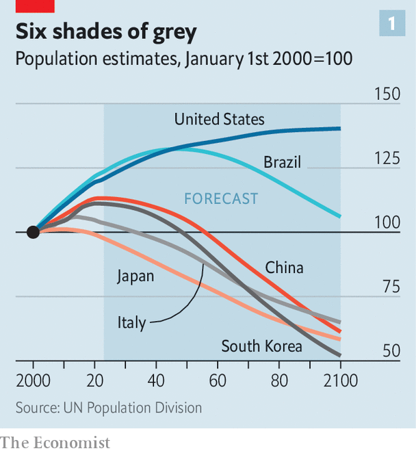
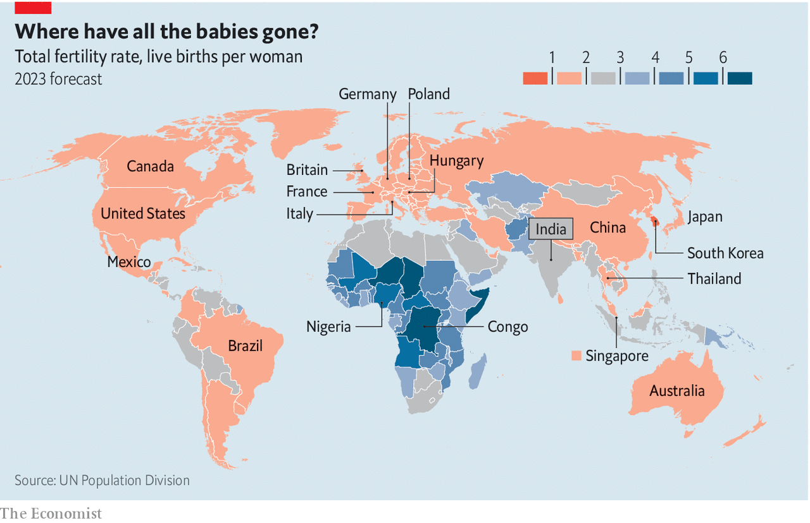
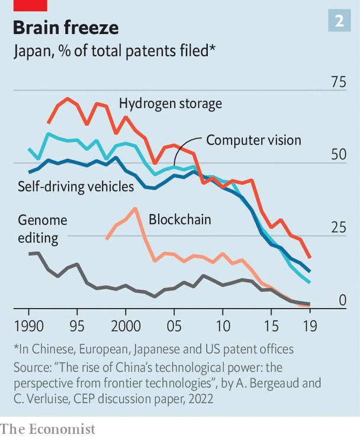

###### The old and the zestless

# It’s not just a fiscal fiasco: greying economies also innovate less 

##### That compounds the problems of shrinking workforces and rising bills for health care and pensions 

 

> May 30th 2023 

“Adam is a special child,” says the voice-over, as the camera pans across abandoned classrooms and deserted maternity wards. “He’s the last child born in Italy.” The short film made for Plasmon, an Italian brand of baby food owned by Kraft-Heinz, a giant American firm, is set in 2050. It imagines an Italy where babies are a thing of the past. It is exaggerating for effect, of course, but not by as much as you might imagine. The number of births in Italy peaked at 1m in 1964; by 2050, the UN projects, it will have shrunk by almost two-thirds, to 346,000.

Plasmon knows what side its fortified biscuits are buttered: a  is not good for sales of baby food. But the rapid ageing of many countries around the world will be bad not just for certain industries, or for governments whose costs rise as their revenues decline. The falling number of educated young workers entering the labour market will also reduce innovation, sapping economic growth across the board. Over time, this effect may prove the most economically damaging result of the greying of the rich world, eclipsing growing bills for pensions and health care.

 


Italy and Japan, in particular, are the poster pensioners for demographic decline and its economic consequences. In both countries the fertility rate (the number of children a typical woman will have over her lifetime) fell below 2.1 in the 1970s. That level is known as the replacement rate, since it keeps a population stable over time. Anything lower will eventually lead to a declining population, something both Italy and Japan have suffered for about a decade. The median Italian is now 47; the median Japanese 49. Earlier this year, Kishida Fumio, Japan’s prime minister, warned that the country is “on the brink of being unable to maintain social functions” because of its baby bust.

But Italy and Japan are no longer the most extreme examples of demographic decline. In 2022 South Korea had a fertility rate of just 0.8. A rate below one means that the next generation will be less than half the size of its parents’. As recently as 2012 the UN projected that South Korea’s population would shrink by only a fifth or so by the end of the century, from 52m today to 41m by 2100. More recent forecasts, however, suggest that the population will fall by more than half over the same period, to just 24m (see chart 1).

South Korea may be an exceptional case, but demographic decline is becoming commonplace. In 2010 98 countries and territories recorded fertility rates below 2.1. By 2021 the number had grown to 124, more than half of the places for which the UN collects data (see map). By 2030 it expects the tally to reach 136.

 


Matthias Doepke, an economist who studies the financial causes and effects of changes in fertility, notes that falling birth rates are no longer limited to richer countries or to wealthier families within a given country. “There’s a global convergence in women’s aspirations for careers and family life,” says Mr Doepke. Fertility rates for women with fewer years of formal education have fallen towards the levels of their more educated peers. In fact, women in America with exactly 16 years of schooling (mostly those with undergraduate degrees) have marginally fewer children on average than those with more schooling.

By the same token, low fertility rates have spread from rich countries such as Italy and Japan to middle-income ones such as Thailand (1.3) and Brazil (1.6). Even more notably, India’s fertility rate recently fell below 2.1 and is expected to keep falling. Since it accounts for a fifth of the world’s population, that will have global repercussions. The 15 biggest economies in the world, including Brazil, China, India and Mexico, all have fertility rates below 2.1.

In 2021 there were 782m people aged between 21 and 30 in countries where fertility is below the replacement rate. By 2050 this group, in effect the potential number of home-grown entrants to the workforce, is expected to have dropped by a fifth, to 619m. This fall is not some subjective and questionable forecast: most members of that generation have already been born, and fertility rates do not tend to change rapidly. In countries in which the fertility rate is below 1.5, which includes almost all of East Asia and much of Europe, the decline will be more extreme, with the same cohort contracting by 37%. 

Instead of a population structure shaped like a pyramid, with each new generation bigger than the one that preceded it, or even a pillar, with all generations similar in size, these countries will become inverted pyramids, with older generations replaced by smaller and smaller cohorts. In parts of the world this has already happened: the number of Chinese aged between 21 and 30 has already fallen from 232m at its peak in 2012 to 181m in 2021. The decline will accelerate rapidly in the 2040s, leaving China with fewer than 100m people in the same pool in the mid-2050s. The population of Europe in the same age category will fall from around 85m to below 60m over the same period. 

The obvious way to compensate for dwindling birth rates is , which is on the rise in much of the rich world, despite the political tensions it has generated in recent years. But as demographic decline affects more and more countries, educated migrants will become harder to find, even as the shrinking of the native-born population accelerates in many rich countries. For China, with a population of some 1.4bn, the notion that enough immigrants could be found to reverse the effects of dwindling birth rates is fanciful. Although India’s population is still growing, it will peak in the 2060s, if not sooner. Sub-Saharan Africa is the only region of the world that seems likely to be a big source of potential migrants for many years to come. But even there, birth rates are falling more quickly than past projections predicted. Although immigration will continue to temper demographic decline in many countries for decades, in the long run, it cannot fully compensate for the baby bust in big economies.

Some of the consequences of these demographic shifts are well known. An ever greyer population will mean higher spending on public pensions and health care, but there will be fewer people of working age to pay the taxes required. The rich world currently has around three people between 20 and 64 years old for every one over 65. By 2050 this ratio will shrink to less than two to one. That will necessitate later retirement ages, higher taxes or both.

The economic consequences of demographic decline are not only fiscal, however. Labour is one of the three main determinants of growth, along with capital and the efficiency with which both are used (productivity). Shrinking workforces, other things being equal, automatically lead to lower economic growth. But demographic decline also has knock-on effects on capital and productivity that are much less well understood.

Many economists believe that a smaller working population will push down interest rates in real terms (meaning, after accounting for inflation), because there will be fewer investment opportunities and a large stock of savings accumulated by those in or near retirement. But others, such as Charles Goodhart, a former official at the Bank of England, believe the effect will be the opposite. As more people enter retirement and so stop saving but continue to consume, there will be less funding for investment, pushing real interest rates up. 

Both sides agree that an ageing population will reduce both savings and investment, but disagree about which will decline more quickly. But the balance of evidence points towards lower real interest rates: many developing economies still have decades of savings accumulation ahead of them, and retirees often cling to their savings rather than running them down. Either way, demographic changes will have huge implications for markets. Broadly speaking, low real interest rates are good for those who have already accumulated assets but bad for those still trying to save, including the increasing numbers of workers approaching retirement with inadequate nest eggs. 

But it is on productivity that demographic decline may have the most troubling effect. Younger people have more of what psychologists call “fluid intelligence”, meaning the ability to solve new problems and engage with new ideas. Older people have more “crystallised intelligence”—a stock of knowledge about how things work built up over time. There are no precise cut-offs, but most studies suggest that fluid intelligence tends to peak in early adulthood and to begin to decline in people’s 30s. Both types of intelligence are useful: companies, industries and economies need both youngsters able to respond to new challenges and seasoned veterans with a detailed understanding of their trade. But the two are not of equivalent value when it comes to innovation.

In research published in 2021, Mary Kaltenberg and Adam Jaffe, both economists, and Margie Lachman, a psychologist, used a database of 3m patents filed over more than 40 years to explore the relationship between innovation and age. Depending on the scientific discipline, the authors note that patenting rates peak in a researcher’s late 30s and early 40s. The rates of patenting then decline only gradually through their 40s and 50s.

But for disruptive innovations, which fundamentally change a scientific field, the picture is very different. The researchers used a measure of disruptiveness based on the number of citations of a given invention in future patents. If a particular patent is cited by subsequent inventors, but that patent’s technological predecessors are not, it is categorised as a disruptive rather than an incremental innovation. For instance, the work of Kary Mullis, a Nobel-prize-winning biochemist, on polymerase chain reactions underpins much modern genetic and medical testing. After Mullis published his work, citations of prior technologies in the same field nosedived. Mr Jaffe, Ms Kaltenberg and Ms Lachman find that patents filed by the very youngest inventors are much more likely to be completely novel, discipline-changing innovations, and that as inventors age the patents they file become increasingly incremental.

This matters, because innovation raises productivity. Improvements to existing processes and the invention of entirely new ways of doing things enable more to be produced with the same amount of labour and capital. In the long term, it is only by raising productivity that standards of living can be lifted. Demographic decline will chip away at that contribution over time by reducing the number of novel ideas stemming from the fluidly intelligent minds of young workers.

Even a fractionally lower rate of productivity growth will compound over the years to make an economy significantly smaller. During the particularly rapid post-war boom in economic growth in the rich world, between 1947 and 1973, productivity growth accounted for about 60% of the rise in output per worker in America, Britain, France, Italy, Japan and West Germany. America has grown much faster than the rest of the rich world since the global financial crisis of 2007-09, thanks in large part to its bigger gains in productivity.

If the decline in fertility was confined to a few countries, or a particular region, the impact on innovation might not be so severe. Technologies invented in one country eventually spread to others. The spinning jenny and the computer chip didn’t have to be reinvented in every corner of the world to improve productivity globally. But the fact that fertility is declining simultaneously in a large proportion of countries means that the consequences in terms of reduced innovation will be felt globally.

Some researchers believe such a demographically driven reduction in innovation is already under way in parts of the world. James Liang, a Chinese economist and demographer, notes that entrepreneurship is markedly lower in older countries: an increase of one standard deviation in the median age in a country, equivalent to about 3.5 years, leads to a decrease of 2.5 percentage points in the entrepreneurship rate (the proportion of adults who start their own business). That is a huge effect, considering the global entrepreneurship rate was around 6.1% in 2010.

What is more, this relationship does not seem to be simply a function of the relative lack of young people in ageing societies. Young people in such countries also seem to start businesses at lower rates than their peers in less wizened societies.

 


This phenomenon, according to Mr Liang, may be the cause of Japan’s “entrepreneur vacuum”. As recently as 2010, Japanese inventors were the biggest producers of patents in 35 global industries, according to the World Intellectual Property Organisation, a un agency. By 2021 they were the leaders in just three. Japan has fallen behind not only China, which now occupies most of the top spots, but America too.

Looking only at the most novel fields, in which radical new innovations are most likely, makes the picture no better. In an analysis published by the London School of Economics’ Centre for Economic Performance, Antonin Bergeaud and Cyril Verluise note that Japan’s contribution to genome editing and blockchain technology has shrunk to almost nothing. Once-leading roles in hydrogen storage, self-driving vehicles and computer vision (a form of artificial intelligence that trains computers to interpret images) have been reduced to supporting roles behind America, China or both (see chart 2).

Needling nabobs of natalism

Governments are largely powerless to reverse declining birth rates. Attempts in various countries to prod women to have more children have typically yielded meagre results. Research on the expensive support provided by governments in Hungary and Poland, in the form of income-tax credits and flat payments respectively, suggests a limited effect on fertility. Singapore offers large grants to the parents of new children, which now run to S$11,000 ($8,300) for the first two children, and S$13,000 for any more, on top of tax rebates and child-care subsidies. Parents are given priority over other buyers in subsidised apartment sale schemes. But Singapore’s total fertility rate is just 1.0: whatever the effect of the policies, it is nowhere near big enough to avert demographic decline.

Of course, birth rates are not the only, or even the main determinant of productivity. If they were, some of sub-Saharan Africa’s poorest economies would be the world’s most dynamic. Levels of education, the reliability of legal and financial systems and the existence of networks of innovators interacting with one another all matter. Japan is still more innovative than many rich countries with a lower average age. But demography can magnify or muffle a country’s underlying potential.

That suggests ways to counteract the effects of demographic decline on innovation, by focusing on other factors that increase productivity. The most obvious is education, which allows ageing societies to make better use of the dwindling pool of young people. Especially in middle-income countries such as Brazil and China, there are millions who do not receive proper schooling, and whose contribution to the economy is therefore small. The same is true, albeit to a lesser extent, in much of the rich world. No matter how intelligent they are, uneducated workers cannot hope to come up with groundbreaking ideas in medicine or computing, say. As the potential workforce shrinks, maximising the output of everyone in it will become essential, and could help offset the effects of an ageing population for some time, at least in the realm of innovation. 

Technology can also provide ways to cope with demographic change, from telemedicine to the increased use of robots in service industries. Such innovations can undoubtedly ease the difficulties presented by an ageing society, whether by directly contributing to the care of the elderly or by automating the roles of young workers. But the shrinking number of innovative young thinkers will, ironically, reduce the number of such valuable new ideas.

A shortfall in human innovation may also be less damaging if offset by new ideas conceived by artificial intelligence. There seems no doubt that machines will soon be working out how to make incremental improvements in existing processes—indeed, in some spheres, they already are. Whether machines will ever learn how to generate disruptive new ideas, however, remains a matter of debate.

Plasmon’s film, about the last child in Italy, ends with a discussion of children as a symbol of hope. It directs viewers to a website that suggests policies to promote bigger families. The website, in turn, asks readers to sign a petition calling for action. Scarcely 8,000 have done so. As the number of Italians continues to shrink, and especially the number of young ones, it is not just buyers of baby food who will be in short supply. Plasmon will struggle to find creative talents to dream up clever advertising campaigns, much less devise new policies to reverse the baby bust. ■

