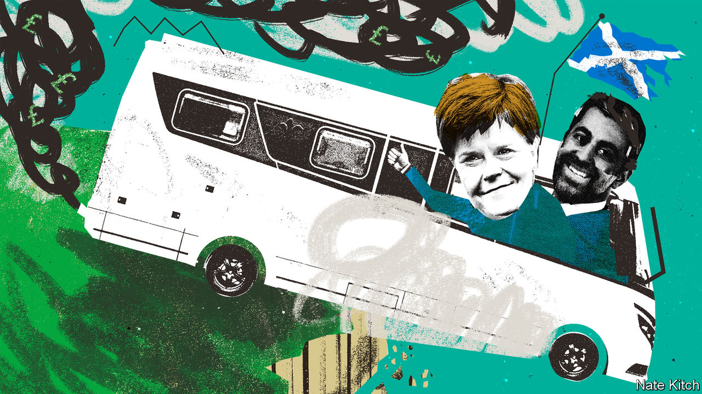
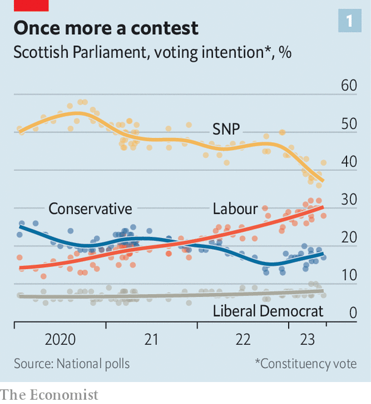

###### Up in the air

# After a decade of SNP dominance, Scotland’s politics is suddenly in flux 

##### From romantic movement to motorhome owner 

 

> Jun 1st 2023 

Shawlands, an area in the southern suburbs of Glasgow, is the heartland of the modern nationalist movement. It is youthful, cheap and increasingly trendy: artisan bakeries, craft boutiques and activist bookshops have sprung up between the pawnbrokers, bookmakers and off-licences. It is a place of students and idealists, and it takes no great leap of imagination to see why this area voted so enthusiastically for Scotland’s independence in the referendum in 2014. 

Nor why, the following year, it elected a Scottish National Party (SNP) candidate to Westminster as part of a yellow tide that all-but wiped out the once-dominant Labour Party. Nor why , who represents the area in the devolved parliament and was until recently Scotland’s first minister, is regarded as a hero by a coalition of progressive dreamers and those who simply want to stick it to the English. 

If a referendum were held tomorrow, says Gordon McKee, the area would probably vote for independence again. (He was an activist for the union in 2014.) But as a referendum will not be held tomorrow, nor any time soon, there is a growing prospect it will elect Mr McKee as its Labour MP. For where Shawlands and the Labour Party are as one, he says, is in their appetite for ousting the Tory government in Westminster.

A change is sweeping through Scottish politics which is both unexpected and stunning. A combination of exhaustion and scandal is signalling the end of the SNP’s electoral dominance and of the prospect—at least in the medium term—of the second referendum that the party craves. The toll of a decade of polarisation is becoming clearer, too. 

Scotland is a small country of 5.5m people, and Ms Sturgeon bestrode it. The SNP has been in power in Holyrood continually since 2007; she served as deputy to Alex Salmond, and then as the country’s first minister. The referendum of 2014 polarised the electorate into tribes of “Yes” and “No” voters. The Brexit referendum of 2016 gave Ms Sturgeon the pretext for a new rolling campaign for independence, which was bolstered by an increasingly erratic Conservative government in Westminster. Last year Ms Sturgeon announced that she had pencilled in October 19th 2023 as the date for a second referendum. 

That turned out to be delusional. On February 15th Ms Sturgeon announced her resignation. She said she was tired, but her departure took on a new light when, two months later, police investigating the alleged misuse of party funds raided the home she shares with Peter Murrell, her husband and the SNP’s former CEO. The police were reportedly searching for a woman’s razor, jewellery and a wheelbarrow, among other things. A large motorhome was seized, and taken to a police lockup near Shawlands. A romantic movement that drew on a vaulting narrative of history suddenly looked humiliatingly small. 

 


The SNP’s polling, already sliding before Ms Sturgeon quit, has since cratered. , who was elected as her successor by SNP members on March 27th, has weak personal ratings. The SNP’s landslide of 2015 may be undone: Labour would leap from one seat to 24 in Scotland if today’s polling were repeated at the general election expected next year, according to a projection by YouGov on May 24th. Its gains would include Glasgow South, the constituency which contains Shawlands. That would ease  task of forming a majority Labour government in Westminster. It would also provide a toehold for returning to power at the next elections to Holyrood in 2026 (see chart 1).

An independence referendum is off the agenda, perhaps for the rest of the decade. It already faced two obstacles. One was constitutional: in November 2022 the British Supreme Court  that the Scottish Parliament could not legislate for a vote without Westminster’s permission. The second was electoral: support for independence never achieved a sustained and clear majority of the sort which might have forced British prime ministers to accede to another referendum. Now a third has sprung up: the derailing of the SNP as the movement’s political vehicle. The momentum stirred by Ms Sturgeon, a gifted orator, has dissipated. “The bubble has burst,” says one nationalist. “Independence is inevitable,” says another. “But it is not clear how we will get there.” 

 


Constitutional polarisation will endure. More than four in ten Scots still support independence, even as the SNP tumbles in the polls (see chart 2). Anas Sarwar, Scottish Labour’s leader, is winning over nationalists, but he is not trying to turn them into unionists. His pitch is that a vote for Labour is now a faster “escape route” from the Conservative government and towards social change than a referendum. “We may disagree on the final destination for Scotland,” he told  in an interview. “But we can all agree we need to get rid of this rotten Tory government, so let’s go on this part of the journey together.” A second referendum could one day happen, says Mr Sarwar. His message resonates most with “soft” nationalists (the two in three “Yes” voters who do not rank independence in their top three priorities). 

Without an obvious route to a referendum, the question for the SNP is “What next?”. The party will meet for a special conference in Dundee on June 24th to settle on an answer. It is hoping for a hung parliament in the next general election, and claims it will be able to extract the constitutional right to organise another referendum in exchange for supporting a minority Labour administration. But that is a long shot. Even if the election turns out that way, the SNP’s bargaining power is diminished by the fact that it cannot be seen to help the Tories stay in power. If it loses lots of seats itself, its mandate for a break-up will look weaker still.

Cooler heads are preparing for a long game, in which the SNP focuses on extracting money and autonomy for Scotland from a Labour government which is keen to cement its electoral gains there. The confrontational approach taken by the SNP in the past decade was a departure from the party’s long tradition of gradualism, notes Stephen Noon, a former party strategist. Its goal now should be “more independence”, not independence full stop, he argues.

The party’s monopoly over nationalist voters is meanwhile weakening: since January, the proportion of “Yes” voters who say they will vote for the SNP in a Scottish Parliament election has fallen from 79% to 65%. Mr Salmond, now leading Alba, a pro-independence conservative splinter party, proposes that nationalists should run for election on a single ticket. He has an audience among the fundamentalist fringe, who will gather at Bannockburn, the site of an old victory over the English army, on the same day as the event in Dundee. The SNP will need to relax its “command and control” approach, says Gerry Hassan, a pro-independence academic. 

Mr Yousaf faces a battle to hold onto his job as first minister, say some colleagues. The police investigation may become more embarrassing. A probable by-election in Rutherglen, a seat outside Glasgow, may also undermine him. Mr Yousaf has decided to launch a legal challenge against the British government over a blocked gender-recognition law, an issue which splits his colleagues. The most likely trigger for a rebellion would be heavy losses in a general election, but if the polling fails to improve then his colleagues may move against him much faster, says one senior party figure.

All the while, difficult questions about the state of the country are becoming harder to dodge. Scotland’s health service is struggling to recover from the pandemic; its school performance is slipping behind England’s. Growth is not good enough: the productivity gap with the rest of Britain shrank in the early years of devolution but has remained roughly constant since 2014. 

It faces a tough demographic transition—Scotland’s working-age population is expected to peak this year—and a looming gap between spending and receipts of 3.5% by 2027-28, notes the Institute for Fiscal Studies, a think-tank. Over the longer term the per-person funding premium for Scotland awarded under the “Barnett formula”, a pan-UK regime of generous fiscal transfers, is set to shrink. All of which is stirring debate about the sustainability of Scotland’s universal benefits, which nationalists regard as a vital symbol of a collectivist culture. 

Mr Sarwar’s answer is to position Scottish Labour as a pro-growth vehicle: “This Scottish Parliament has been for 24 years largely a social-policy parliament and not an economic-policy parliament.” He is not angling for more devolved powers; the problem is the conflicted relationship between London and Edinburgh, he says. “You can have the best model of devolution in the world: if you have bad-faith actors on either side, it won’t work.” 

Left behind

In contrast, Mr Yousaf is not ready to abandon the strategy that worked for Ms Sturgeon for so long. She took a leftward turn as she chased Labour’s strongholds. She gave investors the cold shoulder, and used devolved powers to increase income taxes. Mr Yousaf hints he will raise them more. But these taxes fall on a small group of higher earners, particularly in the volatile oil and gas sector, and the extra revenue they bring in has been offset by a shrinking tax base as labour-force participation falls. During the leadership contest Kate Forbes, Mr Yousaf’s principal opponent, warned that raising taxes further would risk driving activity south of the border; he dismissed her as a cheerleader for the rich. 

Mr Yousaf has upheld the coalition assembled by Ms Sturgeon in 2021 with the pro-independence Scottish Green party, which decries an “obsession with growth”. Such rhetoric plays well in places like Shawlands. But look at the potholed roads there, and the rubbish piled in the alleyways, and it is hard to conclude that this is a country suffering from a fixation with economic growth. Its problems stem from an obsession of a different kind. ■


