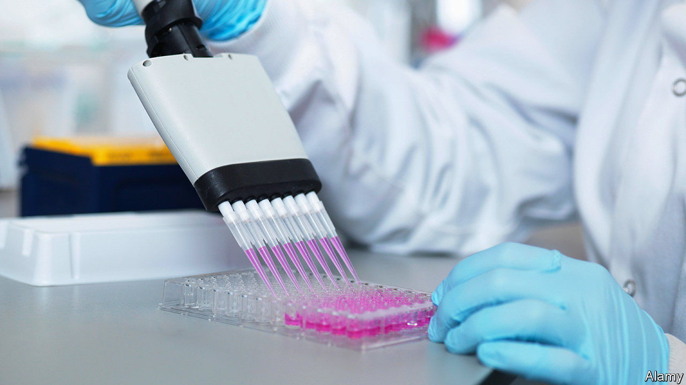
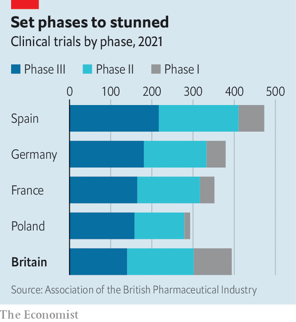

###### Old standard

# Britain is falling behind in clinical trials of medicines 

##### The lead established during the pandemic has been lost 

 

> Jun 1st 2023 

Britain did a lot of things badly during the covid-19 pandemic. But on clinical trials, which test the safety and efficacy of medicines, it did a lot of things . It was the first country in the world to approve a covid vaccine, on the back of speedy yet rigorous testing. And at the beginning of the pandemic British scientists set up RECOVERY, the first randomised trial for covid treatments. The discovery that dexamethasone, a cheap steroid, reduced covid deaths by a third is alone estimated to have saved more than 1m lives.

 


Such feats are hard to reconcile with an independent, government-commissioned review by Lord O’Shaughnessy, a former junior health minister, published on May 25th. He finds that in commercial clinical trials Britain has been falling behind its peers (see chart). Between 2017-18 and 2021-22 it slipped from fourth to tenth in the world rankings for phase-3 trials—those closest to roll-out, when drugs are most extensively tested. For phases 2 and 3, Poland manages to recruit almost three times as many participants as Britain (an average of 61 compared with 21). “We are a long way behind the game at the moment,” says Dame Kate Bingham, who headed the covid-vaccine task force.

Some failings may be linked to success in the pandemic. “We focused all our activities on delivering new vaccines for covid,” says Matthew Hallsworth of the National Institute for Health and Care Research, a government agency that funds such studies. That was at the expense of other things. 

Yet in other ways covid was not a distraction, but a brief interlude from inertia. In 2019 Britain took the longest of ten comparable countries to set up and approve clinical trials. When people were dying of a mysterious virus, investigation was urgent; such momentum has not been sustained. A reluctance to share data sets within the National Health Service (NHS), in order to recruit and monitor trial participants, was only briefly overridden. Researchers “do not feel that research is a priority for either the NHS or the wider UK economy,” writes Lord O’Shaughnessy in his at-times scathing report. 

Missing out on research means patients missing out on innovative therapies for serious diseases. Even in unsuccessful trials, patients often benefit from a “research effect” that improves their care. In 2020 the NHS rolled out a large-scale trial of inclisiran, a cholesterol-lowering medication. Academics reckoned it might be the equivalent of a vaccine for heart disease and that the trial might save up to 30,000 lives. But overworked, risk-averse general practitioners were slow to offer it to patients. The trial of a drug many called “ground-breaking” was grounded.

The breakneck pace set during the pandemic could not have been sustained. But some practices should have been. Britain’s drugs regulator, the Medicines and Healthcare-products Regulatory Agency (MHRA), was, in the words of its boss, already trying to move from being a “policeman” to an “air-traffic controller”. A streamlined approvals process helped it move faster during covid. Since then, an exodus of staff and a reversion to duplicative bureaucratic checks have contributed to myriad delays.

Lord O’Shaughnessy makes some sensible suggestions. To get back on its feet the MHRA needs more money (beyond that promised in the chancellor’s spring budget) and a refreshing of the principles which made it an object of admiration during the pandemic. Contracts with drugs firms, now often negotiated on a case-by-case basis by NHS organisations, should be standardised. Clinicians should be given incentives to take part in trials, and more should be done to involve the public. A successor to the covid-vaccine registry, through which citizens could volunteer for research, has already attracted more than 150,000 people. A full launch on the NHS app is planned later this year.

The government’s response to the report, released on the same day as a string of policies to boost the life-sciences industry, was positive. It tentatively accepted Lord O’Shaughnessy’s suggestion to create networks of private- and public-sector organisations to accelerate selected trials, much as the covid-vaccine task force did. Amid intense global competition for investment in pharma, innovation is required. Clinical trials are  everywhere. Just as it did during covid, necessity may help give Britain an edge.■


