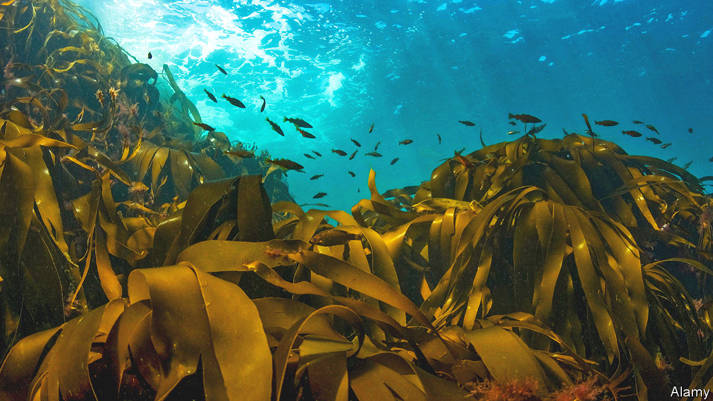

###### With a little kelp from my friends

# Can British seaweed farms bloom? 

##### A nascent industry in which the country has some natural advantages 

 

> Jun 1st 2023 

Setting up a seaweed farm isn’t easy. Four miles off the north Devon coast in Bideford Bay, Algapelago, one of a spate of British seaweed startups, has just lost a sensor to the ocean. “Well, that’s quite irritating,” says Olly Hicks wryly. “That was our first month of data.” Mr Hicks, a co-founder of Algapelago, is captaining a small crew of research scientists and aquafarmers to a pilot site which could become Britain’s largest. The square-kilometre site may one day yield as much as 2,000 tonnes of seaweed per year. Right now, it’s much less.

Seaweed, the umbrella term for thousands of species of marine algae, is seen by some as a magic ingredient in the fight against climate change. Researchers are studying its potential to sequester carbon. From food products to cosmetics to plastic alternatives, it has a range of possible industrial applications. Algapelago’s target market is agriculture; one recent study found that feeding cows seaweed reduced their  by over 80%. It is easy to grow: long pieces of rope are implanted with seaweed spores, incubated onshore and then taken out to sea.

Britain has a long way to go to get a foothold in a global seaweed industry worth $13.3bn. Worldwide algae production reached 36m tonnes in 2019, according to the Food and Agriculture Organisation, a UN body. Over 97% of that production , and nearly all of that is grown at scale. The British contribution, in contrast, comprises small-scale wild harvesting and is barely a rounding error.

With easy access to the nutrient-rich waters of the North Atlantic and the North Sea, Britain should have a natural advantage. More is steadily being done to make the most of it. In 2022 the Scottish Association for Marine Science set up the Seaweed Academy in Oban, offering training and education for would-be aquaculturists. “We were getting calls all the time from people saying ‘Can we start a seaweed farm? Can we just buy some seeds from you?’,” says Rhianna Rees, the academy’s co-ordinator. 

But learning how to grow a crop is only one part of the equation. Making money out of seaweed is a very different proposition. “I break absolutely everything down,” stresses Ms Rees. “I want people to know…that it is a challenge.” Cultivated seaweed is relatively expensive and finding customers for it can be tricky; Britain falls far short of producing the volumes big industrial players need. Without clear routes to market, investment, leases and licences are hard to get. 

Still, an ecosystem of research institutions and a sea of minds focused on the climate emergency offer some hope for the industry. Off the coast of Devon, samples of Algapelago’s first batch of seaweed look promising. Several metres underwater two ropes, each 200 metres long and laced with kelp spores, are coming into season. “In a perfect world you’d have even crop all the way along that line”, says Mr Hicks, drawing an imaginary path across the water. “We could have 250 lines on this patch.” ■


