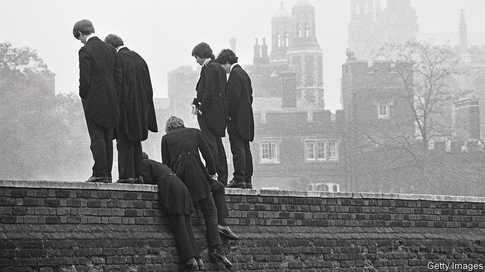

###### Decline and pall

# Sad little boys: the backlash against Britain’s boarding schools 

##### Does posh care lead to bad outcomes? 

 

> May 28th 2023 

The moment when his chemistry master pulled a pistol, declared it loaded and waved it in the air was “probably”, says Justin Webb, a broadcaster, the worst point of his boarding-school career. Winston Churchill would recall the floggings, done until pupils “bled freely” and screamed loudly. In “Such, Such Were The Joys”, George Orwell writes of being beaten so violently that his headmaster broke his riding crop and “reduced me to tears”. 

That British boarding schools are odd places is not news. For several centuries and for fat fees they provided the English upper classes with a ripping blend of architectural beauty and physical discomfort; with neoclassical corridors and cold showers; with lashings of Latin and just plain lashings. The pupils they produced were an equally idiosyncratic mix of the sophisticated and the childlike, mingling precocious brilliance with speech that never quite left the classroom. It was a heady brew and Britain was intoxicated by it: of the 57 British prime ministers, 20 . As Boris Johnson, one of their number, might say: “Crikey!”

Boarding schools are not yet in trouble. Their pupil numbers are relatively constant—around 70,000, owing partly to masses of boarders from abroad. But their charms may be becoming easier to resist. Elite private schools are a  into the top universities than they were. In 2014, 99 pupils from Eton were accepted into Oxbridge; in the 2021-22 school year, it managed 47. (Brampton Manor Academy, a state school in London, had 54.) 

That raises hard questions about value for money. Annual fees for Eton were a mere £861 (around £10,000 today) a year in Mr Johnson’s era. Today, its fees are £15,432 “each half” (which, as Eton’s website explains, means thrice yearly; £46,296 a year apparently does not stretch to an understanding of fractions). For this, Etonians enjoy one pool; two chapels; three “theatre spaces”; a composer-in-residence; a filmmaker-in-residence; a pet pianist; and a director of “inclusive education”, who notes that to promote diversity at Eton it is important “to enable people to talk about uncomfortable things”. Like, say, those fees. 

Perhaps the most profound threat to boarding schools is more fundamental. And that is the idea that to send a child as young as seven or eight away from home is not privilege but brutality; that even if this education goes well—no abuse; First XI cricket; scones for tea; huzzahs all round—it will still have been very wrong. Older adolescents might well find the experience less cruel, perhaps even a relief. But as John Bowlby, a psychologist who was the father of attachment theory, put it: “I wouldn’t send a dog away to boarding school at age seven.” Richard Beard, a writer who lacerates private schools in his book, “Sad Little Men”, echoes the theme. The architectural beauty and bells and whistles of boarding schools, he says, are like the label on a dog-food tin which “isn’t for the dog; it’s for the person buying it”.

Send your offspring to boarding school, agrees Alex Renton, an author and campaigner who was abused at his prep school, and “you’re putting your child into care. You’re just paying for it.” Psychologists increasingly argue that posh care leads to bad outcomes. In 2011 the term “boarding-school syndrome” was coined by Joy Schaverien, a psychotherapist, to cover a series of symptoms such as depression and emotional repression. A group called “Boarding School Survivors” provides therapeutic help to former boarders. Since its foundation in 1990 it has treated hundreds. 

Their defenders argue that boarding schools have changed. To extrapolate from the experiences of children 40 years ago is “obtuse”, says Gavin Horgan, headmaster of Millfield School and chair of the Boarding School Association. “It’s a completely different environment.” Whereas once pupils were sent away for months, many young boarders are now weekly; they can video-call home each day. Attitudes are different, too: today boarding-school teachers talk not about stiff upper lips but safeguarding and mental-health first-aiders. Moreover, boarding-school syndrome is posited rather than proved by hard data. 

But critics say that this is partly because no one has bothered to gather the information. Snobbery and a national obsession with old stone mean that it is still a struggle to see people in Palladian mansions as deprived. Mr Webb thinks he and his fellow-boarders were not privileged. “If anything, the opposite…they should’ve been at home, having tea with mum and dad.” To send him away was, he says, “a crime”.

The cruelty of this system was deliberate, not accidental. Victorian Britons, believing that the battle of Waterloo had been won on the playing-fields of Eton, set about creating new fields and new Etons in order to mass-produce the upper-middle classes. Children, removed from the “softening” influence of mothers, were put in uniform clothes, in uniform beds, in uniform dorms, where they spoke uniform vocabulary (“Topping! Pax! Sneak!”) with an increasingly uniform accent: the clipped tones of Received Pronunciation (RP) are thought to have emerged as part of this school-led standardisation.

The empire might have been happy with the results, its children less so. Churchill wrote of a “life of anxiety” at his prep school; C.S. Lewis called his first school “Belsen”. One of the best arguments in favour of boarding schools is the quality of the prose attacking them; one of the best arguments against is its content. After that beating, Orwell felt that “life was more terrible, and I was more wicked, than I had imagined.” Such, such were the joys. ■


