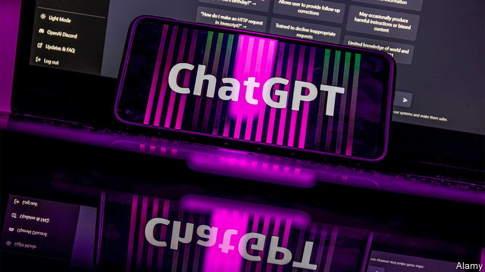

###### ChatBoss

# Chief executives cannot shut up about AI 

##### Earnings calls are overflowing with mentions of it 

 

> Jun 1st 2023 


Since the launch in November of ChatGPT, an artificially intelligent conversationalist, AI is seemingly all anyone can talk about. Corporate bosses, too, cannot shut up about it. So far in the latest quarterly results season, executives at a record 110 companies in the S&P 500 index have brought up AI in their earnings calls. ■


