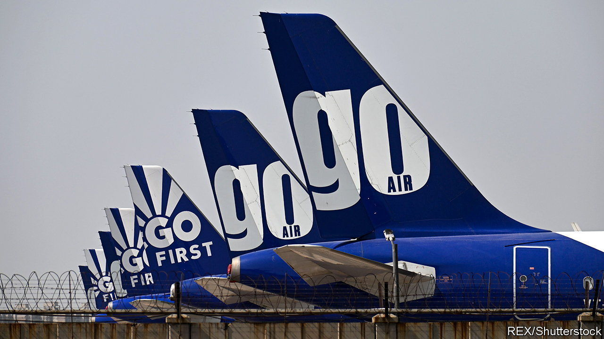
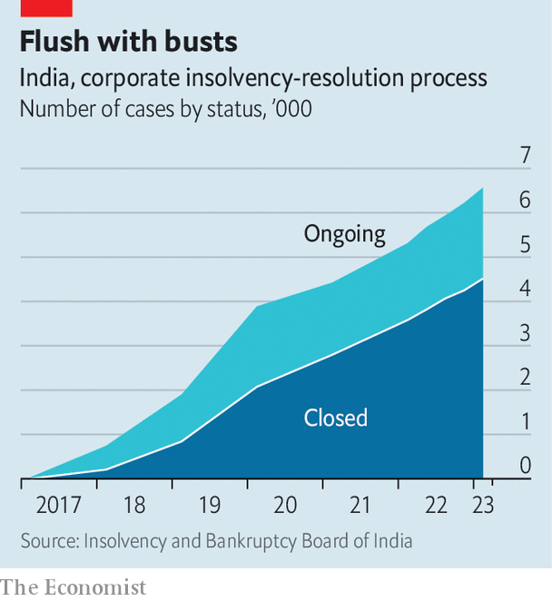

###### Bankruptcy in India

# Go First’s insolvency tests India’s bankruptcy regime 

##### A law meant to speed up going broke needs its own restructuring 

 

> Jun 1st 2023 

GO FIRST, an Indian low-cost airline, collapsed in May under the weight of four years of losses, citations for safety lapses and operating confusion that, in January, resulted in a flight from Bangalore to Delhi carrying baggage but forgetting a third of its passengers. At least the carrier held valuable assets in the form of 45 or so aircraft stranded at Indian airports. And, as a high-priority case, it was supposedly subject to expedited bankruptcy hearings. 

A prompt liquidation and redeployment of assets has obvious benefits for the aviation industry, its creditors and, possibly, for rivals keen to snap up its planes to add capacity in response to packed flights. Not so fast, the court hearing Go First’s case now appears to be saying. Rather than allow easily identifiable assets like the company’s aeroplanes to be reclaimed while more complicated financial ones are unwound, it has placed a blanket hold on all the airline’s assets. 

The Go First roadblocks are indicative of longstanding problems with bankruptcy in India. These were meant to be solved by a new insolvency code introduced in 2016. That code’s provisions shifted power from indebted companies, protected by a morass of earlier rules, to their creditors. It allowed some interminable bankruptcy proceedings at last to come to an end, for example forcing the sale of Essar Steel, an industrial giant which had been in default to various creditors as far back as 2002. A smooth journey through the court system was meant to send a bigger message—that the risk of lending to Indian businesses could be mitigated by ensuring that collateral is readily transferable. This, the argument went, would help reduce borrowing costs for corporate India more broadly. 

Despite a few successes such as Essar, however, the regime has not lived up to its promise. One persistent problem has been the low recovery rate for creditors’ claims. In the past seven years lenders to a company that presented a successful resolution plan received a paltry 32% of their claims, on average. And only one in four bankrupt firms present such a plan; the remaining three-quarters of cases end in liquidation, for which creditors’ average recovery rate is a dismal 7% of what they are owed. 

The official figures may overstate the actual returns of what creditors are owed. They take no account of the time and effort involved in the process—the second problem with the code as applied in practice. Under the law, cases are to be resolved within 330 days. The latest quarterly update by the law’s administrator, the Insolvency and Bankruptcy Board of India, indicated that cases leading to a liquidation took an average of 456 days to conclude. The average for cases in which the company survived through a resolution plan was a gobsmacking 614 days. The number of applications that are taking more than two years rose to 85 in the 12 months to March 2022, from 15 a year before. Bankruptcy lawyers grumble that submitting an application in the first place is becoming harder, and can itself now take a couple of years. 

 


Fixing India’s bankruptcy process may require revisions to the law. It could, for instance, do with a clearer distinction between tangible and less tangible assets of the sort that has historically allowed things like railway carriages to be repossessed quickly and leased out in jurisdictions such as America. 

The bankruptcy system also needs more resources. As the number of cases keeps rising, so does the backlog (see chart). Unlike India’s older courts, often ensconced in palatial buildings, the country’s busiest bankruptcy forum in Mumbai occupies an upper floor of a dilapidated old building owned by MTNL, an ailing state-owned telecoms provider. In theory, its five courtrooms operate six hours a day. Lawyers say that in practice four hours is more common. Without enough judges to man all five benches, some courtrooms remain empty. As an exasperated banker involved in many insolvencies puts it, “No one is winning now.” ■


