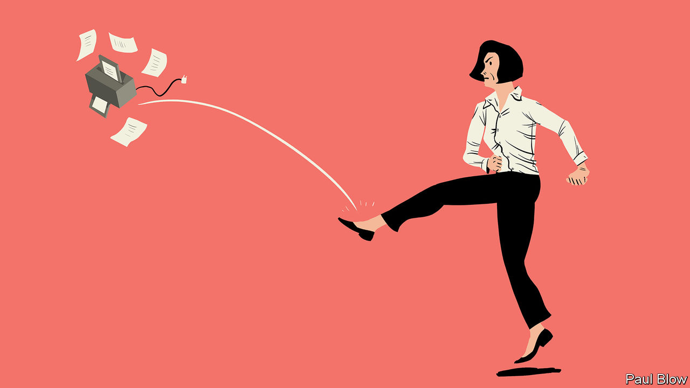

###### Bartleby

# How to beat desk rage 

##### The office equivalent of misophonia 

 

> Jun 1st 2023 

A recent piece of research revealed that as many as one in five people in Britain suffers from “misophonia”, a condition in which certain sounds cause them disproportionate distress. If you can listen to your spouse eating an apple and don’t immediately want a divorce, you are not a sufferer of misophonia. But you may have another, similar condition for which the workplace is the perfect breeding-ground. “Misergonia” (colloquial shorthand: desk rage) is the name hereby bestowed on the eye-gougingly deep irritation triggered by certain aspects of office life. 

Like misophonia, sounds are often the trigger for misergonia. The routine fire-alarm test is a case in point. “Attention please, attention please,” shouts a voice that is literally impossible to ignore. “This is a test,” it roars, making it clear that your attention is not in fact required. More shouting and eardrum-piercing noises follow. Then, most galling of all, a message of thanks for your attention, the aural equivalent of a prison thanking you for choosing them for a stay. By the end of it all, a conflagration would be sweet release. 

Other noises are less obviously intrusive but just as annoying. The noise of clicking keys is the soundtrack of cubicles everywhere. But every office has its share of keyboard thumpers, people whose goal seems to be not producing a document but destroying the equipment before one can be created. 

Verbal tics are another tripwire for misergonia sufferers. “This is a point that has already been made,” is how weirdly large numbers of people start to make a point that has already been made. Why not just say “I don’t value your time” and have done with it? 

Small IT failures are a fact of office life, but they can still be soul-destroying. The printer which jams repeatedly. The design requirement in said printer that demands every flap and tray must be opened once before things can restart. The headphones that never work. Or the mouse that gives up at just the wrong moment. Your cursor is two centimetres from the unmute button on a Zoom call; you move your mouse towards it when it is your turn to speak, and nothing happens. You rattle it around more vigorously, and still no response. Either your cursor is in a coma or the battery has run out. “You’re still on mute,” offers up a colleague helpfully. Someone else fills the gap. “This is a point that has already been made…,” they begin. 

And then there is the reply-all email. It starts innocently enough, with someone asking for help with a problem. In come one or two replies, and with a sickening lurch of the stomach you realise that the entire company has been copied in on this request. Suddenly, an avalanche. It is as if nothing else matters other than weighing in on this one question. Deadlines are deferred. Milk goes off in the fridge. Visitors in reception are left to forage for food while members of staff devote themselves to the matter at hand. There are replies to replies, and replies to replies to replies. This isn’t a thread, it’s a hawser. Everyone seems to be enjoying themselves hugely. 

But there is a silent, suffering group for whom every new message lands as a hammer blow to their composure. How many minutes can one organisation fritter away on this nonsense? Why isn’t it stopping? And when the initial round of answers has died down, can you be certain that it is really over? It is always possible that someone who has been away from their desk will pile in and start the whole farrago up again. 

Individual workers will have their own triggers, ostensibly tiny things to which they are extremely sensitive. It might be the person who still doesn’t understand you have to tag someone in Slack to notify them of a message. It might be the doors closing on a crowded lift, only for an arm to snake in and a voice to ask “room for one more?” (If you were the size of a marmot, yes.) It might be a particularly heavy tread or an even heavier perfume. It might be the way someone insists on using the word “pivot”. It might be anything, frankly—which means that for some of your colleagues it might also be you. 

There is no cure for misergonia. The workplace is a collection of people in enforced and repeated proximity, their habits, noises and idiosyncrasies turning into something familiar for some colleagues and disproportionately grating for others. The only release is to go home, close the front door behind you and find your significant other tucking into an apple.■


