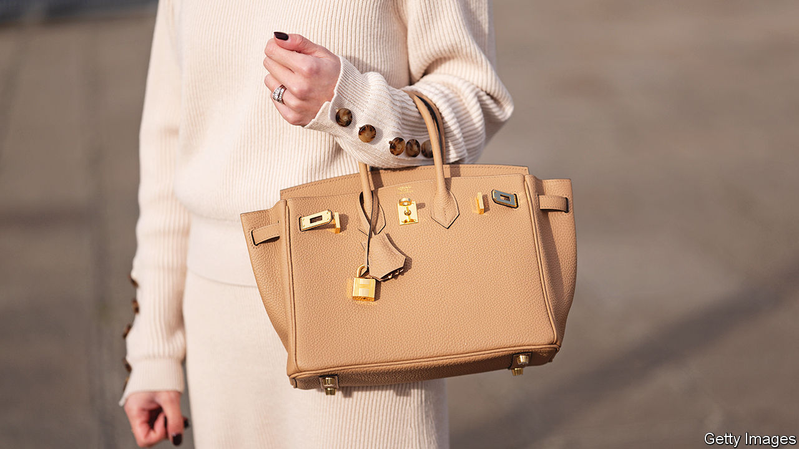

###### Champagne lifestyle

# Is the luxury sector recession-proof? 

##### Not all high-end brands will lose their shine 

 

> Jun 1st 2023 

Hermès is a byword for exclusivity. Its signature Birkin bag, one of which sold for $450,000 last year, cannot be bought from the luxury firm’s website or by simply walking into a store. There are neither ads in fashion magazines nor glossy campaigns on Instagram. For the not-so-famous, owning a Birkin can involve a years-long waiting list.

Part of the reason for the wait is constrained supply, which Hermès manages with the precision worthy of its stitching. But another part is booming demand for all manner of luxury goodies. Last year net profits of Kering, which owns fashion labels such as Gucci and Balenciaga, rose by 14%. Those at LVMH, owner of Tiffany and Louis Vuitton, among other brands, grew by nearly a quarter. Hermès and Richemont, which owns Cartier, among other baubles, each saw theirs surge by more than a third. Together, the four groups raked in over €33bn ($35bn) in profits, on combined revenues of around $130bn.

That, though, was before persistent inflation and rising interest rates to combat it fanned fears of a global recession. Now, as those fears intensify, luxury brands are losing their shine, at least in the eyes of investors. Luxury bosses’ unease expressed at an industry pow-wow on May 22nd provoked a sell-off that wiped $65bn, or 7%, from the four luxury groups’ collective market value. Once shareholders stop quaking in their Louboutins, they may pay closer attention to two things in order to assess their luxury stocks’ prospects. 

The first is a brand’s positioning within the luxury business. Mid-market houses that target the merely affluent, such as Ralph Lauren, a maker of polo-themed apparel, are more sensitive to economic headwinds than top-end brands catering to the obscenely wealthy. This was already evident last year. Shoppers who had shelled out up to €1,000 on designer goods before the pandemic cut their average spending in half in 2022, according to Bernstein, a broker. By contrast, the truly loaded more than doubled theirs. These days just 5% of buyers account for two-fifths of global luxury sales.

Exposure to China, one of the world’s biggest luxury markets, is another factor. Luxury merchants counting on a sharp rebound from years of harsh zero-covid lockdowns to raise sales have been disappointed by Chinese shoppers’ unobliging restraint. Brands including Estée Lauder, a pedlar of pricey cosmetics, have slashed their outlook for the region. Burberry, a British maker of beige coats, generated less than a third of sales from Chinese shoppers, down from 40% before the pandemic. Things could get worse for American and European brands in China if Sino-Western geopolitical tensions ratchet up.

Luxury houses are already searching for new engines of growth. These include India, which though mostly poor has growing ranks of the super-rich, and sub-Saharan Africa, where last year Chanel became the first European luxury brand to stage an African fashion show, in Dakar, the capital of Senegal. But these markets will take years to reach China’s scale, if they manage to do so at all. In the meantime, investors are likely to become as discerning about their luxury stocks as they are about their posh wardrobes. ■


