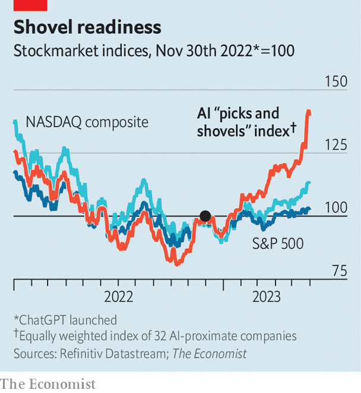

###### There’s AI in them thar hills

# Nvidia is not the only firm cashing in on the AI gold rush 

##### Selling specialist chips and infrastructure is becoming a trillion-dollar industry 

 

> May 29th 2023 

A GREY RECTANGULAR building on the outskirts of San Jose houses row upon row of blinking machines. Tangles of colourful wires connect high-end servers, networking gear and data-storage systems. Bulky air-conditioning units whirr overhead. The noise forces visitors to shout. 

The building belongs to Equinix, a firm which leases . The equipment inside belongs to corporate customers that are increasingly using it to run their  (AI) systems. The AI gold rush, spurred by the astounding sophistication of “generative” models such as , a hit virtual conversationalist, promises rich profits for those who harness the technology’s potential. As in the early days of any gold rush, though, it is already minting fortunes for the sellers of the requisite picks and shovels.

On May 24th Nvidia, which designs the semiconductors of choice for many AI servers, beat analysts’ revenue and profit forecasts for the three months to April and said it expected sales of $11bn in its current quarter, half as much again as what Wall Street was predicting. On May 29th Nvidia’s boss, Jensen Huang, declared that the world is at “the tipping point of a new computing era”. The next day the company’s market value, which had leapt by 30% after its earnings, briefly hit $1trn. 

 


Other chip firms, from fellow designers like AMD to manufacturers such as TSMC of Taiwan, have been swept up in the AI excitement. So have providers of other computing infrastructure—which includes everything from those colourful cables, noisy air-conditioning units and data-centre floor space to the software that helps run the AI models and marshal the data. An equally weighted index of 30-odd such companies has risen by 40% since ChatGPT’s launch in November, compared with 13% for the tech-heavy NASDAQ index (see chart). “A new tech stack is emerging,” sums up Daniel Jeffries of the AI Infrastructure Alliance, a lobby group. 

On the face of it, the AI gubbins seems less exciting than the clever “large language models” behind ChatGPT and its fast-expanding array of rivals. But as the model-builders and makers of applications that piggyback on the models vie for a slice of the future AI pie, they need computing power right now—and lots of it. 


The latest AI systems, including the generative sort, are much more computing-intensive than older ones, let alone non-AI applications. Amin Vahdat, head of AI infrastructure at Google Cloud Platform, the internet giant’s cloud-computing arm, observes that model sizes have grown ten-fold each year for the past six years. GPT-4, the latest version of the one which powers ChatGPT, analyses data using perhaps 1trn parameters, more than five times as many as its predecessor. As the models grow in complexity, the computational needs for training them increase correspondingly. 

Once trained, AIs require less number-crunching to be used. But given the range of applications on offer, this “inference” will, cumulatively, also demand plenty of processing oomph. Microsoft has more than 2,500 customers for a service that uses technology from OpenAI, ChatGPT’s creator, of which the software giant owns nearly half. That is up ten-fold since the previous quarter. Google’s parent company, Alphabet, has six products with 2bn or more users globally—and plans to turbocharge them with generative AI. 

The most obvious winners from surging demand for computing power are the chipmakers. The products of companies like Nvidia and AMD, which design chips and have them made at foundries like TSMC, are in hot demand, notably from the big providers of cloud computing that powers most AI applications. AI is thus a boon to the chip designers, since it benefits from more powerful chips (which tend to generate higher margins), and more of them. UBS, a bank, reckons that in the next one or two years AI will increase demand for specialist chips known as graphics-processing units (GPUs) by $10bn-15bn. Nvidia’s data-centre revenue, which accounts for 56% of its sales, could double. AMD will this year launch a new GPU. A much smaller player in the GPU-design game than Nvidia, the firm is poised to benefit “even if it just gets the dregs” of the market, says Stacy Rasgon of Bernstein, a broker. Chip-design startups focused on AI, such as Cerebras and Graphcore, are trying to make a name for themselves. PitchBook, a data provider, counts about 300 such firms. 

Naturally, some of the windfall will also accrue to the manufacturers. In April TSMC’s boss, C.C. Wei, talked cautiously of “incremental upside in AI-related demand”. Investors have been rather more enthusiastic. The company’s share price rose by 10% after Nvidia’s latest earnings, adding around $20bn to its market capitalisation. Less obvious beneficiaries also include companies that allow more chips to be packaged into a single processing unit. Besi, a Dutch firm, makes the tools that help bond chips together. According to Pierre Ferragu of New Street Research, a firm of analysts, the Dutch company controls three-quarters of the market for high-precision bonding. Its share price has jumped by more than half this year. 

UBS estimates that gpus make up about half the cost of specialised AI servers, compared with a tenth for standard servers. But they are not the only necessary gear. To work as a single computer, a data centre’s GPUs also need to talk to each other. And that requires advanced switches, routers and specialist chips. The market for such networking gear is expected to grow by 40% annually in the next few years, to nearly $9bn by 2027, according to 650 Group, a research firm. Nvidia, which also sells such kit, accounts for 78% of global sales. But rivals like Arista Networks, a Californian firm, are getting a look-in from investors, too: its share price is up by nearly 70% in the past year. Broadcom, which makes chips that help networks operate, said that its annual sales of these would quadruple in 2023, to $800m.

The AI boom is also good news for assemblers of servers that go into data centres, says Peter Rutten of IDC, another research firm. Dell’Oro Group, one more firm of analysts, predicts that the world’s data centres will increase the share of servers dedicated to AI from less than 10% today to about 20% within five years: this kit’s share of data centres’ capital spending on servers will rise from about 20% to 45%. 

This will benefit server manufacturers like Wistron and Inventec, both from Taiwan, which produce custom-built servers chiefly for giant cloud providers such as Amazon Web Services (AWS) and Microsoft’s Azure. Smaller manufacturers should do well, too. The bosses of Wiwynn, another Taiwanese server-maker, recently said that AI-related projects account for more than half of their current order book. Super Micro, an American firm, said that in the three months to April AI products accounted for 29% of its sales, up from an average of 20% in the previous 12 months.

All this AI hardware requires specialist software to operate. Some of these programs come from the hardware firms; Nvidia’s software platform, called CUDA, allows customers to make the most of its GPUs, for example. Other firms create applications that let AI firms manage data (Datagen, Pinecone, Scale AI) or host large language models (HuggingFace, Replicate). PitchBook counts around 80 such startups. More than 20 have raised new capital so far this year; Pinecone counts Andreessen Horowitz and Tiger Global, two giants of venture capital, as investors. 

As with the hardware, the main customers for a lot of this software are the cloud giants. Together Amazon, Alphabet and Microsoft plan to undertake capital spending of around $120bn this year, up from $78bn in 2022. Much of that will go to expanding their cloud capacity. Even so, demand for AI computing is so high that even they are struggling to keep up. 

That has created an opening for challengers. In recent years IBM, Nvidia and Equinix have started to offer access to GPUs “as a service”. AI-focused cloud startups are proliferating, too. In March one of them, Lambda, raised $44m from investors such as Gradient Ventures, one of Google’s venture arms, and Greg Brockman, co-founder of OpenAI. The deal valued the firm at around $200m. A similar outfit, CoreWeave, raised $221m in April, including from Nvidia, at a valuation of $2bn. Brannin McBee, CoreWeave’s co-founder, argues that a focus on customer service and infrastructure designed around AI help it compete with the cloud giants. 

The last group of AI-infrastructure winners are closest to providing actual shovels: the data-centre landlords. As demand for cloud computing surges, their properties are filling up. In the second half of 2022 data-centre vacancy rates stood at 3%, a record low. Specialists such as Equinix or its rival, Digital Realty, compete with big asset managers keen to add data centres to their property portfolios. In 2021 Blackstone, a private-markets giant, paid $10bn for QTS Realty Trust, one of America’s biggest data-centre operators. In April Brookfield, Blackstone’s Canadian rival, which has been investing heavily in data centres, bought Data4, a French data-centre firm. 

Continued growth of the AI-infrastructure stack may yet run up against constraints. One is energy. A big investor in data centres notes that access to electricity, of which such assets are prodigious users, is expected to slow development of new ones in hubs like northern Virginia and Silicon Valley. But a shift away from vast AI models and cloud-based inference to smaller systems may lower demand, since these require less computing power to train and can run inference on a smartphone, as is the case for Google’s recently unveiled scaled-down version of its PaLM model.

The biggest question-mark hangs over the permanence of the AI boom itself. Despite the popularity of ChatGPT and its ilk, profitable use cases for the technology remain unclear. In Silicon Valley, hype can turn to disappointment on a dime. Nvidia’s market value surged in 2021, as its GPUs turned out to be perfect for mining bitcoin and other cryptocurrencies, then collapsed as the crypto boom turned to bust. And if the technology does live up to its transformative billing, regulators could clamp down. Policymakers around the world, worried about generative AI’s potential to eliminate jobs or spread misinformation, are already mulling guardrails. Indeed, on May 11th lawmakers in the EU proposed a set of rules that would restrict chatbots. 

All these limiting factors may slow AI’s deployment, and in doing so dampen the prospects for AI-infrastructure firms. But probably only a bit. Even if generative AI does not turn out to be as revolutionary as its boosters claim, it will almost certainly be more useful than crypto. And there are plenty of other, non-generative AIs that also need lots of computing power. Nothing short of a global ban on generative AI, which is not on the horizon, is likely to stop the gold rush. And so long as everybody is rushing, the pedlars of picks and shovels will be cashing in. ■


