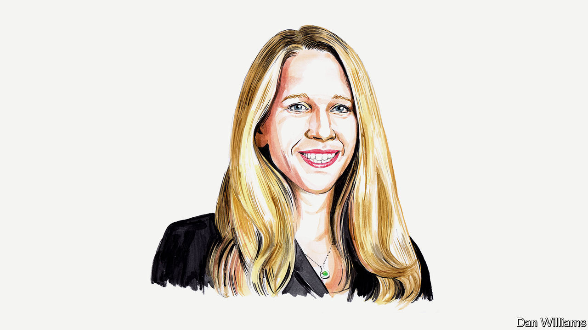

###### Russia’s army

# Dara Massicot believes that Russia faces twin personnel crises in its armed forces 

##### It will struggle to hold on to fighters and to treat traumatised veterans, says the American defence analyst 

 

> May 31st 2023 

MUCH ATTENTION in recent months has focused on Russia’s  and  in Ukraine. But there are other problems, largely unnoticed outside Russia, lurking for the country’s armed forces and society more broadly. Russia’s wartime military-personnel policies, instituted last September, temporarily prohibit active-duty and mobilised soldiers from leaving service. Russia faces a crisis in military retention and a larger social crisis of veteran mental-health disorders when these restrictions are lifted. Just as the terms “Afghan Syndrome” and “Chechen Syndrome” emerged to describe the plight of Russian veterans who lacked support and struggled to adapt to civilian life after those conflicts, it is only a matter of time before “Ukraine Syndrome” grips Russia, as thousands of veterans suffering from post-traumatic stress disorder (PTSD) or other conditions return home.

Since President Vladimir Putin’s partial-mobilisation decree in September 2022, no Russian personnel fighting in Ukraine have been allowed to leave the armed forces, and none will be until the “period of partial mobilisation” is ended by another decree. Currently, the only ways out—apart from death in combat—are reaching mandatory retirement age, medical discharge or imprisonment. Some soldiers have taken matters into their own hands by deserting.

Indefinite deployment and inadequate rest and rotation, due to a shortage of soldiers, mean that Russian soldiers endure prolonged exposure to combat stress, which intensifies feelings of resentment and helplessness. When these restrictions are lifted, and they will have to be eventually, the army could face large-scale resignations among officers and other professional soldiers, including those whose contracts expired while fighting in Ukraine. The mood among Russian troops in Ukraine is not easy to gauge, but anecdotal evidence—from social media, intercepted phone calls to families, officer accounts and other sources—suggests that many are likely to resign as soon as it becomes possible.

Moscow certainly seems worried about recruiting and retention. The government is offering attractive salaries (base pay of at least 200,000 rubles a month—three times the average Russian wage—plus bonuses), comprehensive social benefits for soldiers and their dependants (from housing and utilities subsidies to guaranteed places at university) and lifelong veterans’ benefits for current and prospective servicemen. Despite these incentives, large-scale forced recruitment is likely to remain necessary. Having mobilised 300,000 personnel in the autumn of 2022, Moscow has announced a goal of recruiting 400,000 more by December 2023, which many military experts consider unrealistic, given that it took six years to grow from 295,000 contract servicemen to 405,000 (between 2014 and 2020).

No less worrying is the ticking social time-bomb that Russia faces as troops return to their towns and villages. Ukraine Syndrome is likely to be felt more deeply than what emerged in the wake of Russia’s previous wars. An estimated 97% of Russian army and airborne personnel are deployed in this conflict, a much higher percentage than in Afghanistan or Chechnya. Combat intensity is high. 

Russian forces have sustained more casualties in the past 16 months than in a decade of war in Afghanistan in the 1980s or two campaigns in Chechnya in the 1990s. Casualty estimates vary, from official Russian numbers from late last year (just under 6,000 killed in action), to more than 23,000 confirmed military funerals, according to the BBC and Mediazona, to Western military estimates of 40,000-60,000 killed in action with 100,000-140,000 wounded. The higher estimates are staggering figures, with enormous implications for the future of Russian military power and for Russian society.

The Russian medical system is already straining, even though most Russian soldiers are still deployed. Many hospitals are overwhelmed with the wounded. Some of those experiencing severe psychological trauma are discharged untreated. 

Russian psychologists estimate that more than 100,000 veterans will need professional help to cope with mental-health disorders from the war. Russia does not have anywhere near enough psychiatric facilities for this number: it has only ten veterans’ hospitals, according to veterans’ advocates, and only one of them, with just 32 beds, focuses on psychiatric rehabilitation. Some soldiers are sent to military-vacation sanatoriums that lack the staff and facilities needed to treat them. Some of them reportedly buy alcohol off-site, withdraw to their rooms and drink alone.

There are signs that Russia recognises this looming social crisis. After belatedly announcing a pilot PTSD programme for Ukraine veterans in the spring, the Kremlin has made funding available for a second programme to create veteran-support centres in each federal district. These “‘Defenders of the Fatherland Fund” facilities are designed to link returning veterans with physical rehabilitation, psychologists, prosthetics, in-home and palliative care, and free employment and legal assistance. But it is too soon to say if this will cushion the blow to a health system that is already overwhelmed. (Ukraine, too, faces huge challenges in dealing with the human toll of the conflict: its health ministry wants to offer mental-health support for up to half of the population—an enormous task, the required resources for which are yet to be secured.)

Spending money on prosthetic limbs and psychiatrists is one thing, creating the right environment for treating PTSD quite another. Russian law was recently changed to criminalise statements seen as discrediting the armed forces. This could discourage returning troops from discussing their wartime traumas candidly, impeding their recovery. Russian authorities are using second-world-war iconography to cast veterans as heroes or liberators, but it is unclear if these efforts will lead to less social alienation than that experienced on their return by soldiers who fought in Afghanistan and Chechnya. Symptoms of untreated combat trauma include increased risk of criminal behaviour, substance abuse, domestic violence and problems at work. These issues will be felt all across Russia when the soldiers return home. The domestic prestige of the armed forces, badly dented in the wake of those earlier conflicts, will once again be at risk. 

Russia’s looming troop-retention and veteran-treatment problems are already visible on the horizon, even though they have been delayed by policy. By invading Ukraine, Russia has created a wave of severe trauma that will soon crash over its own country.■


